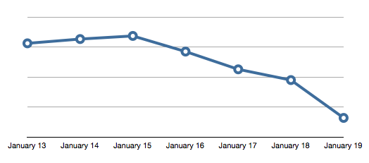

Mid December, due to a combination of the pressures imposed by a holiday iTunesConnect shutdown and a desire to get a new version of the app approved before Christmas, I shipped a version of the 500px iPad app that actually introduced _more_ bugs than the version it was replacing. Compounding the issue, after the holidays were over, I submitted rushed the new update _again_, which was not properly tested on the original iPad hardware. This update took only 3 days to be approved, but the update that fixed _that_, 1.3.3, took 12 days to get through the approval process.

The first two weeks of January were very hard for me. I had shipped a product that I was ashamed of and couldn't do anything about it. I had the fix written but it was not live yet; I had to answer to frustrated users who were&nbsp;understandably&nbsp;upset that an update that claimed to "fix crashing issues" was, in fact, crashing _more often_.

What was the cause of the crashes? Different, small things that compounded into a large problem. Concurrency and Core Data are two difficult things to do well on their own, and I was using them together. I had hoped for a performance-optimized app, but the results were disastrous. Rushing to come up with a fix only introduced more problems.

The previous version, 1.2, of the app had fewer features, but was very solid and stable. In the end, it would have been better to keep 1.2 until I could perform extensive testing on all the hardware the app supports. Crashlytics reports the number of crashes our app receives. This is a chart representing the _total_&nbsp;number of crashes, per day, of all of users running all versions of the app:

 

The update was released late night January 17. Over the past two days, crashes have been reduced to only 20% of what they were, and will only improve as people continue to upgrade to the latest version.

Releasing an update that made things worse for users already experiencing a problem violated their trust, and I truly apologize.&nbsp;In the future, I'm going to take my time with bug fixes and properly test them.

On the up side, since the update has gone live, the app has received only 4- and 5-star reviews worldwide. Users are happy again, and I feel a lot less like a "Scumbag iOS Developer." It's been a painful lesson, but one well-learnt: it's better to have an app that does fewer things, but does them very well than an app that does more but performs poorly.

  