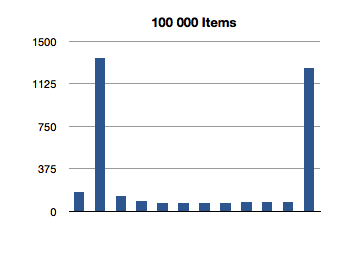

iOS 5 introduced a new, exciting feature in Core Data: ordered, to-many relationships. Previously, all relationships were unordered and necessitated the use of an intermediate entity to describe ordering. This new feature allows developers to specify that objects in a to-many relationship have an intrinsic ordering to them, which is very exciting.

The new feature uses a new Foundation class: `NSOrderedSet`, which was introduced in iOS 5 and OS X 10.7. This class is similar to `NSSet`, but offers the ability to access objects at contiguous indexes within the set. How exciting! I wonder what the run time of the access methods is? I know, I'll check the documentation. Surely, Apple would have documented such a critical feature of this data structure.

Just kidding, the documentation makes no such references.

So I wrote a small program to check out the running time of the data structure. Since we're concerned with the complexity and not the absolute time it takes to execute, running this on a computer is sufficient.

```objc
NSMutableString *results = [NSMutableString string];

for (unsigned long int passes = 100; passes <= 10000000; passes *= 10)
{
    NSLog(@"%ld", passes);

    NSMutableArray *mutableArray = [NSMutableArray arrayWithCapacity:passes];

    for (NSInteger i = 0; i < passes; i++)
    {
        [mutableArray addObject:[NSString stringWithFormat:@"%ld", i]];
    }

    NSArray *array = [NSArray arrayWithArray:mutableArray];

    NSOrderedSet *orderedSet = [NSOrderedSet orderedSetWithArray:array];

    for (NSInteger innerPasses = 0; innerPasses < 12; innerPasses++)
    {
        //test the whole range of the set, including some that don't exist.
        NSString *testObject = [NSString stringWithFormat:@"%ld", passes * (innerPasses / 10)];

        uint64_t start;
        uint64_t end;
        uint64_t elapsed;
        Nanoseconds elapsedNano;

        start = mach_absolute_time();

        [orderedSet indexOfObject:testObject];

        end = mach_absolute_time();

        elapsed = end - start;

        elapsedNano = AbsoluteToNanoseconds( *(AbsoluteTime *) &elapsed );

        uint64_t valueForTest = * (uint64_t *) &elapsedNano;

        [results appendFormat:@"%ld, %lld\n", passes, valueForTest];
    }
}

NSLog(@"%@", results);
```

We'll test the time it takes to test for inclusion, first. Testing for inclusion in an `NSSet` is a constant-time operation, so `NSOrderedSet` would hopefully maintain this feature. We also test for inclusion of members we _know_ aren't present, a likely "worst case" for their implementation.

I've graphed the results below. The bottom axis is testing for inclusion in an `NSOrderedSet` instance with that many members, and the left axis is the number of nanoseconds it took to execute that line of code. (Each test in the graph below is measured in nanoseconds.)


Interesting! The spikes you see are the **first** test for inclusion, but subsequent tests remain about constant across groath of the data set. This first test for inclusion seems to scale sublinearly with the size of the ordered set.

The following is the 6 above graphs combined into one, to show how the longest running tests for inclusions grow with ordered set size.


(Let's avoid that seeming outlier in the first test for now - I'll come back to it later.)

It would appear that, after creating the data set, the first test for inclusion balances the underlying data structure. The need to balance is probably a result of creating the ordered set from an array.

Adding Core Data into the mix was next, since these findings aren't really conclusive if they only apply to bare `NSOrderedSet` instances. We want to see how well they scale in terms of use in a persisted store.

Using relationships in a Core Data store appeared to add a constant slowdown to each request. When compared to using bare `NSOrderedSet` instances; the below graph plots the additional time, in nanoseconds,required to test for inclusion in a Core Data store for a relationship with a given number of members.


Pro tip: ensure your SSD has enough space to actually _hold_ all the contents of your managed object context before doing this test. I filled up my hard disk while also starving my real memory, forcing OS X to try to use a swap file on a drive with only 40MB of space left. OS X does not handle hard drive low-memory very well.

So the results translate over nicely, that's good. Since we can test for inclusion on a balanced tree easily, let's run the same program, modified for another feature of `NSOrderedSet`. Sets don't have intrinsic ordering, but arrays do. Finding the index of an object, contained in an array, is a linear time operation; the program actually has to go through each element of an array and compare it to the test object. Arrays that are ten times as long typically take ten times the amount of time to find the index of an object. In the worst case, you have to check each object, only to find that the object isn't not even in the array (returning `NSNotFound` in `NSArray`'s implementation).

Let's see how `NSOrderedSet` handles `indexOfObject:`.

     

That's super-interesting! It looks like the longest-running invocation of the `indexOfObject:` is the _second_ one. Huh.

This actually makes sense, since the first invocation is looking for the index of an object at the first index of the ordered set; there is not much additional overhead of re-balancing the data structure since we only make a shallow traversal.


But what about this crazily high test for the first 100-item test? That's almost 3 milliseconds to find the first object of a 100-item ordered set! We saw an even higher number in the previous test, for inclusion. What gives?

I thought maybe we might be running into a problem with the operating system's virtual memory system. I'm only testing _time_ complexity of these methods, not space complexity. It could be that these implementations use a lot of memory as virtual scratch space. What's probably happening is that the space complexity.

The first time we invoke this method, it must be calling a lot fo `malloc`. As one engineer at Apple once reminded me, "`malloc` is expensive. If they're breaking off a significant chunk of contiguous memory in these implementations, then the virtual memory subsystem in the OS might have to do some extra work to find that space.

If this is true, then we should run the first test once, throw away the results, and then re-run the entire test as usual.

```
NSMutableString *results = [NSMutableString string];

for (unsigned long int passes = 100; passes <= 10000000; passes *= 10)
{
    NSLog(@"%ld", passes);

    NSMutableArray *mutableArray = [NSMutableArray arrayWithCapacity:passes];

    for (NSInteger i = 0; i < passes; i++)
    {
        [mutableArray addObject:[NSString stringWithFormat:@"%ld", i]];
    }

    NSArray *array = [NSArray arrayWithArray:mutableArray];

    NSOrderedSet *orderedSet = [NSOrderedSet orderedSetWithArray:array];

    for (NSInteger innerPasses = 0; innerPasses < 12; innerPasses++)
    {
        //test the whole range of the set, including some that don't exist.
        NSString *testObject = [NSString stringWithFormat:@"%ld", passes * (innerPasses / 10)];

        uint64_t start;
        uint64_t end;
        uint64_t elapsed;
        Nanoseconds elapsedNano;

        start = mach_absolute_time();

        [orderedSet containsObject:testObject];

        end = mach_absolute_time();

        elapsed = end - start;

        elapsedNano = AbsoluteToNanoseconds( *(AbsoluteTime *) &elapsed );

        uint64_t valueForTest = * (uint64_t *) &elapsedNano;

        [results appendFormat:@"%ld, %lld\n", passes, valueForTest];
    }

    static BOOL skipped = NO;

    if (!skipped)
    {
        skipped = YES;

        results = [NSMutableString string];

        passes /= 10;

        continue;
    }
}
```

Hacky, sure, but whatever. Let's take a look at the test results for 100-item ordered sets

 

There's the money shot. The first invocation still has a larger time than subsequent ones, and is probably due to the re-balancing of the tree. Additionally, though there is a longer run time on the first invocation, it isn't as significant in the context of the tests with larger ordered sets.

## Conclusion

Accessing ordered, to-many Core Data relationships can be done in constant-time provided the tree underlying the ordered set is balanced. The numbers here are extreme (at one point, I got an exception for trying to create an array with a hundred billion elements), but illustrate that accessing indexes of elements, or elements at indexes, is performed in constant time.
