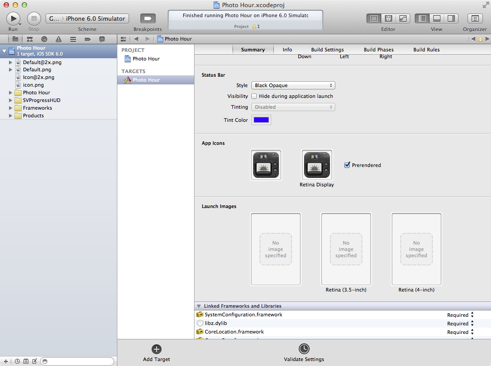

Creating a new project with Xcode 4.5 will automatically add support for the iPhone 5's larger screen. However, it's not immediately obvious how to _add_ support for the larger screen. Let's jump right in.

Since this is just to illustrate the basics of how to add support for the taller screen, I'm going to walk you through the actual migration I've made to [Photo Hour](http://itunes.apple.com/us/app/photo-hour/id524263013?ls=1&mt=8), an actual app I sell in the App Store. It's fairly simple and has only one view controller.

Before I make any changes to the project, Xcode looks something like this:

 

If I ran the app right now, I would get the following letterbox/pillarbox effect from the OS:

  

This is _not_ the experience we stylish iOS developers want to provide for our users.

The _only_ clue about what to do next is a compiler warning

 

The iPhone 5 has a screen of 640x1136 pixels (or, more accurately, 320x568 point). Remeber that on a Retina screen, 1 point is equal to 2 pixels. What apple is doing here is being cute; they know that a screen that is 568pt high _must_ be Retina, but they're reminding us through the file name that even though the image we provide should be 640x1136px, it's still only 568 points tall.

Adding this `Default-568h@2x.png` launch image will enable iPhone 5 support for your app.

The way that I generate launch images is by actually using my app and hide all the UI componenets, then taking a screenshot. It's a sort of chicken-and-egg problem: you need the larger launch image to enable support, but you need support enabled to take the screenshot. Let's just throw in _any_ launch image to get iPhone 5 support.

Open the project file in Xcode's File pane, select your target, and drag any random `.png` onto the "Retina (4-inch)" space.

If I run the app now, it looks like this:

  

iOS is just taking the springs and struts defined by the `UIViewAutoresizingMask` supplied on the views that make up the interface. In landscape, that's exactly what I want. In portrait, though, it looks like I've totally entirely forgotten about a whole 88pt of my app's interface. I can't ship this! What do I look like, an Android developer?

Let's open the nib (or storyboard) and deal with this mess.

If you select the main `UIView` and open the Attributes inspector (⌘⎇4), you'll see a new dropdown under "Simulated Metrics."

 

This is the first time that developers have been able to specify any size other than 320c640pt for a view controller with a simulated status bar. Nice!

Since I only want to do this work once, I'm going to select "Freeform" so I can resize my nib and see visually how the springs and struts are being used to layout the interface. This would be a great time to migrate to Auto Layout, but that's iOS 6 only and a topic for another blog post.

**Protip** : Hold down ⌘ while resizing interface elements on a nib or Storyboard to get the views to resize and reposition in accordance with their springs and struts.

Don't forget to repeat these steps for any localized nibs you have!

 

Luckily, the rest of my app is using `resizableImageWithCapInsets:` and `colorWithPatternImage:`, so I don't need to regenerate any assets besides the launch image.

That's it! Take some new screenshots of your app in the iPhone 5 simulator (assuming you don't _have_ an iPhone 5, yet) and upload them to iTunes Connect; there is a special spot for screenshots of the iPhone 5. Submit, and know that you've done your due diligence and your users will get the best experience possible.

  