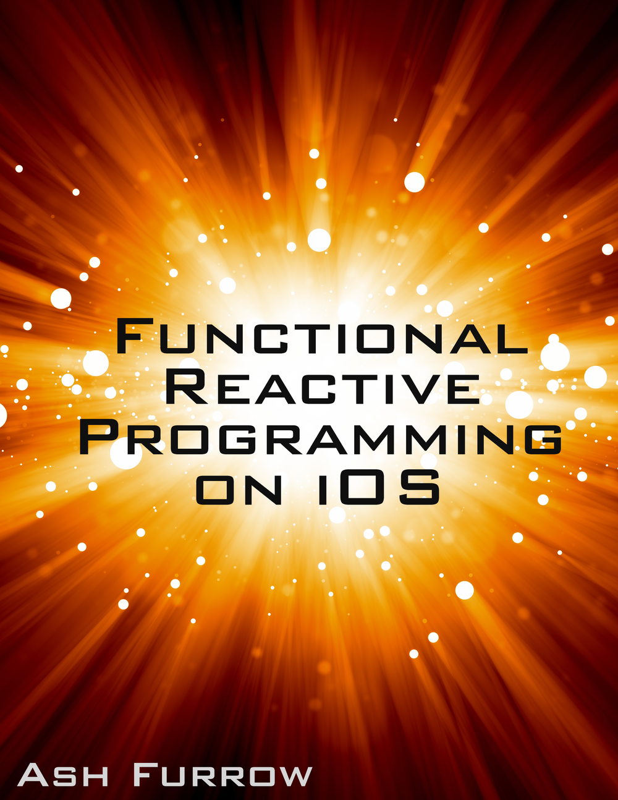

 

I'm writing a [new book about functional reactive programming on iOS](https://leanpub.com/iosfrp), specifically using ReactiveCocoa. It's going to be a shorter one – about a hundred pages. The source code for the book is [available on GitHub](https://github.com/AshFurrow/FunctionalReactivePixels).

The book is currently [number two](https://leanpub.com/bestsellers) on the bestsellers list, and I couldn't be happier. Thank you to everyone who has purchased a copy. It means a lot to me that people believe enough in my work that they're willing to buy a book I haven't even finished yet.

  