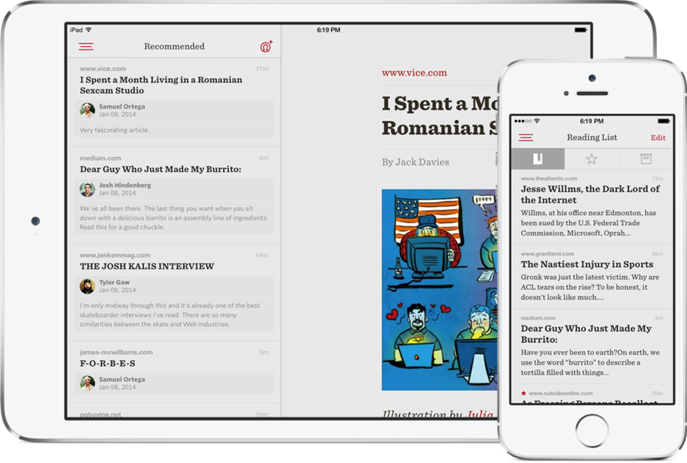

My friends at Readability have released the 2.0 version of their reading application. You can download it from the [App Store](https://itunes.apple.com/us/app/readability/id460156587?mt=8&uo=4&at=1l3v6zC).

 

I was part of the handoff of technical responsibility from Teehan+Lax to arc90 of the iOS application. I feel a sense of ownership of the product since I worked on it for a few months, and I hope it does well. I don't know if any of the code I wrote is still present in the product, but still :)

  