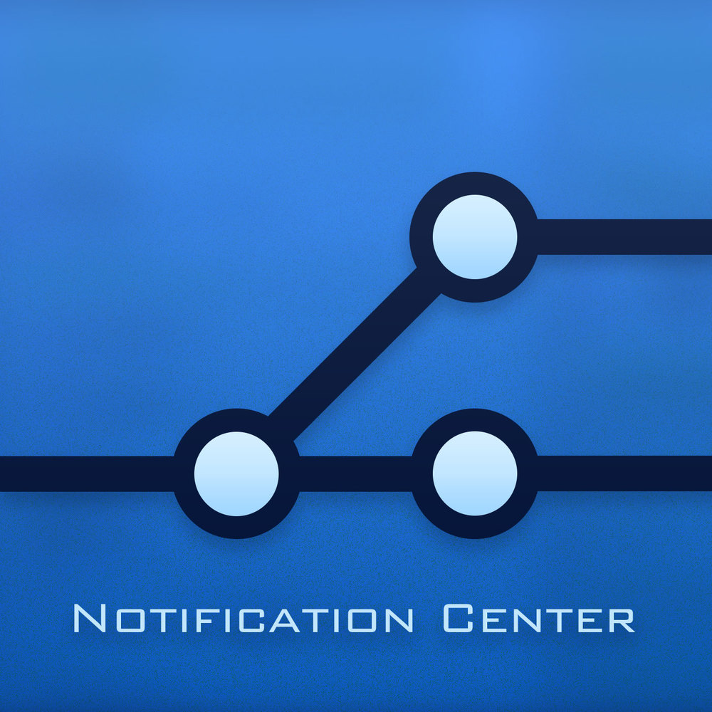

 

I've started a new, weekly podcast called [Notification Center](http://www.notificationcenter.tv). It's a talk-show discussing iOS news and events with my co-host, [Tom](http://twitter.com/swizzlr). Check it out, give it a listen, and let me know what you think.

Our first week discusses a lot of open source stuff that happened, like the CocoaPods repo fix and OmniGraphSketcher being open sourced.

I'm also particularly proud of the site, since we threw it together ourselves. Typically I'd go with Squarespace for something like this, but it was a lot of fun to flex my (albeit limited) web dev muscles.

It'll be on iTunes soon; or you can use the [RSS feed](http://www.notificationcenter.tv/feed.rss) for now.

  