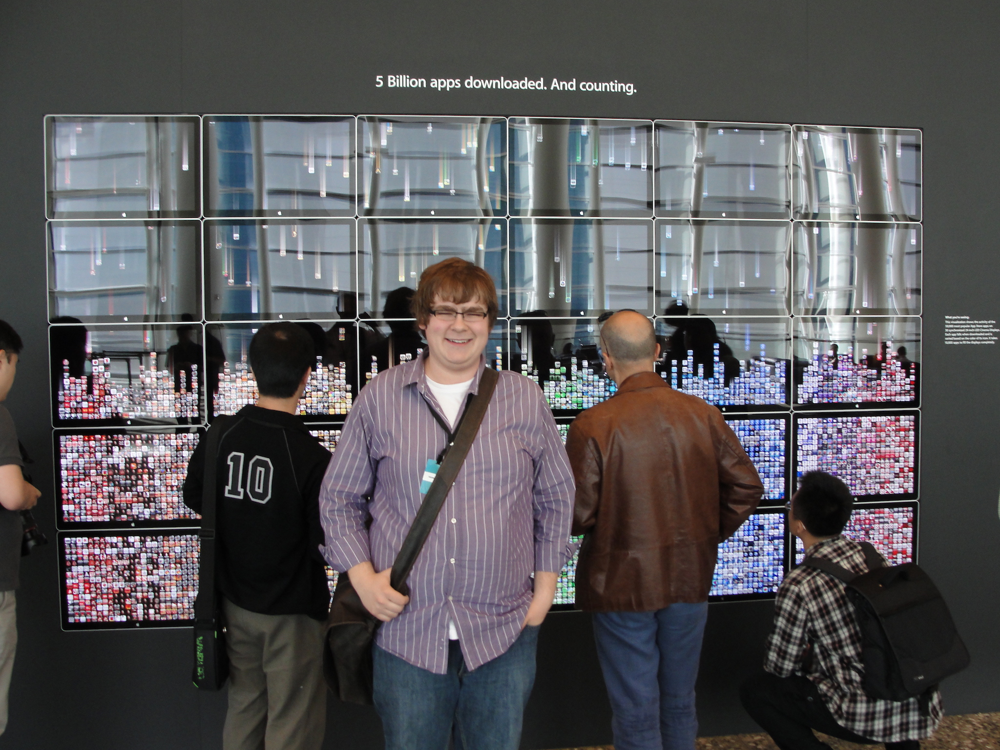

A few months ago, I felt something change. I remember it precisely: I asked a friend for advice designing a portfolio section of my website, and I couldn’t implement his suggestions. This wasn’t the first time that tools have limited my ability to express my ideas on the web, but it was a catalyst for what you see today: a brand new website.

So to talk about how and why we arrived here, we need to go back a bit. (This is going to be a bit of a storytelling post.)

It was Christmas break, 2009, when I sat in a dark basement typing on a computer. I was busy writing my first ever iOS app. Near the end of the process, when I was getting ready to submit, I realized that I would need a website. I registered one, coffeetimerapp.com, and set about trying to make a website.

I knew that making a website was beyond my abilities, so I turned to iWeb. I whipped something together with screenshots and arrows and text typeset in Marker Felt and I threw it up on the web.

That Summer, after winning a WWDC scholarship, I got a reputation around my university’s CS department as being an Apple guy (not _the_ Apple guy, we had two others in the city). I decided I needed to have some presence on the web, beyond twitter. I was afraid to set up a full site, so I used what I already had. Some [">[mangled artefacts are still online](http://web.archive.org/web/20101118104908/http://coffeetimerapp.com/CoffeeTimer/Ash_Furrow.html). Laugh, but it got me contracting jobs while I was still studying.

Time passed. I was writing on a now-defunct-and-don’t-look-for-it-you-won’t-find-anything blogger blog and I really liked it. Initially, I started it to have discussions about atheism (I am not even kidding). It was a great way for me to start writing, and would eventually lead to writing books. But it drifted into too personal of a thing for my tastes, and I decided I needed a blog on my own terms with my own name on it. A friend [suggested Wordpress](/blog/professional-site), but I’d need a site and hosting and blah blah blah. It was too scary, but I did use my existing site and moved it to Wordpress (hosted on Dreamhost).

Eventually it became embarrassing as a professional to have your business cards read “coffeetimerapp.com”, so I purchased this domain and migrated the Wordpress install over. I [changed my name](/blog/twitter-name-change) on Twitter and [struggled to administer the site](/blog/site-change).

So I graduated, got my first “real” job and everything was good. I had written a few articles that got picked up on Hacker News, installed some caching plugins, and struggled to maintain the Wordpress install. It wasn’t ideal, but it was good enough.

Until one day, [my site got hacked](/blog/moved-away-from-wordpress). It sucked, having your name on pages selling knock-off handbags. I needed a new site that could import my old posts. I chose Squarespace for a few reasons: it was easy and let me write in markdown, it let me focus on writing instead of design and upkeep (which I was still afraid of), and it would let me – at any point – export all my content.

Bingo.

I hopped on board and things were great. I continued to develop as a writer, grew my professional reputation, and didn’t worry about a thing. Over the next few years, through professional and hobby experience, and with the mentoring of many friends and colleagues, I learnt how to set up basic static websites on S3. I learnt about to use modern HTML and CSS (not the kind I played around with in high school). And I learnt about design.

For a long time, I’ve wanted to have more control over my Squarespace site, but not in a way I knew a normal person would want to. Putting ads on the side – figuratively bolting them on to the site – was difficult and looked not great. I would grow frustrated with its options of displaying tweets or other embedded content – what works for _my_ template would have to of course work for _every_ template.

These were pretty trivial concerns – nothing worth going back to Wordpress over. But then my friend gave me that advice for my portfolio – just another thing I couldn’t do, and a seed was planted.

Squarespace recently came out with the [seventh version](http://www.squarespace.com/seven/) of its product. I have always loved Squarespace, and this new released looked _awesome_. I _really_ liked the “single page” features, and I found myself wishing that I could write some of my posts with those designs – those contemporary “Medium”-inspired, full-bleed designs. But I couldn’t. Not with Squarespace.

I looked at myself – the same guy who had to use iWeb because making websites was “too scary” – and I thought “yeah, I can do this.” I now had the tools and experience to make my own site, hosted statically on S3 for minimum maintenance, and using a tool that let me write in markdown and have as much or as little control over styling as I felt like.

That was a few weeks ago. I’ve been slowly pecking away at this blog, using the different tools that I had become familiar with. Ruby, Middleman, S3. I had to learn some new tools, or re-learn old ones. I used Bootstrap because why the heck wouldn’t you, and Middleman because I had used it before for my [podcast’s website](http://notificationcenter.tv). I found a [free Bootstrap blogging template](http://startbootstrap.com/template-overviews/clean-blog/) and chose a [nice shade of blue](http://www.colourlovers.com/color/398CCC/Walton). I listed my requirements beyond a basic blog – like syntax highlighting – and used libraries that provided that for me.

I kind of just quickly smashed together a bunch of cool, open source tools, combined with some photos I’ve taken and sample content, and this site was born.

The last step would be importing my content from Squarespace. Not too bad – I just wrote a ruby script to parse the exported XML file, download any Squarespace-hosted assets, reconfigure each post’s content to match new URLs, and that’d be it. If you had told me that a few years ago, I would have been terrified.

(The script for transforming the Wordpress-compatible XML file into Middleman blog entries is [available online](https://gist.github.com/AshFurrow/ea1e354fba72bb4cc533) for anyone else needing it.)

So that’s where we are today: a new person, and a new website. Looking back at how my web presence has grown – and how I’ve grown – has given me a lot to think about. In the midst of a my depression, I’m able to objectively look at myself and say “I am pretty OK”, which is a big accomplishment for me right now.

There are a few complications, of course. Amazon has a hard limit of 50 resource redirects, which I’ve used for the most popular posts on my blog. The RSS feed _should_ automatically redirect, but you’ll likely see a few duplicate entries.

All in all, I’m pretty happy with the results. I’ve now got the tools available to focus on my writing _and_ use design as a new medium of self-expression. I’m looking forward to writing really cool posts that integrate form into their function in a way that I couldn’t express before. And currently I’ve just imported existing content – I’ll be updating things like my portfolio to introduce some slick new designs soon.

If you have any suggestions, questions, or feedback, [drop me a line](http://twitter.com/ashfurrow). Or [open a pull request or issue](https://github.com/AshFurrow/blog). I’m sure I’m doing something suboptimally, so please feel free to point out where I could improve.
