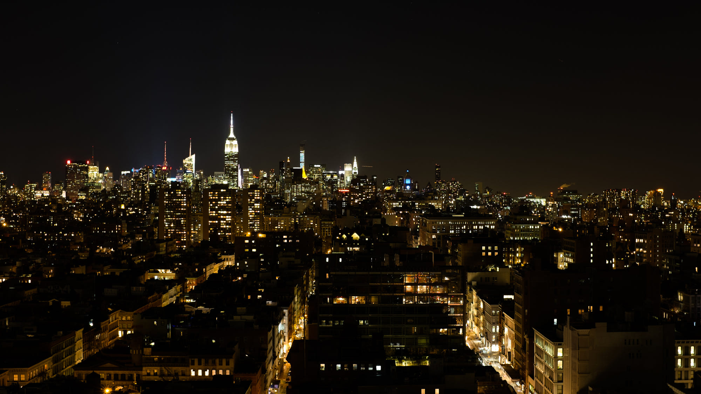
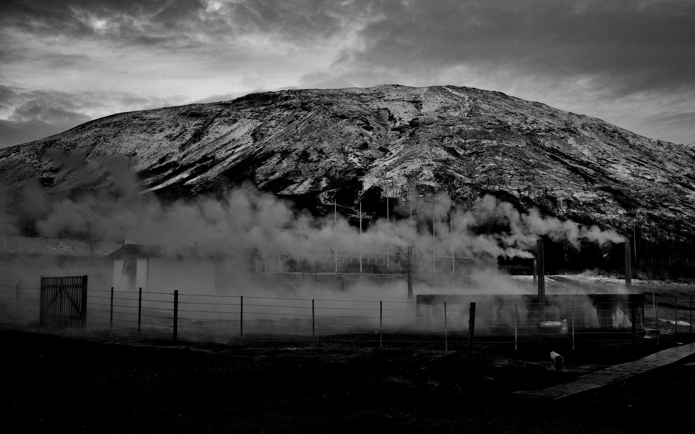
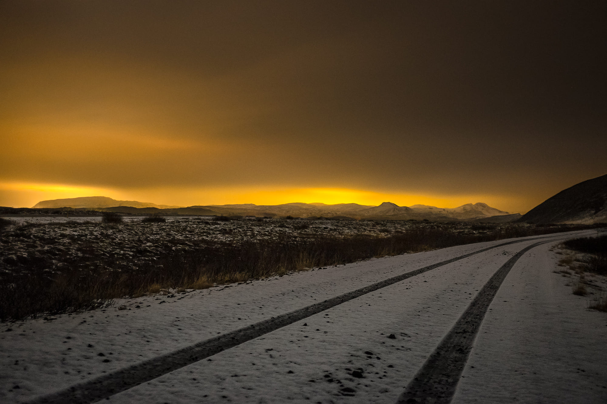
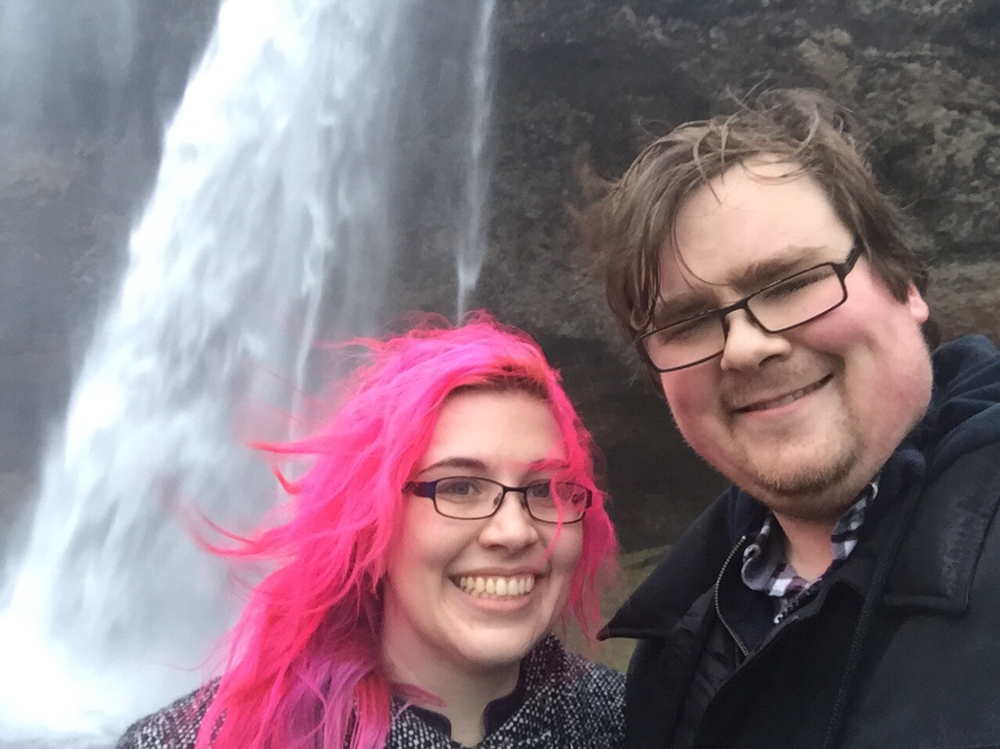

As I mentioned in a [previous post](/blog/lessons-learned-travelling-europe/), I’ve travelled a lot this year, and I’ve just returned home with my wife from our last trip of 2014. It was a whopper: a two-week jaunt starting and ending in Amsterdam and stretching through three other countries. It started a bit over two weeks ago when I left for New York and my wife Ashley left for Nova Scotia to visit her family. We met up a week later in Halifax, drove to my hometown in New Brunswick for a few days’ visit with my family, then back to Halifax for a flight to Reykjavik for a three-day vacation in Iceland. Phew!

I’m a photographer and will have a post on my [photo blog](https://photos.ashfurrow.com) about Iceland once I get my film back from the development lab. But that takes time, and I feel like I have a broader story to tell, so I’m going to do a bit of a personal post about my trip.

## New York City

I visited New York City for a week to meet with [Artsy](http://artsy.net). (I was there for meetings; if I were there to work, then I’d have needed a visa. Since I didn’t have a visa, I must have been there just for meetings.) I got to experience my [first art auction](/blog/first-art-auction/), meet some friends I knew only online, hang out with my super-cool colleagues, and prepare for moving to NYC in February.

I stayed in Lower Manhattan near Battery Park and walked twenty minutes up to Artsy’s office at Broadway and Canal. Artsy have just opened up a second floor of the building, which is super-exciting. I got to have coffee with some awesome coworkers and soak in the company culture. After a week of being in the office, I’m more excited than ever to work at Artsy. The company has an ambitious and laudable goal, an awesome culture, and really smart people. It’s the kind of company that I hope to start myself someday.

Because I was busy taking advantage of the opportunities to meet so many cool people, I didn’t have much time to take photos. However, the Artsy office has a great 360º view of Lower Manhattan, so I took some photos when I could.

<Wide>

</Wide>

While I was excited to see Ashley and my family, I was admittedly sad to leave NYC. Working for Artsy is the first time I’ve ever worked remotely full-time, and I don’t think that it’s for me. It’s so easy to feel disconnected when working remotely, and as much as I feel that I’m an introvert, I genuinely feel energized when I’m around my coworkers.

## Atlantic Canada

I flew from LaGuardia to Halifax to meet my wife at the airport. We had rented a vehicle to drive to Woodstock, New Brunswick. We got in pretty late, but managed to get a pizza from our old favourite pizza chain. The pizza place accepted credit cards, but their (actually modern) card machine still used a dial-up modem to process payments.

It’s weird how things change, but they also stay the same. I left Woodstock in 2006 for university and I’ve only visited it now and then, and not for a few years. Old stores close and new ones open. Houses burn down and new subdivisions are built. But while the same familiar traffic patterns have been repainted an untold number of times since I left in 2006, I still recognize where they are worn away by traffic.

Even though I was glad to see my family and share some meals with them, my dad has to work and my sister is busy in college, so we got to sleep in and enjoy our days however we wanted (after fixing a minor emergency at work early in the week). One day, Ashley and I took a drive to a nearby village, stopping along the Saint John River to take photos. My mom even suggested stopping by the remains of an old train bridge for some photos – the same bridge she and my dad had scared me away from playing near when I was a kid (rightly so – the thing is a death trap).

<Narrow>

<blockquote class="instagram-media" data-instgrm-captioned data-instgrm-permalink="https://www.instagram.com/p/vIlmg2DBn9/?utm_source=ig_embed&amp;utm_campaign=loading" data-instgrm-version="13" style=" background:#FFF; border:0; border-radius:3px; box-shadow:0 0 1px 0 rgba(0,0,0,0.5),0 1px 10px 0 rgba(0,0,0,0.15); margin: 1px; max-width:540px; min-width:326px; padding:0; width:99.375%; width:-webkit-calc(100% - 2px); width:calc(100% - 2px);">
 <a href="https://www.instagram.com/p/vIlmg2DBn9/?utm_source=ig_embed&amp;utm_campaign=loading" style=" background:#FFFFFF; line-height:0; padding:0 0; text-align:center; text-decoration:none; width:100%;" target="_blank"> 
 

 
 

 

 

 
 View this post on Instagram

 

 

 

 

 

 

 

 

 

 
 

 

</a>
<a href="https://www.instagram.com/p/vIlmg2DBn9/?utm_source=ig_embed&amp;utm_campaign=loading" style=" color:#c9c8cd; font-family:Arial,sans-serif; font-size:14px; font-style:normal; font-weight:normal; line-height:17px; text-decoration:none;" target="_blank">A post shared by Ash Furrow 🏳️‍🌈 (@ashfurrow)</a>

</blockquote> 

</Narrow>

Something I’ve wanted to photograph for a few years is the graveyard behind my old house. Most of my shots are on film, so I don’t have many yet. It was a really interesting experience. I’ve reflected a lot about death and dying, especially with my <a href="/blog/depression-sucks/">depression</a> and my grandmother’s illness earlier this year (she’s fine!). Walking through a field specifically set aside in order to bury peoples’ remains, (nominally) “forever”, is weird. It’s just really really weird. Not creepy – just strange. I’ve concluded that cemeteries are more for the living than for the dead.

The next day, we have some goodbyes and begin our nighttime drive back to Halifax, 600km away, to sleep at Ashley’s dad’s house for the night. We weren’t expecting to get to see him or her stepmom, but left Woodstock early due to the weather. It was great to see the two of them again, and the next day, we got to meet with our friend Lauren before flying to Reykjavik.

<Narrow>

<blockquote class="instagram-media" data-instgrm-captioned data-instgrm-permalink="https://www.instagram.com/p/v32sjTvczQ/?utm_source=ig_embed&amp;utm_campaign=loading" data-instgrm-version="13" style=" background:#FFF; border:0; border-radius:3px; box-shadow:0 0 1px 0 rgba(0,0,0,0.5),0 1px 10px 0 rgba(0,0,0,0.15); margin: 1px; max-width:540px; min-width:326px; padding:0; width:99.375%; width:-webkit-calc(100% - 2px); width:calc(100% - 2px);">
 <a href="https://www.instagram.com/p/v32sjTvczQ/?utm_source=ig_embed&amp;utm_campaign=loading" style=" background:#FFFFFF; line-height:0; padding:0 0; text-align:center; text-decoration:none; width:100%;" target="_blank"> 
 

 
 

 

 

 
 View this post on Instagram

 

 

 

 

 

 

 

 

 

 
 

 

</a>
<a href="https://www.instagram.com/p/v32sjTvczQ/?utm_source=ig_embed&amp;utm_campaign=loading" style=" color:#c9c8cd; font-family:Arial,sans-serif; font-size:14px; font-style:normal; font-weight:normal; line-height:17px; text-decoration:none;" target="_blank">A post shared by Lauren Vail (@laurenevail)</a>

</blockquote> 

</Narrow>

It was great to visit Atlantic Canada and see my family and friends, but were were only there for a few days and couldn’t possibly see everyone we wanted to. Soon we’ll be living a lot closer and should be home again before too long.

## Iceland

Due to some issues booking flights to Iceland, Ashley and I were on completely different routes, though we both arrived at about 6:30 on Thursday morning. I flew from Halifax to Toronto then to Reykjavik, while Ashley flew from Halifax to Boston then to Reykjavik. We were worried that the weather would cause one of us to get delayed, but we were lucky enough to both arrive on schedule to make the two hour trip to our secluded cottage on Þingvallavatn, a lake near [Þingvellir Park](https://en.wikipedia.org/wiki/Þingvellir#Geography). We opted to rent an SUV with a GPS so we a) could go anywhere we wanted to and b) always find our way back.

<Narrow addBottom>

<blockquote class="instagram-media" data-instgrm-captioned data-instgrm-permalink="https://www.instagram.com/p/v56T8oDBqE/?utm_source=ig_embed&amp;utm_campaign=loading" data-instgrm-version="13" style=" background:#FFF; border:0; border-radius:3px; box-shadow:0 0 1px 0 rgba(0,0,0,0.5),0 1px 10px 0 rgba(0,0,0,0.15); margin: 1px; max-width:540px; min-width:326px; padding:0; width:99.375%; width:-webkit-calc(100% - 2px); width:calc(100% - 2px);">
 <a href="https://www.instagram.com/p/v56T8oDBqE/?utm_source=ig_embed&amp;utm_campaign=loading" style=" background:#FFFFFF; line-height:0; padding:0 0; text-align:center; text-decoration:none; width:100%;" target="_blank"> 
 

 
 

 

 

 
 View this post on Instagram

 

 

 

 

 

 

 

 

 

 
 

 

</a>
<a href="https://www.instagram.com/p/v56T8oDBqE/?utm_source=ig_embed&amp;utm_campaign=loading" style=" color:#c9c8cd; font-family:Arial,sans-serif; font-size:14px; font-style:normal; font-weight:normal; line-height:17px; text-decoration:none;" target="_blank">A post shared by Ash Furrow 🏳️‍🌈 (@ashfurrow)</a>

</blockquote> 

</Narrow>

Sunrise is at about 10:30am this time of year, so by the time we arrived and settled in, the sun was still an hour away from rising. A perfect chance for photos, especially since there was a fresh snowfall from the night before and the landscape looked majestic.

We kept taking photos, travelling to a nearby settlement for some supplies and more photos. After getting some breakfast from a hostel there, we explored the waterfront of another lake. They had a geothermic hot tub by the edge of the lake, but we were more interested in the steaming pipes coming up from the boiling sand.

We slept that afternoon, since I got very little sleep on the flight over (and Ashley got none at all). We left the cabin after sunset, which is at about 4pm, and took more photos. Using a tripod, we got some really slick long exposures, even in the cold rain.

<Wide>

</Wide>

The next morning, we left before sunrise to get some cool photos from a road we had seen the previous night. All of the snow had melted from the 3º rain, so it was a completely different landscape.

When we arrived at the spot I wanted to set up, my digital camera wouldn’t turn on. I hit the power switch and nothing happened. That really sucked. We got some photos with my film cameras (which work without any power – take that, analogue photography haters), then headed back to the cabin.

I made sure the battery was charged (it was) and then threw the camera in a ziplock bag with a half cup of white rice.

Ten minutes later and the camera worked so we set off. Later, it didn’t work again, but I put the battery in my pocket for a bit (batteries hate the cold) and the camera back in the bag, and no problem. I don’t know what the issue was, but if taking photos is an important part of your vacation, having backups is important.

When we were planning this vacation, there was one thing I wanted to see more than anything else: in 1973, a US Navy DC–3 <a href="https://www.google.com/maps/place/63°27'34.3%22N+19°21'52.6%22W/@63.459523,-19.364618,414m/data=!3m1!1e3!4m2!3m1!1s0x0:0x0?hl=en">plane crash-landed</a> on the shores of Southern Iceland. The crew survived and the wreckage remains on the beach today. It was something I wanted to photograph, sure, but more than anything I just wanted to see what a 41-year old plane corpse looked like.

<Narrow addBottom>

<blockquote class="instagram-media" data-instgrm-captioned data-instgrm-permalink="https://www.instagram.com/p/v56T8oDBqE/?utm_source=ig_embed&amp;utm_campaign=loading" data-instgrm-version="13" style=" background:#FFF; border:0; border-radius:3px; box-shadow:0 0 1px 0 rgba(0,0,0,0.5),0 1px 10px 0 rgba(0,0,0,0.15); margin: 1px; max-width:540px; min-width:326px; padding:0; width:99.375%; width:-webkit-calc(100% - 2px); width:calc(100% - 2px);">
 <a href="https://www.instagram.com/p/v56T8oDBqE/?utm_source=ig_embed&amp;utm_campaign=loading" style=" background:#FFFFFF; line-height:0; padding:0 0; text-align:center; text-decoration:none; width:100%;" target="_blank"> 
 

 
 

 

 

 
 View this post on Instagram

 

 

 

 

 

 

 

 

 

 
 

 

</a>
<a href="https://www.instagram.com/p/v56T8oDBqE/?utm_source=ig_embed&amp;utm_campaign=loading" style=" color:#c9c8cd; font-family:Arial,sans-serif; font-size:14px; font-style:normal; font-weight:normal; line-height:17px; text-decoration:none;" target="_blank">A post shared by Ash Furrow 🏳️‍🌈 (@ashfurrow)</a>

</blockquote> 

</Narrow>

We spent all day travelling the 140km to the crash site. It took so long because we kept stopping for photos along the way, which was totally worth it.

<Wide>

</Wide>

We overshot the coordinates on the highway but didn’t realize it at the time. We found a makeshift gate in the fence along the highway and got our SUV through in order to begin the trek across the volcanic sand to the plane, 3km away from the nearest highway. We arrived shortly after sunset; the light was slipping away fast, but I managed to get some decent shots. At least, I think I did. Most all of them are on film, so I haven’t gotten them back yet.

We travelled home, stopping for some more long exposures along the way. Snuggling up in a warm bed during a cold, windy night, we talked about how lucky we were to travel as much as we have. We are both from rural parts of Atlantic Canadian provinces and didn’t travel much growing up (my first flight was only in 2010). To get a chance to live in Amsterdam for a year, travelling around Europe, has just been exhilarating and pretty unexpected.

The next day, we got up and took some more photos at sunrise, this time on the shores of the lake. We were headed for Gulfoss, another waterfall, but were going to stop at lots of places along the way.

<Wide>

</Wide>

That afternoon, after some brief lunch at a rest stop, we were off to the waterfall about 40km away. It was our last day of our trip and we wanted to make the most of it. Driving along the chasm that separates the North American and European tectonic plates, I saw a really cool spot for some photos so we pulled over. We looked around together for about ten minutes and then split off. A few minutes later, I decided to get a closer look at a ravine. There was a clear path where others had gotten down into it a bit, and it was only about 4 metres deep in total, so I figured I’d be fine.

When moving down to another rock, my left foot got snagged on some roots hidden by the thick carpet of moss. In what felt like a split-second, I lost my footing and fell a metre into the ravine, landing on my side. My rib cage and left hip took most of the fall on a pair of bare rocks while my head landed on a rock mercifully covered in thick moss. My glasses went flying but my camera gear landed safely on top of me (hooray).

I was winded. I couldn’t stand up – I could barely breathe. I screamed for Ashley and she came running to help me. Ten minutes went by as I caught my breath, ensured that I didn’t have any broken bones, and checked my gear. I had lost an SD card and my tripod plate, but didn’t notice at the time. I asked Ashley to pass me my camera so I could get the shot that I came for. I finished my roll of film and we drove directly home.

I spent the next few hours sitting on a couch, not able to move, as I watched the first sunset over clear skies we had seen the whole trip. It was magnificent, but I was having trouble seeing. After an hour or so, my vision returned to normal, but I stayed awake for a while longer in case there were more serious neurological problems. We were two hours away from the nearest hospital.

Earlier, I said that I had reflected on dying as part of my depression. In that moment of panic, as I fell toward what I knew at the time could easily be my end, I realized more concretely than anything that I didn’t want to die. It was a painful lesson, but in a way, I’m sort of glad it happened. I feel more alive now, and I’m committed to staying that way.

## Home Again

The next morning, we set off to the airport at 3am. We nearly missed our 7:40 flight because the GPS we had rented with the car returned us to the wrong airport. Ashley suggested that I use a wheelchair at the airport since I was having trouble walking, but we didn’t have time. We _just_ made it and were on a flight to Amsterdam to see our cats. They sure had missed us.

<Narrow>

</Narrow>

It had been an amazing two week trip. Ashley and I spent half of it apart and half of it together. We spent half of our time together with family, and the other half by ourselves. We returned home refreshed, invigorated, and ready to face the problems facing us in the coming months: passport renewals, pet passports, visa applications, prescription transfers, etc etc etc. Everything you need to move to America.

It was a fantastic journey filled with passion and longing, misery and triumphs. Our first real vacation in over a year lasted just a few days, but it was worth it. We hope to return to Iceland someday. Maybe someday soon.
