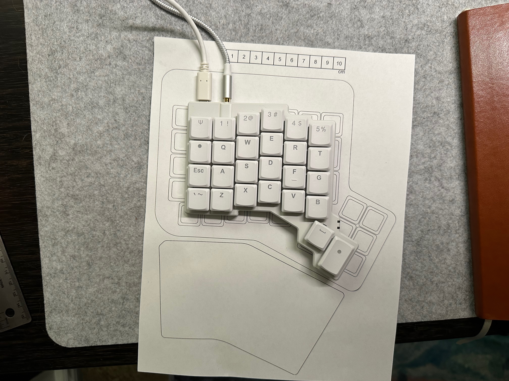

A few months ago, I came across [this amazing video from Christian Selig detailing how he built his own keyboard](https://www.youtube.com/watch?v=7UXsD7nSfDY). And I mean _built_ it. Unknown to me up to that point, there exists both the tools and community such that anyone could design and build, from scratch, their own custom computer keyboard. The printed circuit board, the case, the microcontroller firmware – everything.

<YouTube videoID="7UXsD7nSfDY" />

I had been using an [ErgoDox-EZ keyboard](https://ergodox-ez.com) since 2020 and so I was familiar with the concept of custom keyboard firmware. But I had no idea that the custom hardware was so accessible. Building something from scratch wasn't something I was interested in doing, but I did start tinkering with my ErgoDox layout. It was a tonne of fun!

Since I was tinkering with the layout, I started thinking about my home office ergonomics more broadly. A lot has changed since I [last talked about my home office setup](https://people.zsa.io/ash-furrow/). My RSI pain is something that I have under control, but it is something that takes active management. I looked up how to adjust my chair. I had someone watch me work. I bought a keyboard tray to sit under my desk. And, I bought a new keyboard.

The thing with my ErgoDox was, I never really made the most of it after I got over the initial learning curve. I kept some bad typing habits. I had a lot of unused keys.

I could have solved these problems, and would have, but the physical size of the ErgoDox also presented some challenges on my desk setup. The keyboard is tall and wide and I wanted something lower profile.

So I bought [ZSA's Voyager](https://www.zsa.io/voyager). It is also a split mechanical keyboard, smaller, and with low profile keys. It feels great! I got the clickiest key switches and they feel so satisfying. It's also much smaller. ZSA has a to-scale printout of all their keyboards, so here is the Voyager on top of the ErgoDox-EZ.

I've been using it for a few weeks now and have mostly regained my typing speed. It has fewer keys that the ErgoDox, which has pushed me to be creative with my layout. Honestly, I have been having a blast! My layer is [open source](https://configure.zsa.io/voyager/layouts/NWX4X/YGQ34/4) if you're interested. I have made fifty changes so far and forked it twice.

I thought I might collect some thoughts and lessons. If your keyboard is programmable, maybe this could be of interet to you.

- Blank keycaps are not worth it, at least for me.
- I was only using one layer above my base layer. By using two, I could separate symbols and navigation onto their own layers. This let me put shifted symbols like `&` onto their own keys, which reduced how much shifting I had to do.
- My shoulders were spread to wide. I had gotten used to keeping notebook between my keyboard halves, but over time I had opened up my chest too much.
- [Home row mods](https://precondition.github.io/home-row-mods) remove the need for dedicated shift, command, alt/option, and control keys. I needed to use per-key tapping terms, as low as 150ms for my left index finger (shift).
- I thought that I **needed** left-hand only command-tab to switch between applications while mousing, but I don't. If you can be flexible where you can be, it helps you be rigid where you need to be.
- I was basically only shifting with my left hand, even for awkard letters like Q. Home row mods have been a good way to re-train myself to use both hands together.
- When I want to change how I do somethting on my layout, I need to remove the old way. I need to force myself to make the change. Cortés and ships and all that.
- Hover typing was not difficult to learn. I now try to use my palm rest only when resting, and not while typing.
- I added [Tap Dance](https://blog.zsa.io/2101-introducing-tap-dance/) keys for press-and-hold actions for undo, cut, copy, and paste. I'm not sure I love them yet, and [they interfere with caps WORD](https://github.com/qmk/qmk_firmware/issues/19574).
- Up until now, I had been holding modifers for a lot of text navigation with arrow keys that were already on the second row. That means hold multiple keys while tapping yet others. For example, select the next word with alt-shift-(navigation layer modifer and right arrow key). Now, I use dedicated keys on my navigation layer to move between words, to forward- and backward-delete words, etc.
- There is value in muscle memory. Don't over-optimize for perfection; the keyboard should fit you, not the other way around.
- I was sleeping on [hyper keys](https://brettterpstra.com/2012/12/08/a-useful-caps-lock-key/). I now have a single key that I can assign to _any_ shortcut with reasonable confidence of avoiding conflicts.
- Tools like [skhd](https://github.com/koekeishiya/skhd), [Raycast](https://www.raycast.com), and [Shortcat](https://shortcat.app) open up possibilities to use the keyboard far less.
- Wireless is not that important to me. I don't _like_ wires, but I do actually prefer a wired keyboard. By using a keyboard tray, the wires are effectively hidden anyway.
- [Cat Mode](https://tenforward.social/@ashfurrow/113160750825678795)

<iframe
  src="https://tenforward.social/@ashfurrow/113160750825678795/embed"
  class="mastodon-embed"
  style="max-width: 100%; border: 0; margin-bottom: 50px"
  width="600"
  height="600"
  allowfullscreen="allowfullscreen"
></iframe>

<!--
I’ve added a new feature to my programmable keyboard: Cat Mode.
Tapping QWER activates the combo to enter Cat Mode. This combo is easy to do but hard to do by accident.
In Cat Mode, all the buttons are disabled except F and J, which are the combo used to leave Cat Mode. F and J get lit up by RGB to make it obvious how to leave Cat Mode. Like a Zelda Dungeon. This combo easy to do but hard for my cat to do.
If you have a cat and a programmable keyboard, try it out.
-->

This has all been a great reminder of the joy of investing in my own tools and productivity. There was once a time where I had quite a nice [well-documented setup](https://gist.github.com/ashfurrow/3865eed417a5fbe8402708e2c706eea6/revisions). But time, entropy, and Apple's locking down of macOS have left me using close to a stock setup. I'm excited to be changing that.

I have spent hours over the past two months watching videos of keyboard enthusiasts explaining their layouts and building their own keyboards. It has been helpful and I want to contribute something back. I am a writer, though, not a YouTuber. So this is my contribution.

Having learned a lot about what I want from a keyboard, I think I _might_ actually want to build my own. Someday. I confidently know what I would want now: a more aggressive pinky stagger and a third thumb cluster button. Maybe even one fewer rows of keys. I'm looking at the [totem](https://github.com/GEIGEIGEIST/TOTEM). We'll see.

I've always had [an interest in developer tooling](https://ashfurrow.com/blog/craft-and-tooling/) (even if my open source contributions have tapered off for now). I have built my own [software libraries](https://github.com/Moya/Moya), [CI culture-as-linter plugins](https://github.com/ashfurrow/danger-swiftlint), and [even this blog](https://github.com/ashfurrow/blog). It just feels natural that I would take an interest and joy in building and programming my own keyboard. Like how a skilled woodworker builds their perfect tablesaw jig. _Their_ perfect jig.

For now, I will settle for "only" programming the firmware! There is enough to keep me busy for a long time.
