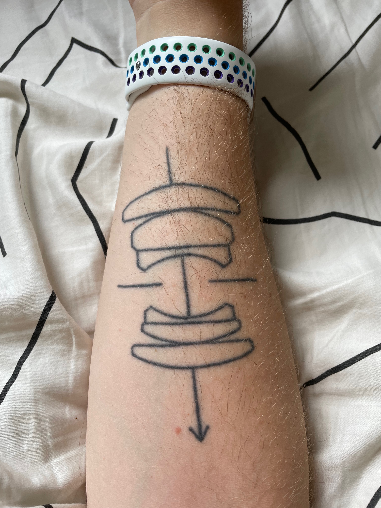

Recently, I published [my first photo blog post since 2018](https://photos.ashfurrow.com/downtown-in-the-rain). (Yes I have a separate photo blog, because of course I do.) So what's up with that? Nothing better than a blog post about another blog post.

I haven't really been doing a lot of photography since the pandemic, but I had been increasingly drawn to it over the past six months. Creativity is actually something I've found to be missing in my life – when I found a renewed interest in photography, I decided to follow it. I started taking more photos on my iPhone, then I got out my film cameras since that's what I _had_ been mainly shooting. But film wasn't working for me, so I got out my digital camera, a FujiFilm X100S from 2014. And I loved it.

But, that camera has some limitations I was hitting. First, it's a fixed focal length and I felt myself wanting something with more reach. I've only used prime lenses since 2014 and I enjoyed their limitations. Prime lenses helped me improve my composition skills, but now I'm ready for a zoom. The X100S is also from 2014, which means it's from near the _very beginning_ of the industry's transition to mirrorless. So, it's fiddly.

Don't get me wrong – I've taken some of my favourite shots with the X100S. I have a large canvas print of [a long exposure of Tokyo taken from Roppongi Tower](https://photos.ashfurrow.com/losing-myself-in-tokyo/photos/2580931) hanging in my office, and I took that with the X100S. Back when I used to travel a lot, The X100S was exactly what I needed. But as I rediscover photography in Atlantic Canada, I started to feel its limitations. I kept shooting with it anyway.

<Wide>

</Wide>

I started looking around and realized that you can buy really nice used DSLRs for not that much. I had a sick DSLR kit and I daydreamed about recreating that same setup. But it felt weird to invest in a DSLR kit when they are on their way out. And in the decade since I bought my last digital camera, the X100S, mirrorless cameras have gotten really good. They have some distinct advantages over DSLRs.

Mirrorless cameras are smaller and weigh less than DSLRs – and their lenses too. They often have a tilting LCD screen and I was interesting in using it as a waste-level viewfinder (like my TLR camera). And unlike DSLRs, mirrorless cameras can be adapted to work with my film lenses. My (only) tattoo is an optical diagram of my favourite lens, the Leica Summicron 50mm f/2. The idea of using my Summicron lens on digital really tickled me.

<Narrow>

</Narrow>

I was concerned about some of the downsides to mirrorless cameras, like shorter battery life and feeling more like a computer than a camera. But the thing I was most concerned about was having to use an electronic viewfinder. I'm used to being able to see, optically, the actual scene that I'm shooting. I was reluctant to give that up. So as an experiment, I started using my X100S with its electronic viewfinder. (In over ten years, I had barely used it.) The refresh rate was kind of laggy but I got used to it pretty quickly. I was actually enjoying the way the EVF gave me an exposure preview of the photo that the camera was actually going to record when I hit the shutter button – that's something that DSLRs just can't do. I figured that if the older X100S was usable, then a newer mirrorless camera would be great (spoilers I was right).

So then the question was: which camera system to get? Usually when a photographer picks a camera system, they're either just getting started or they're experienced and switching systems. I was in a distinct position to knowing what I wanted _but also_ starting fresh. So let me outline my thinking. 

Canon and Nikon had both initially missed the boat on mirrorless. Sony, FujiFilm, Olympus, and other manufacturers hadn't been caught in the same "innovator's dilemma" as the two market-leading DSLR makers, and so they had had a huge head start. Canon was also being weird about letting third party lens manufacturers not build on its new mirrorless lens mount, which gave me a bad vibe. And to be honest, Nikon digital cameras have always given me a bad vibe. 

So I ruled out the giants. I considered Micro Four Thirds but decided against it. That narrowed it down to Sony or FujiFilm. I spent a lot of time researching opinions online and thinking about what I actually wanted in a camera.

Primarily, I wanted a camera that I would feel inspired by. When I was shooting on my walk to-and-from work in Manhattan every day, I didn't need much inspiration. Photography was automatic. Now, working from home in Fredericton, photography is a decision. It's something I go and do. I've been know to struggle with creative motivation so I was looking for a tool that would get me excited to use it.

I tried some cameras out in-person. _By far_, the FujiFilm cameras I tried were the clear winners. The Sony cameras reminded me that I'm using a computer, while the FujiFilm cameras felt like old film cameras. Many FujiFilm cameras have physical dials for shutter speed and ISO, and their lenses usually have aperture rings. It felt natural. After some more research, I made a decision on a model. Normally, I would buy a used camera and lens, but FujiFilm's used market is currently overinflated (due to a lot of factors). So I picked a current model.

But before I bought anything, I hit a wall. I became preoccupied with anxiety that all this excitement was just Gear Acquisition Syndrome. When I first got into photography, I compulsively and continuously upgraded my gear. Over the years, I have bought cameras that I didn't really need and that I quickly moved on from. Nerds call this GAS, and I've worked hard to get it under control. Now I found myself worried that my renewed interest in photography was somehow GAS in disguise, that I wasn't authentically interested in photography at all. I wanted to make a responsible decision, both financially and creatively.

Because gear doesn't matter. You can take great photos on bad cameras. And you can have a lot of fun doing it. Here is a photo I love, and the camera I used has an entire _two_ shutter speeds – plus bulb mode! 

<Wide>

</Wide>

It's the photographer that matters, not the camera. (Of course, it's easier to say "gear doesn't matter" when you have nice gear. And I do have a nice film kit.) I started questioning whether I should buy a new digital camera at all. Wasn't my X100S enough?

I sat with this for some time. I talked this over with a few people who know me. And I kept taking photos with the X100S. I started editing those photos in Apple Photos, then tried some more sophisticated tools like Photomator and ON1 Photo Raw, before (reluctantly) reactivating my Lightroom subscription. I had really been enjoying editing photos, in a way that I hadn't for a long time. 
 
Not suddenly, but slowly, I realized that my anxiety over a possibly "inauthentic" interest in photography was unfounded. I wasn't trusting myself. It does make sense to sit on a big purchase decision like this, but I had. I _had_ thought it over. And I knew I didn't _need_ it; I _wanted_ it. (Confusing these two is an symptom of GAS.) I talked it over one last time with Ashley and then I hit the purchase button. 

That was a month ago. So which camera did I get? 

"Gear doesn't matter."

<Narrow>

</Narrow>

I'll be publishing more photo blog posts [over at my photo blog](https://photos.ashfurrow.com). I'm exploring some new editing styles and I plan to write about that process over there. I don't really know where people are sharing their photos online anymore, to get photo critique; let me know if you have suggestions. See you there! 

