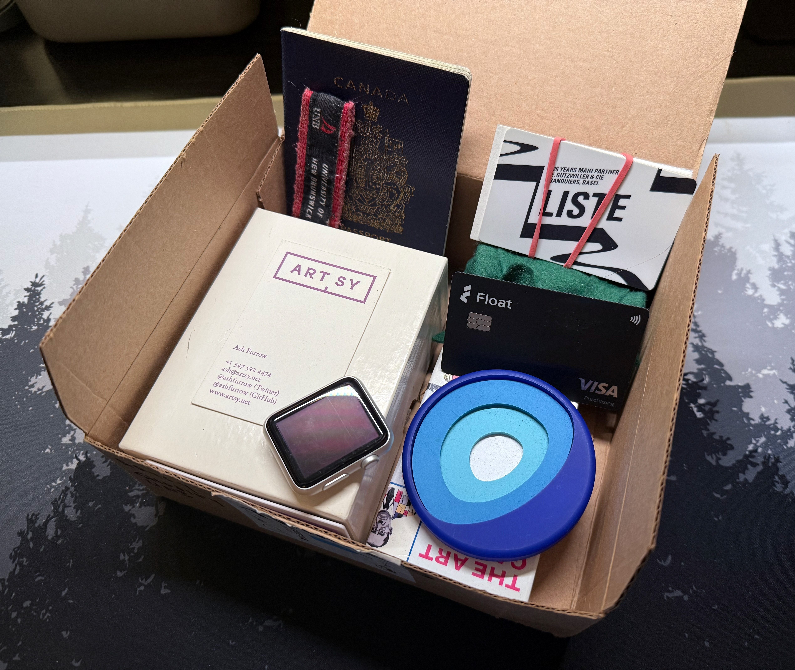

It's with mixed emotions that I'm announcing today is my last day working at [Float](https://floatfinancial.com/). I've accomplished a lot here and I'm grateful for the opportunity to help shape such a young company and product team. I'm sad to say goodbye to my coworkers and I wish everyone the best.

Whatever job I'm in, I always learn something – that's just how I practice product development. But I was surprised by how much I learned _about myself_ at Float. I've worked in early-stage startups before and so I _thought_ I had an idea of what to expect. There were two curve balls I didn't anticipate.

The first is Float's distinct ferocity: _everyone_ at the company cares deeply about Float's success. They work harder than anyone to earn the customers' business, to fight for their market position. I care a lot about my work, so a company full of other people who care about _their_ work was a perfect fit for me. The unexpected part was the intensity. Float is the most ferocious company I have ever worked for. While I'm proud of how I rose to that challenge, I also learned where some of my own limits are.

The other difference is me. _I'm_ different. At other startups I've joined, my role was (at first) to build apps. I grew into leadership positions, but Float was my first time I _joined_ an early company _as a leader_. That brought a whole new set of challenges. I worked more closely with company leadership, I learned more about the business than I had at other startups, and I exercised my autonomy appropriately. That's a lot of extra context to absorb and execute on.

I'm proud of my accomplishments here, as both a technical leader and as an organizational leader. Building an app from scratch is always a lot of fun, and the team I led launched the app _only 99 days after our initial commit!_ Scaling a mobile app within a product organization is always an interesting challenge, and I led the Float mobile app to get contributors from _every_ product team. Being part of a high-growth engineering team is always thrilling, and I've successfully modelled my practice of product development through curiosity and empathy. I joined Float to build a great app, and customers have said the app is their favourite part of Float's product. What a compliment! I'm proud of what I've done and how I've done it.

Failure has always been my greatest teacher. Float is a company where you cannot succeed without taking risks and making mistakes, and I've been successful enough here to have made some of my most interesting mistakes. I'm proud of those mistakes. I treasure them.

Deciding to leave a company is never easy for me, and particularly so with Float. It's a unique company and I'm sure it will continue to make waves. I wish Float and my coworkers well.

I keep a small box of what I call "captain's trinkets." Picard had his flute, Sisko had his baseball, and Freeman had her flag of the California Republic. In my office, I keep a small collection of objects that symbolize meaningful times of my career. Float's first product was in corporate credit cards so I feel it's appropriate to retire my own Float card to the captain's trinkets box.

I have an exciting new opportunity that I'm starting after some time off. When I've described the role to people who've worked with me, they've nodded and said something along the lines of "oh yeah, that sounds perfect for you." I'm excited to share more. Until then, take care!
