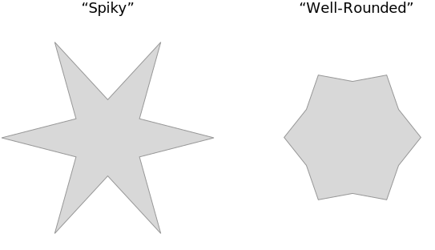

I want to discuss my career trajectory and a chronic issue I've identified with my job satisfaction since becoming a staff developer. It's been subtle and I didn't notice it for years. Maybe this will resonate with you.

After a lot of reflection, I've identified a trend in my career direction that started when I first led Artsy's new Mobile Experience team in 2019. It was the perfect role for me, and I _crushed_ it. But it also set me on a path where I would feel unfulfilled with my work. This trend that I've identified has followed me from Artsy to Shopify to Float. But now that I've identified it, I've got a better understanding of where I want my career to go next.

The trend is not working at my "spikes", doing more and more work that is only "okay." Basically, the amount of my day-to-day time that's spent on tasks that aren't a distinguishing strength of mine. 

## Spikiness

"Spiky" people (also sometimes called "[T-Shaped](https://en.wikipedia.org/wiki/T-shaped_skills)" people) refers to people who have _specific_ areas of professional skill and experience. I'm spiky in mobile UX implementation, for example. Spikes are deep and narrow. Spiky people tend to have gaps, though. These are areas where they have neither the need or interest to improve. One of my gaps is low-level database optimization; it just doesn't interest me and I've never needed to learn it.

You can think of a spiky person as a contrast to a well-rounded person. These two ideas are at either ends of a gamut – no one is "only spiky" or "only well-rounded." But it's a helpful metaphor for professional growth. Spiky people have gaps that well-rounded people don't have, but spiky people can have an outsized impact in their areas of expertise. So it's a tradeoff. 

I like being spiky. My spikes have helped me stand out and get opportunities that a more well-rounded version of myself wouldn't get. I prefer to _manage_ my gaps rather than fill them in because filling them in would smooth down my spikes. After all, there is only so much time in a day and you have to choose where to spend your time and energy. 

Everything has an opportunity cost. Filling in my gaps would mean less time spent getting _even better_ at my spikes. My spikes are also where my interests lie, so doing work in my gaps is already less interesting. Which would help me more? Spending time getting better at mobile UX implementation, or spending time getting better at low-level database optimization? 

There are tradeoffs to being spiky, of course. For example, I _need_ a team to do my best work. Working solo, I can do a _good_ job; working in a team where I can rely on and support others, I can do a _great_ job. I like to work with other spiky people because we help mitigate each other's gaps. A team with a lot of spiky people can accomplish more than a team of generalists, in my experience.

The thing is, though, I haven't been working at my spikes. For a while, I've been generalizing. [I've written about how it's good and fun to branch out](/blog/perspective-of-the-polyglot/), and it is! This is not a post _against_ generalizing. But it's about the consequences and tradeoffs. (Spoilers: [I've also written about stretching myself out too thin](/blog/specializing-in-being-a-generalist/).) I've caught myself accepting that I was a generalist now. I accepted that I wouldn't get to do as much deep work at my spikes – mobile UX implementation – because there were _so many other things_ that my job demanded needed me to do instead.

Side note: a lot of staff/principal developers struggle with letting go of _coding_ as their primary responsibility. At a certain level of seniority, your time is better spent helping your _whole team_ be productive than it is spent on your own productivity. I (and many peers) do struggle with decoupling a sense of accomplishment from a number of pull requests or features built. But this is something different. Because I (and many peers) do find ways to be fulfilled by technical leadership work.

The root of my issue is that I've allowed the needs of my employers to guide my career growth too much. I've become whatever the business needs me to be at the time. To be clear, this has been a successful career! From the business' perspective, it's _really_ handy to have a staff-level mobile developer who can design UI themselves, who can manage their own projects, who can deploy their own microservices, who can even build their own dashboards! That kind of person can jump into any environment and be effective. Businesses love that.

Consider that the Shop Minis SDK that I built didn't have an actual product manager for the first year of its existence. It was just me, organizing the small team of engineers and whatever design capacity we could borrow. Without many resources, I got _a lot_ accomplished. The project was a success even without a PM.

Those other skills, though – design, project management, backend, dashboards – they are not my spikes. I can do them, but... so, uh, the thing is my dashboards are not... exceptional, okay? They're fine, they're good. Dashboards are not a _gap_ for me like database optimization, but they're not a spike either. They sit in-between.

I don't like making dashboards. I find the task tedious. And yet, I've spent more and more time on dashboards over the years. I've had to, to be an effective leader in my different roles. I now have enough "experience in dashboards" that I could credibly list it as a skill on my resume. Ugh.

Upon reflection, I've found myself working further and further away from my spikes in a lot of different ways (not just dashboards). I'm doing many types of work not because I excel in those areas, but because _I can be effective working across many areas_. And _that_ has been what my employers have needed. When I _do_ get to work at my spikes, my work has still been of high enough quality that I can still get a lot of job satisfaction. The tradeoff has worked for me. Also, it feels _amazing_ to be "the fixer" who can parachute in and help any team do any thing. 

But this trend has picked up and the balance has been broken. It led me to not really enjoy my work like I used to. This affected my motivation and the quality of my work.

So what happened? 

### Early Stage Companies

There are a lot of things I enjoy about working for early-stage startups and one of the my favourite aspects is how you get to own a broad domain. To "wear a lot of hats", so to speak. If you see a problem or opportunity, you get to own the solution. There actually aren't a lot of resources in early companies, so being able to handle a broad range of responsibilities is _really important to being successful_ at a startup.

However, such a resource-constrained setting can make it challenging to advocate for resources you _do_ need. I can understand the business' perspective here: why allocate scarce resources to a team who's already so effective without them? There is a great reason, actually. Artsy's CTO dB once explained to me how startups need more and more engineers year-over-year _just to keep shipping at the same velocity_. As you build the product, its surface area grows which increases complexity and risk, which require more engineer time to manage. Not every company understands this.

Over time (especially if you don't get more resources as your own surface area grows) you can easily become overstretched. You can get used to being overstretched, spending _so little_ of your time working at your spikes that the time you _do_ get to feels... almost like a chore? Work you once loved can feel like obstacle to doing the work your team needs... like building dashboards. You can lose your own sense of accomplishment and the sense of shared accomplishment that comes from enabling others.

As your motivation drops, the quality of your work drops too. If you a person who is motivated by doing great work, this can easily become a self-reinforcing cycle where lowered quality leads to less motivation and even worse quality. The whole time, you feel worse and worse.

### AI and the Push Towards Average

The other factor that accelerated my mid-career malaise was AI. LLM tools have had an impact on baseline expectations for many, many roles in the past few years. They let you "do more with less." It's now pretty easy for _anyone_ to make dashboards almost as good as mine! _Despite my years of experience!_ 

It's honestly really frustrating to me. Infuriating! I'm enraged! What is even the point?? If _anyone_ can "vibe chart" then _why_ the fuck am _I_ doing it? AI tools have lifted up the "floor" of dashboard skills which has, in effect, brought me down closer to average. Average! Me! No way.

Now, you could push back here and suggest that maybe _I_ need to use the AI tools to become better at dashboards. Either improve the quality of the dashboards, or build them faster, or whatever. And that would be a fair pushback except _I already didn't want to be doing dashboards._ It's one of many skills that I picked up because various employers needed me to. Using AI to get better at dashboards would just be filling in my gaps ✨ but with AI ✨ and _still_ at the expense of my spikes.

(Besides, if I'm going to use AI tools to improve my skills, then why not use them at my spikes?)

## Mid-Career Slump

I'm really glad that I specialized in mobile software so early in my career. It's been fun and rewarding. I'm also glad that I branched out a few years in. Being able to fit into whatever shape a business needs has been very lucrative. The problem is that I've spent the past six years fitting into other shapes that I've lost a connection to my own intrinsic shape.

It feels a little ironic to end up back where I started, specializing again. But I'm not really "back" here because I'm not the same person I was in 2019.

I'll offer some advice for software developers, advice I wish I had gotten sooner: specialize at first for a jump-start, then generalize quickly after that to accelerate your career. But re-specialize again as _soon_ as possible. Once you become "general enough" to specialize again, do it. Do it _before_ you feel ready.

One of my best skills is being able to discern the most important thing I need to do for a business at any given time, and I've always prioritized the business need. Putting the business first is a great way to get rewarded, but I'm not working _just_ to collect a paycheque. I want to do great work! I'm lucky enough to _get_ to pursue a fulfilling career, so it's time to prioritize my own satisfaction. It's time to find a role where the business' needs overlap with my own.

My hope is to use this reflection like a gravity assist, _approaching_ a career as a generalist before spectacularly sling-shotting away towards a more specialized, more fulfilling career. Gravity assists are famously difficult courses to plot – you have to work backwards from the destination. My destination has been my mobile UX spike. 

I've found my next role in a larger organization where I'll have a narrower focus. I'll have an announcement about where I'm going soon. In my new role, I'll get to leverage my expertise as a specialist again. Fewer dashboards, more mobile UI implementation. Less average, more spiky. And hopefully, a happier me. 
