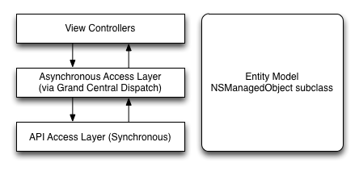
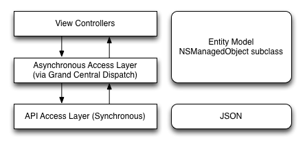
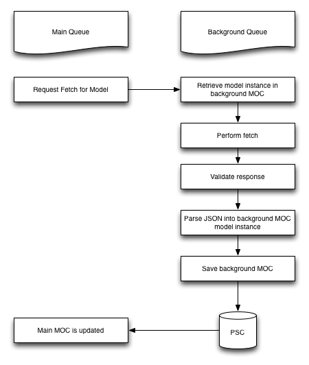
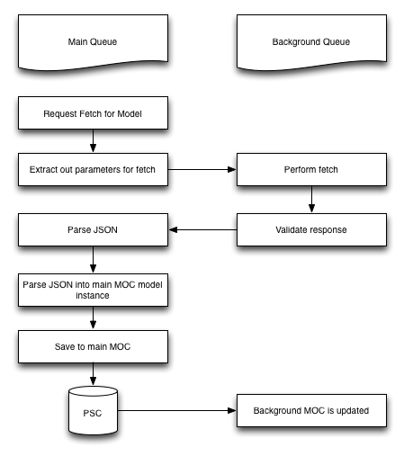
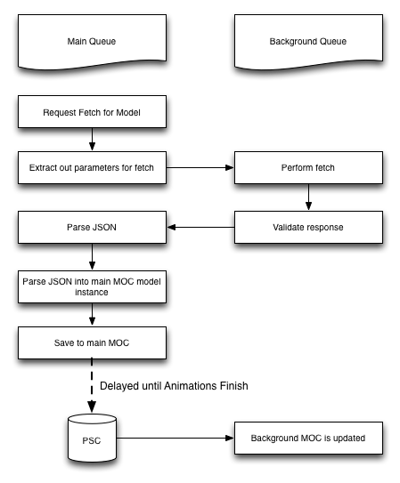

I recently transitioned from keeping data models in memory to persisting them to disc using Core Data. [There are a lot of good reasons to do this](/blog/when-should-i-transition-to-core-data/). This article discusses the finer points of optimizing an application for important data from an external API, storing it in Core Data, and displaying it to the user without adversely affecting performance of the app.

The existing set was fairly elegant; synchronous API fetches were performed in a background thread and invoked using another layer whose responsibility it was to make these calls asynchronous. View controllers accessed this middle layer and provided GCD blocks as callbacks to be executed when the API fetches were complete. The view controllers didn't touch any GCD code and the callbacks were all performed on the main queue.

One of the biggest challenges to getting started with Core Data is trying to do everything perfectly at first. This is kind of, you know, impossible. So I threw out early optimization and went with the naive approach of replacing my data model instances with NSManagedObject subclasses.

Since NSManagedObject contexts are not thread safe, this was not acceptable. An easy to implement solution was to isolate the parsing of the returned JSON to the middle layer; that way, the API access layer can be called from any thread.

This is a good first step, since with a small amount of effort, we've simplified the problem of safely accessing these object instances. Standard practice when using Core Data is to have one Managed Object Context, or MOC, for each thread. When you save one MOC, the modified attributes of the data models are propagated to the other MOCs. So that's what I did next.

Whenever the background MOC is saved, the Persistent Store Coordinator, or PSC, propagates the changes to the remaining MOCs. This is kind of a simplification and definitely not a automatic process; it involves some manual lifting on the programmer's part.

As it stood, the application was fine. It obeyed the conventions for good iOS apps, like MVC and not using view controllers to fetch from APIs, and followed the rules of Core Data with regards to memory management and concurrency.

However, it still wasn't a good app. As you can see in the above diagram, once we were finished loading data from the API and parsing into the background MOC, it needs to be persisted to the PSC and those changes propagated through to the main MOC. A chunk of this has to happen on the main queue, since that's where the main MOC lives. In my case, this adds quite a bit of disc access on the main thread (potentially megabytes of data). When an object has been updated from the background thread, it faults and is updated on the main thread, so changing any attribute or relationship of an object would cause the entire model to be re-fetched.. This lead to a lot of jerkiness in the UI, even a lack of perceived responsiveness. There had to be a better solution.

This is what I came up with. Since propagating the changes was now done in the background thread, it alleviated a lot of the work from the main thread and helped. But the interface was still lagging. I loaded my app in Instruments, and I was saving to Core Data in the main queue a lot. No seriously, like, a lot! I took a look at how the parsing was architected (easy, since it was all contained in one class). I was saving practically every time data was mutated. Since the background queue was only being used to fetch, never mutate, saving often was unnecessary (this is true in my case - your app may be different). So I did the clever thing and only saved every so often.

But how often?

If you try and do something like save every random interval, you're almost literally asking for trouble. You'll probably end up introducing intermittent and hard-to-detect bugs. I tried saving one tenth as often, which fixed the lagging. The only problem was, when it lagged one tenth as often, it lagged ten times as bad. So what to do?

The interface appears to be lagging only because the animation is jerky and the controls are unresponsive. The solution I came up with is to use UIScrollViewDelegate's method that corresponds to the end of a scrolling animation. At this point, the main context saves.

This lets us delay saves until they won't be noticed by the user. While it breaks my architecture of MVC and strictly separating view controllers from data fetches, it makes the best user experience.

The background MOC is now almost strictly used for accessing background instances of the data models. In fact, no parsing or mutating of data takes place in the background queue at all. I _could_ get rid of it altogether, but&nbsp;I'm going to keep the background MOC around since it might come in handy to perform long-running fetches or importing lots of data.

  