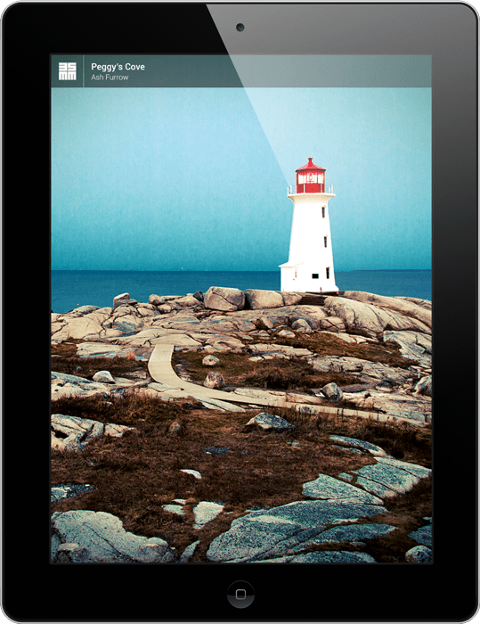

My side project, [35mm](http://35mm.io), launched today. I'm super stoked about it!

35mm is a Newsstand iPad app designed to showcase amazing photography, curated from around the Internet. There are blogs and sites you can get similar content from, but they're all ad-supported. That's fine, but we saw an opportunity for something different.

If you're interested in hearing more about how we built 35mm, check out a [special episode of Springboard](http://springboardshow.com/episodes/2013/10/6/35mm-with-tom-creighton).

If you could [download it](https://itunes.apple.com/ca/app/35mm/id659514572?mt=8) and leave a review, I would be super-grateful. It comes with a free seven-day trial, too!

  