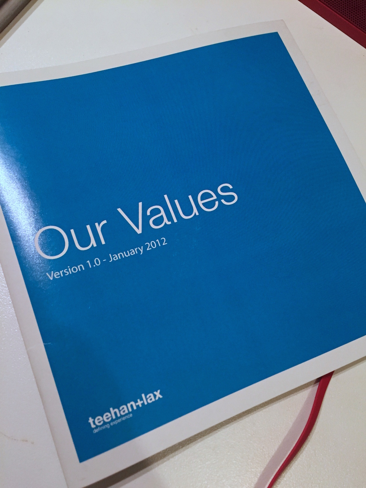

I didn’t realize it at the time, but the ultimate reason I decided to leave 500px was the lack of company values. Decisions were being made based only on what was convenient at the time – never consistently and never using the same thought-process. As an employee, it was chaotic and fostered a hostile work environment.

When I was interviewing at [Teehan+Lax](http://teehanlax.com), Jon Lax handed me a booklet he had designed which defined the company’s values. It was important enough to him as a leader, and to his company, that they have a canonical source of the company’s values. These values defined a framework through which decisions can be made. Consistently.

<Narrow>

</Narrow>

I still have my booklet. It defines the values and also explains why they’re important. Jon would regularly refer back to these values when making decisions. 

Eventually, I left T+L and found my way to [Artsy](https://www.artsy.net). Sometime last year, the CEO Carter Cleveland started the process of defining Artsy’s values. This was super-interesting to me, because I had seen how valuable values were to T+L, but never got to observe the process through which they were defined. 

During the process – which all employees were asked to participate in – a common theme was the value of "love", which at first might seem a bit lofty. At first, I was surprised to hear Carter discussing something as abstract as love in the context of company values, but it made sense very quickly.

It may seem strange for a company to value love, but I think it makes a lot of sense. Artsy's goal is to make art as accessible as music; a company that operates out of love has a higher chance of success. 

----------------

Now that Artsy has defined values, we're working to operationalize them: to make sure that they're a normal part of everyday work. Part of that is our hiring process. Companies have lately begun using "cultural fit" as a metric of evaluating potential hires, but this is a [terrible idea](http://mobile.nytimes.com/2015/05/31/opinion/sunday/guess-who-doesnt-fit-in-at-work.html) because it leads to subjective decisions based on interviewers' biases. Instead, we're working on an objective rubric that measures alignment between personal and company values. 

Hiring is only one decision-making process. Ultimately, all decisions will be informed by our values. 

I've never been more excited to be doing what I'm doing, and who I'm doing it with. 

  