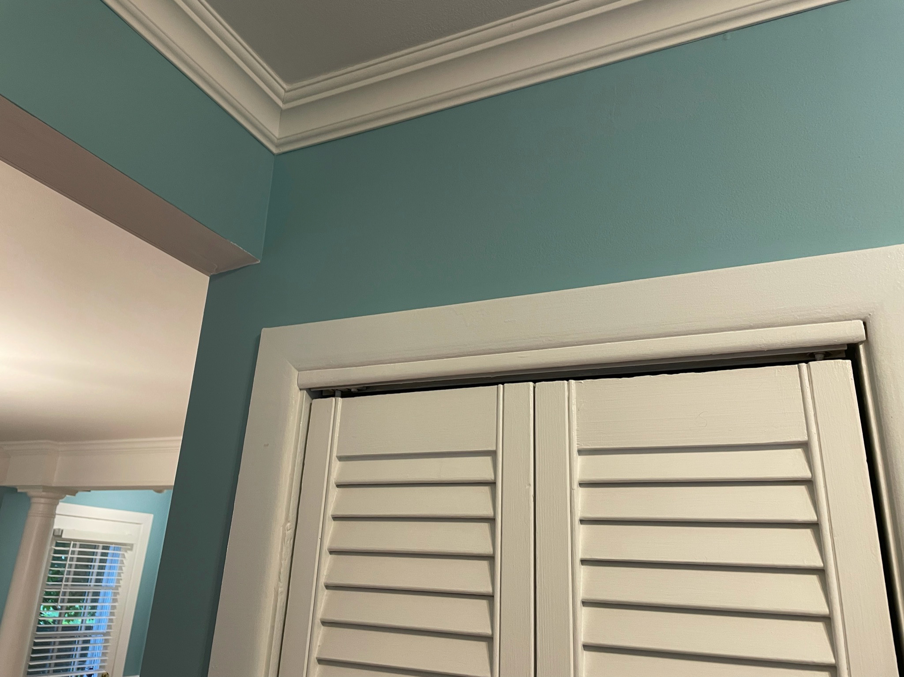
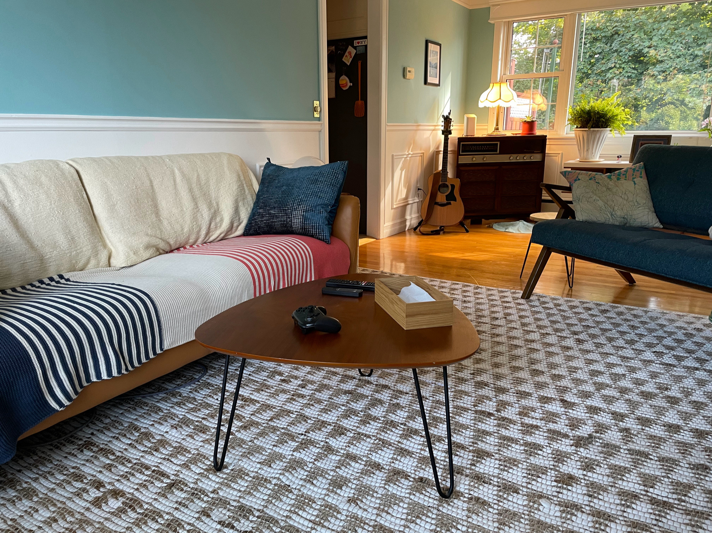
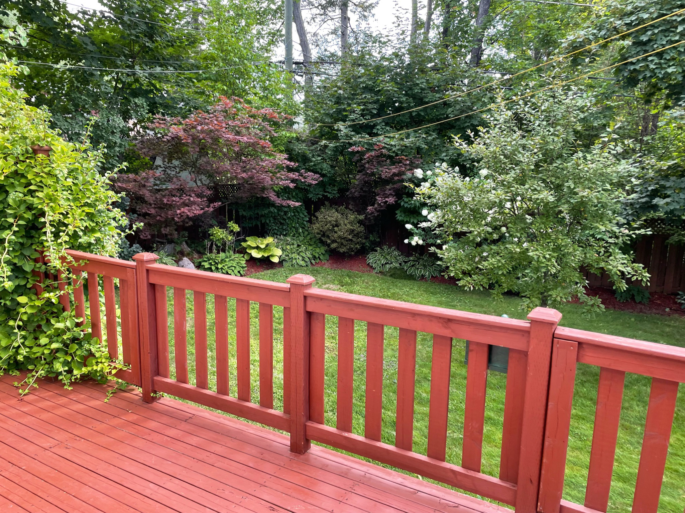

[In my previous post](/blog/what-happens-next/), I mentioned that my wife and I have purchased a house and that we'd be moving in soon. I wanted to give an update on how all that was going, but, it turns out that buying a home and moving into it are a lot of work. I've also been, generally, very very busy.

Literally, we closed on the house this one weekend, and the next weekend I ran my first ever race, and the next we moved into the house. All while a big work project wrapped up, so uh, yeah!

Hmm? Photos?

<Wide>

</Wide>

Okay okay, so I didn't _actually_ move into this old house in Hateno village – I moved into an old house in Fredericton 😅 But I enjoy my privacy so I'm not going to post that many photos of my new home.

It's a bit older of a house, which suits us perfectly – my wife and I both grew up in older homes. This house has obviously been cared for, and has been well-maintained over the years. Before we moved in, we had its main floor painted and it looks _so good_. We've also had a lot of fun getting the main areas set up.

<Wide>

</Wide>

My home office is upstairs so I get a stronger division between my "work" area and my "living" area. We even have more than one bathroom, so gone are the days of conflicts between my meeting schedule and my wife's bathing schedule. I've set up the home gym in our basement. It's great that my office can be _just_ my office, instead of combination office-and-gym-and-also-that's-where-the-piano-goes-I-guess.

Hard to believe that just one year ago, we were living in a tiny Manhattan one-bedroom apartment, whose kitchen featured only a single drawer, _and_ I was working from home full-time. Wild!

When we moved back to Fredericton, we knew we wanted to buy a house _eventually_ but didn't expect it to happen so soon. But after the financial dust settled from our move home to Canada and my new job, we found ourselves in the privileged position of being able to afford it, so we figured "why wait?"

Most of our moves over the past decade have been quite... a lot. We thought that moving between provinces was difficult when we did it a decade ago, but that turned out to be comparatively easy once we had moved between _countries_ several times times. So when we bought a house that wasn't far from our apartment, we figured we could just kind of coast on this move. Probably we should have been more organized, but whatever. It's hard moving twice in one year and honestly, it all worked out anyway.

The transition from apartment living to home ownership is a real trip. I'm acutely feeling the responsibilities of owning this house. For a while, I would jump at every floor creak or wall scuff. Apparently this is normal for first-time home buyers.

In previous apartments, we've been able to get them fully set up the way we like them in a matter of weeks. A house is a lot larger than an apartment, though, and we've found ourselves compromising a lot more than we used to. I find myself saying "I can live with that", which, I dunno. That's new. There is something so appealing to me about crafting a space that is uniquely our own, that reflects and supports our life. But that's also a tonne of work!

For example: the previous owners did not understand lightbulbs. You may already know, but lightbulbs have a "temperature" rating that indicates how "warm" or "cool" their light is. Most light fixtures in this house have two bulbs, and _every_ one of those had one "warm" bulb and one "cool" bulb. Were they trying to blend harsh blue and rusty orange into a perfect synthesis? It's unclear. The disparency drove me nuts when we first took possesion! I vowed to unify the bulbs under a common kelvin degree, but sometime after I got the main living area under one bulb, I lost steam.

Whatever. I got the main bulbs fixed, and I can live with the rest. When the back porch lightbulb dies, I'll deal with it then.

<Wide>

</Wide>

The other morning, I woke up and went to the bathroom. As I looked out the window into the back garden, I saw a cat sniff around, dig a whole, squat, and "go to the bathroom" itself. For a brief moment I felt powerless – how dare this cat crap in my garden?! – but then I realized that the cat does not care _at all_ that this is "my" garden. It's a cat, and this garden is outdoors. The whole yard is outdoors, and so it's all up for grabs.

The house itself is outdoors, actually. It feels obvious to say that, but the distinction between "indoors" and "outdoors" is becoming increasingly important to me. The house isn't just a building – it's a volume of low entropy. And the universe is doing everything it can to smear my beautiful low-entry artifice into disarray and chaos. It's motivating, in a way. The universe is trying to destroy my home, and given enough time, it will win. But there's no way in hell that it's happening while I own this place.

<Wide>

</Wide>

I have a back yard – yay! The backyard also has a workshop – also yay! I haven't quite figured out exactly what to _do_ in the workshop, but I have years ahead of me to figure it out. Wood-working, probably. That seems to be what all experienced programmers do eventually. I'm keeping my eye out for a good deal on a used table saw.

I guess that's the biggest adjustment from apartment living: being able to think longterm about the space I live in. It feels totally new to me. I'm grateful to be here now, but looking back, I find the whole idea of paying rent to a landlord kind of... repulsive, to be honest. I'm sure it's a great deal if you're a landlord, but if you're a renter, well... it sucks.

After [reading an old blog post](/blog/ios-versus-javascript-how-to-learn-from-other-programming-communities/) recently, this passage popped out to me:

> I think there are benefits to both renting and owning your home. I **like** renting, actually, because it keeps me mobile – I can pick up and move from one city or neighbourhood to wherever I want. It’s not for everyone, but it’s right for me at this point in my life. (And I couldn’t afford to buy a house in Manhattan anyway, so.)

Again, really wild to me how quickly my life situation has changed. I don't live in Manhattan anymore, and I don't care _at all_ about being mobile. I'm here to stay. And I'm really, really grateful to be in this position now.

So tl;dr owning a houses is great but also terrifying and a huge adjustment. It's stressing me out, but mostly in a way that's normal. Mostly.
