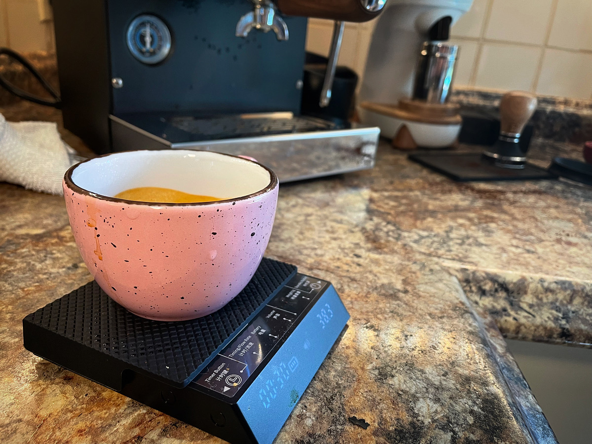

It started with a stall. I was making a pour-over coffee and the brew stalled out. I was left with a bitter, over-extracted mess in my cup. And it kept happening, again and again over weeks, even though I hadn't made any recent changes to my coffee setup.

Hmm. I'd have to do some research.

---

Over the summer months, I have continued to struggle with my mental health. This summer has [been a lot](/blog/summer-fam-jam/) and my wife and I were hoping for a quiet fall. Unfortunately, that doesn't look likely, for different family reasons. Life has been – and will continue to be – straining.

It's been really difficult getting excited about anything. I can't motivate myself pick up a camera or a guitar, for example, even though I enjoy those hobbies.

One thing that I've bene trying to do lately is capitalize on any excitement I _do_ happen to feel.

Before [leaving Canada](/blog/moving-to-amsterdam/), I was into espresso. [I had a nice machine and grinder](https://ashfurrow.com/blog/new-espresso-machine/), and I even still follow the coffee world. I was never that _good_ at espresso, but I was _deep_ in the weeds: roasting my own beans, making espresso drinks for friends and coworkers, browsing forums all the time.

When we moved overseas, I had to sell my gear. Then, living in New York, we never had the room for an espresso machine. Instead, I made pour-over coffees. These are great because you have the _option_ to fuss without _having_ to fuss. Usually, even a bad pour-over tastes okay.

---

I continued trying to fix my stalling pour-overs. It took time and research and trial-and-error, but I finally resolved the problem: my pouring technique was disturbing the coffee bed, leading fines to clog the filter. During all that research, I stumbled (back) into Weird Coffee Person Internet. And among Weird Coffee People, espresso is supreme.

I started reading reviews of [coffee grinders I would never buy](https://www.option-o.com/lagom-p64), or watching video reviews comparing [espresso machines that wouldn't even fit in my kitchen](https://home.lamarzoccousa.com/gs3-configurator/). I was getting excited, and I wanted to capitalize on that excitement. My old blog posts about coffee made for good reading – it was easy to relate to my old self and feel my old feelings. That previous excitement rubbed off on me.

In a move that's typical for me, I looked for reasons to not get excited – but even [articles detailing how no one should really make espresso at home](https://www.nytimes.com/wirecutter/blog/making-espresso-at-home/) only got me more excited to dial-in and fine-tune.

One thing that photography and music share with coffee is a focus on – and celebration of – gear. Photographers love to compare cameras and do crazy things like tattoo lens diagrams on their bodies. Guitarheads love to go on and on _and on_ about different tone woods and pickup designs. And espresso lovers similarly love to scrutinize distribution tools and grinder burrs.

And although good espresso is also subjective, I would say that photography and music are _more_ subjective. Espresso is about repeatability and controlling variables. It's creative in the way that baking is creative – it is clear when you've achieved your goal.

It's been nearly two weeks since I got [my new espresso setup](https://www.instagram.com/p/CiSrgw7OE6N/) and I'm really enjoying it. Espresso has changed _a lot_ in the decade since I gave it up. I'm catching up on a lot that I forgot and I'm learning a lot that has happened since. I'm already pulling better, more consistent shots than I was ten years ago with more expensive equipment. I've even returned to [the local roaster](http://jonniejava.com/Paradise_Imports_%26_Jonnie_Java/Welcome_to_our_site.html) that first got me deep into coffee to start with.

I'm excited. This has not been without its frustrations, but it's been fun. I'm excited for it, and I'm excited to be excited about anything, honestly.

Let's see.
