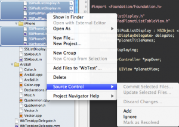

UPDATE: Apparently just initializing an empty repository in the project directory is enough; Xcode autodetects it for you. It be nice if something to that effect was in the documentation. Thanks to Jason for that ( [details here](http://nearthespeedoflight.com/article/creating_a_git_repository_for_an_existing_xcode_project)). Open the project directory in a terminal and type the following:

```
git init
git add .
git commit -m "Initial commit"
```

I got Xcode 4 - pretty impressive. I've been waiting to get this stable release since I was at the demos at WWDC last Summer. I was particularly excited about the new Git integration.

New Xcode projects will let you keep local git source control. Using an existing project with this local source control is ... difficult. I tried for a while before almost giving up. Documentation around the "Add Working Copy" is almost non-existent. This is how you do it.&nbsp;



1. Move your existing project folder to your desktop.
2. Make a new, empty project in Xcode with the same name as your project. Make sure the box for using a .git repo is selected.
3. Close Xcode.
4. Copy all files from the project folder on your desktop to the new project folder Xcode created.
5. Double-click the project file.
6. You'll now need to add all the files to the source control since (they'll all have question marks beside them, shown right).

I tried adding initializing an empty git repo and importing into Xcode with no luck. If anyone has a better solution, please let me know!
