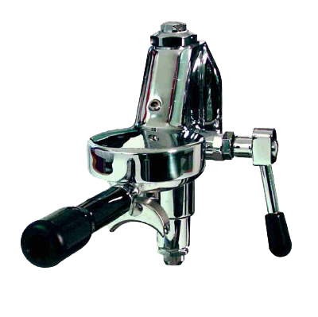

I'm considering my options for buying a [new espresso machine](/blog/new-espresso-machine/) when I move. There are two main factors weighing in on my decision: heating type and group head. I'm settled on a semi-auto machine; that is, unless my friend Nick convinces me to join the La Pavoni club. There are several different ways an espresso machine can heat the water before it pushes it through the portafilter to make espresso or to steam milk.

### Thermoblock

Imagine how a car's radiator pumps hot liquid through a pipe wound inside some grills which are cooled by the air as you drive. A thermoblock is the exactly opposite of this; you run cool water through a pipe wound inside heated grills. This is what I have now, and it's not great. It's unreliable in terms of pressure and temperature, the latter being critical for a great shot.

### Single Boiler

A single boiler machine is, well, a machine with a single water boiler. It's the most common system in higher-end consumer and lower-end prosumer machines. Usually you have two thermostats - one for coffee and one for steam. This means between brewing and steaming, you'll have to wait for the boiler to heat the water up a little more. Not a huge deal, especially since I typically only make espresso for myself.

### Heat Exchanger

Heat exchangers have a single boiler, used for steaming milk. A coil is wound _inside_ the boiler, separating the water in the coil from the heated water in the boiler. The water in the coil is flash-heated to the perfect brewing temperature. You get the benefits of a dual boiler (below) at a fraction of the cost and energy use.

Heat exchangers are effin' cool and I want one. However, they don't exist below $1000 so it's very unlikely I'll get one. Right away, anyways.

### Dual Boiler

This is excessive for most homes; some dual broiler machines require two plugs or a 220V plug to operate. Since the boilers are independent, you can steam milk and brew coffee at the same time and at different temperatures. This is definitely overkill for what I want.

The other main consideration is the E61 Group, featured right. It's sort of a standard in the espresso world. The advantages include an expansion chamber to aide in pre-infusion, its popularity, and looking completely badass. If you were ever going to kill someone with part of an espresso machine, you'd pick an E61 Group.

Their usually limited to Heat Exchange machines, but you can get some on single boilers. Their popularity means getting accessories like portafilter baskets, naked portafilters, and tampers would be a breeze. Not that I already don't have a new [Reg Barber](http://www.coffeetamper.com/store/pc/viewCategories.asp?idCategory=3) tamper picked out.
