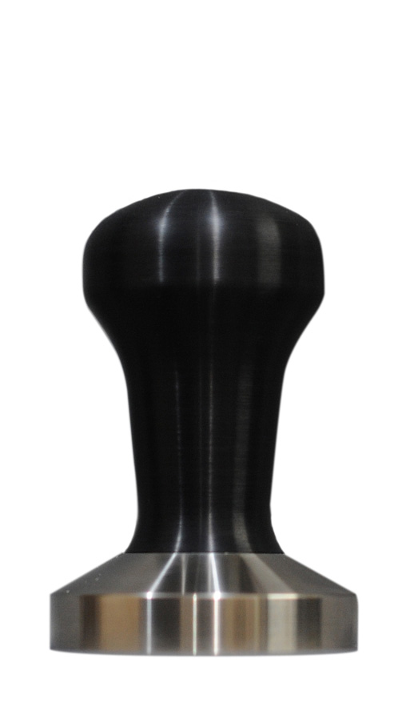
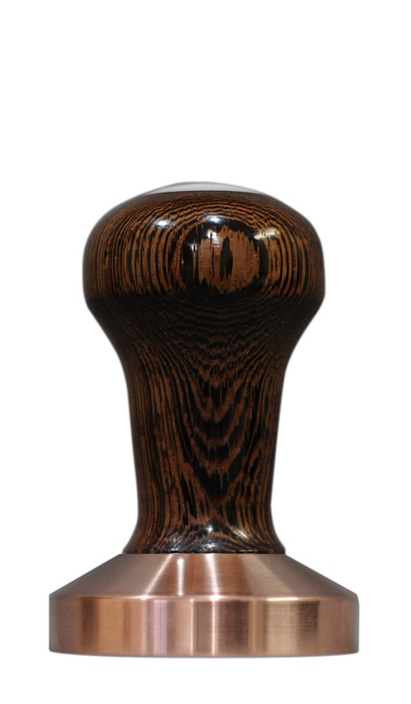

I'm moving to a big city, leasing a big city apartment, and getting a big city job. Additionally, I'm getting a big-city espresso machine. I'm not going to post which one in case you all try to convince me I've made the wrong decision, but I am going to need a new tamper.

My current one, a Reg Barber with a plain black handle and standard [RB logo](http://www.seattlecoffeegear.com/v/vspfiles/assets/images/reg180.gif) delron, has served me faithfully for two years. Something I never experienced, but has been discussed a lot on Coffee fora online, is the personal connection one feels with their tamper. My friend says he has the same experience with bookmarks while he's reading a book.

I've decided to sell my old tamper with my old machine and get a new tamper that's a little more personal. I'm going back to Reg Barber once I move and getting a nice wooden handle and copper base.

It's a wenge wood with a copper base. I think feeling the grain of wood will make it a little easier to feel connected to my tamper and make the act of creating espresso a more satisfying experience.

[Reg Barber](http://www.coffeetamper.com/store/pc/home.asp) has always been very good with email communication and is very active in the online coffee community. He even "likes" [CoffeeTimer on facebook](https://www.facebook.com/pages/Coffee-Timer/380859466680). His hand-made products are well known to be among the best in the espresso world.

  