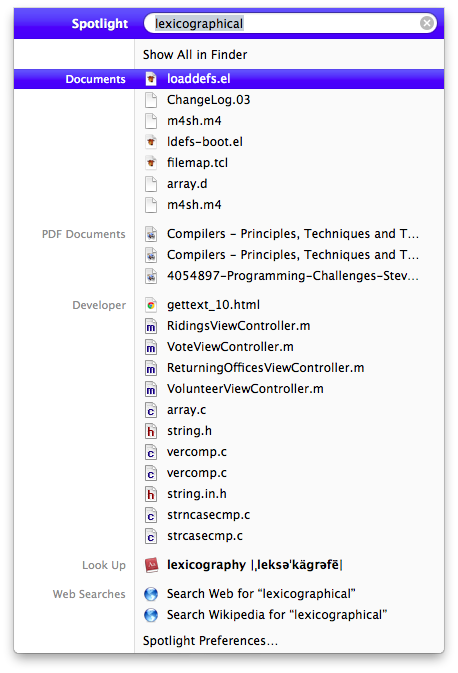
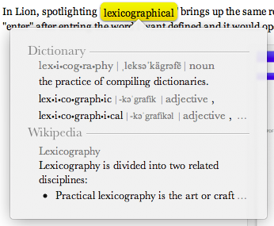

When I'm at work, I still use Snow Leopard (for a number of legitimate reasons). When I come home, I use Lion. And it's a little jarring. Just like when iPhone OS 3 came out and introduced spotlight and when I used someone else's iPod Touch with iPhone OS 2, it wasn't there. When my established workflow changes, it bothers me. In Snow Leopard and all previous versions of OS X with spotlight, search for a word like "lexicographical" would bring up (at the top) a dictionary entry for the word, followed by any documents, emails, and browser history with that word in it.

In Lion, spotlighting "lexicographical" brings up the same results, but the dictionary definition is all the way at the bottom. Before, I could hit "enter" after entring the word I want defined and it would open the dictionary. But now I have to actually use my mouse to click on the word. Why?

It's because looking up words in Lion is done by way of a double-three-finger-tap on a word. That's right, three fingers, tapped (not clicked) twice.

I love to use Apple products and I Apples their attention to this level of detail, but my god am I having trouble adjusting. I've always thought it was great that Apple subtly gives cues on how to use their products, that it was a great way to herd their users away from antiquated practices. Until they tried to herd me.

Honestly, I'm still having mixed feelings about Lion. It feels like a work in progress, a transition to what Apple's desktop OS _is going_ to be. I'm picturing an OS X House Cat 10.8 that looks more like iOS 6 than Snow Leopard.
