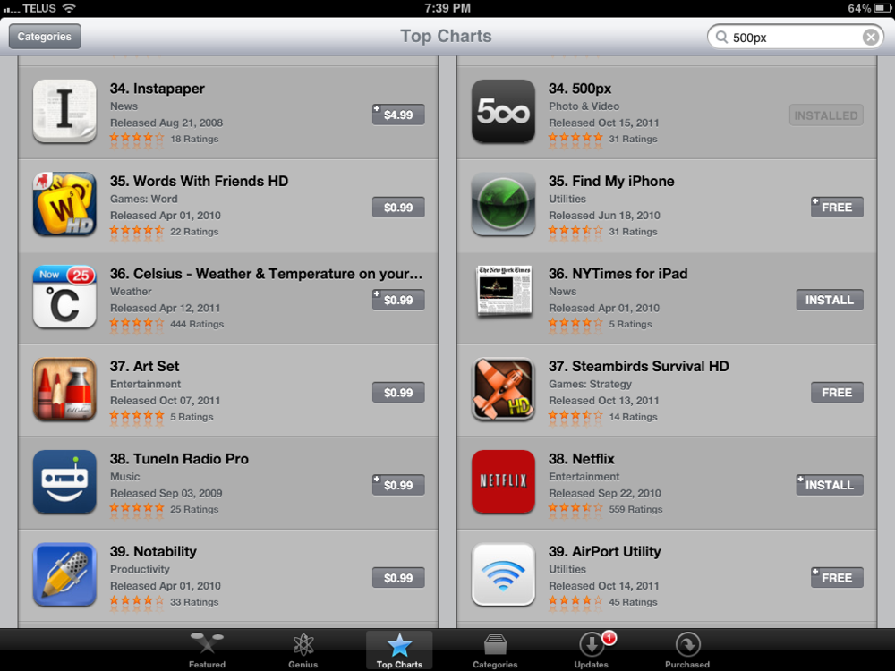

Recently, I blogged about [Code Idols](/blog/code-idols/) and how I look up to [Instapaper](http://www.instapaper.com/u) creator [Marco Arment](http://www.marco.org/). Well, just this last weekend, we at&nbsp; [500px](http://500px.com/) released [our new iPad app](http://500px.com/ipad)&nbsp;to tremendous applause. It had been 7 weeks in the making and a lot of fun. Already, within 4 days of launching, we were at the #34 spot for free iPad apps. _All of them_.

We're currently beating Google Earth, "Find my iPhone", and Netflix in terms of free app downloads. _In four days_.

But what I'm most proud of is that my app is being featured beside Marco's, who holds the #34 spot for the paid category. Awesome.
