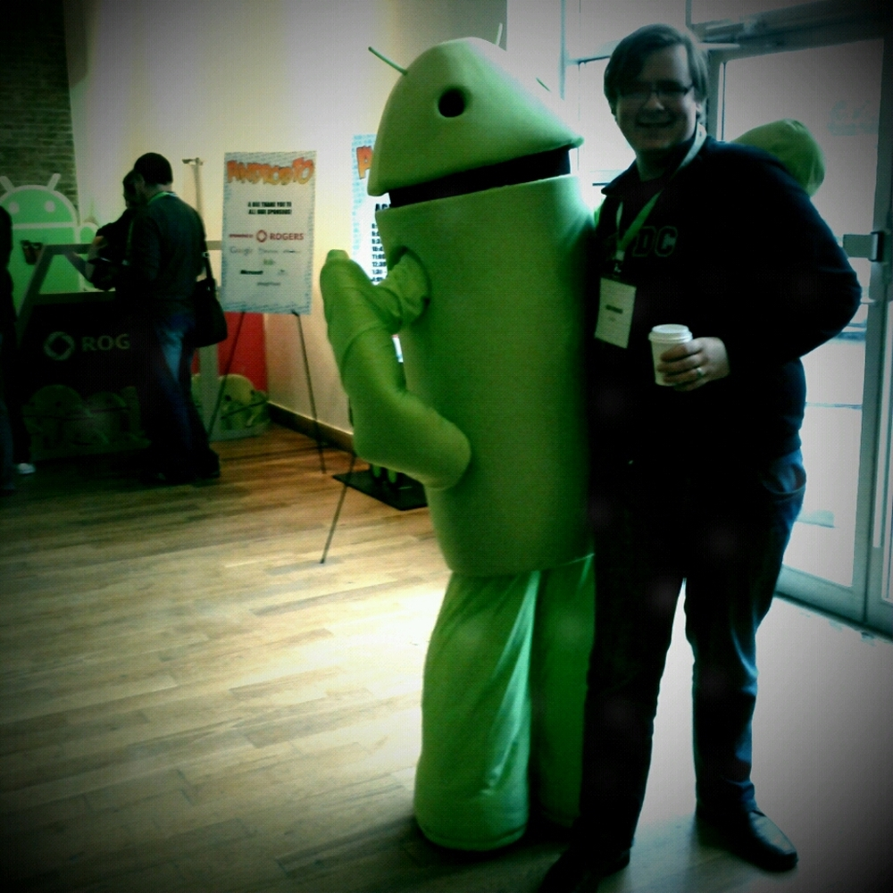

My coworker Tom posted this morning on&nbsp; [what he learned from AndroidTO](http://tomcreighton.com/2011/10/antenna-headed-stepchild/)&nbsp;which forced me to finally write down my thoughts on the conference.

Unlike Tom, I attended mostly the developer track. I didn't have any expectations, but somehow it wasn't what I expected. Many of the profesional presenters seemed&nbsp;unprepared&nbsp;on stage - some looked like they were going through their slides for the first time in front of their audience. Normal people have a hard time giving presentations and, let's face it, most developers aren't ordinary people, but this was a little unreasonable. Demos didn't work. Code didn't compile. Code examples were shown in 11pt font on the overhead projector.

Tony Wong and Greg Burgoon from Xtreme labs were a welcome change; their presentation on some open source Android UI elements they developed was polished and well done. The content itself, while interesting to an Android developer, was less appealing to me as an iOS developer. They managed to duplicate the table view stack made iconic by the Twitter table app, reproduce the functionality of UIPopoverController's in iOS 3.2+, and replicate MKAnnotationViews on a map. All these UI elements are important for the user experience, but two of the three are included in iOS and the third is available from [CocoaControls](http://cocoacontrols.com/).

What I really took away from AndroidTO is that Android is a great platform for hobbyists willing to run hobbyist software. Android, as a platform and an OS, lacks polish, even if it has a few features missing on iOS.&nbsp;I'm not interested in developing for the Android platform.

Ironically, I checked out the Microsoft booth, and I'm _very_&nbsp;impressed with WinMo 7.5 "Mango" running Metro. Why was I impressed? Intuitive interface, meaningful apps, and, most importantly, a _responsive interface_. This is the one thing that I cannot forgive Android for. When I put my finger down on the screen and pan, I expect whatever is under my finger to move. _Immediately_. Anything less and you've broken every UI metaphor you've tried to create for the user.

I think Apple has less to worry about from Android, and more to worry about from Microsoft. I'm even considering installing Visual Studio and having my hand at it - it looks like a fun platform to develop for.&nbsp;
