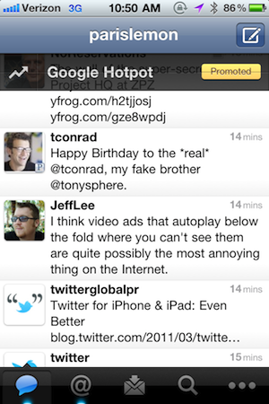

The first lesson I learned about business was to keep the customer happy. If the customer was happy, then you would get paid. Another lesson I learned, years later, was that when making software, your customers weren't necessarily your users. I've worked, among other places, for various businesses over the past few years: a .Net shop writing entreprise software for corporations as large as Thompson Reuters, a small contractor shop, a "disruptive, pre-revenue social media startup" (what a clustermess that turned out to be), and presently&nbsp; [500px](http://500px.com/), a startup that allows features photographers' best works. In working for such a variety of shops, the lesson I mentioned have a sort of&nbsp;corollary: in software development, you make decisions that are in the best interests of your customer, not necessarily the user.

As I've talked about, before, [I'm in the business of making users happy](/blog/ash-furrows-holistic-software-development-agency/). I want to, above all else, make decisions that are in the _users'_&nbsp;best interests. The easiest way to do this in my professional life is to work for a company whose&nbsp;_users_ _are their customers_. That's what I love about work at 500px.

When I worked for the entreprise software shop, that's what I got. Then again, writing entreprise software meant I didn't have a lot of opportunities to make decisions that directly affected users.

At the contractor agency, the clients were the people we were writing software for, and their users were our users. In this situation, making your clients happy can mean making decisions that adversely affect the users experience of the software you're writing. "A pop-up every 5 seconds to let users know of all the benefits of signing up? Sure! Why not?" I've written software that I disagreed with, on principle, because it's what my customer wanted. And I didn't like it.

"Social Media" startups are the most interesting, since their customers are necessarily almost never their users. At these businesses, it's the most snaky, since getting customers requires first having users, and having users requires a great user experience. As a business, you're selling your product (your users' attention) to your customers, the Advertisement Agencies&nbsp;(see:&nbsp; [Customers as Body Parts](http://5by5.tv/buildanalyze/44)). A software developer there sort of has to "fake it" - making a great users experience while having someone else's interests in mind. I can just see some poor soul at twitter trying to argue against the Quick Bar twitter management tried to introduce to the iOS app before realize that users don't want your ads literally shoved at the top of every screen, forever. I bet the software developers who wrote the Quick Bar saw it's demise before the management did. That's what I like to think, anyways.

At 500px, our users are our customers. Those that aren't paying for us are potential customers, and it's my job as a software developer to _make people happy_. I love that. I never have competing interests distracting me from what I love to do. As a guy who has, for years, dreamed of being paid to just make cool stuff, I couldn't be happier.

There are a few other niche products, but for the most part, if you're developing software, you're either selling to your users, writing software for clients, or selling to someone other than your users. Or you write software for the government, in which case, god help you.
