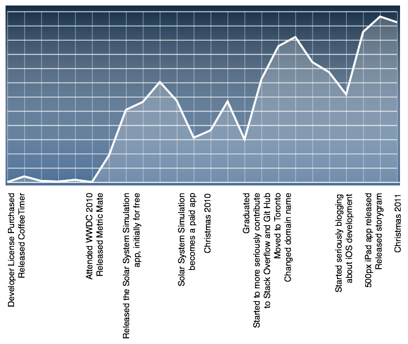

It's been two years since I decided to start developing iOS apps and wrote Coffee Timer, the app I was sure would sweep the App Store (it didn't). At the time, I couldn't afford a new Intel Mac, so all my development was done on my then fiancées MacBook and my first generation iPod Touch. Here is a graph representing sales of paid apps over the past two years.

The graph represents total unit sales for those months, not total revenue. Additionally, I'm not actually releasing the actual numbers, so it's sort of a qualitative graph.

I've annotated it to include events that I feel affected (or rather, effected) sales of my apps. Having popular free apps helped, initially, but I've found in the long run, selling the Solar System Simulator for $3 nets more than releasing it for free and getting incidental traffic from the App Store. The prices of my apps have also fluctuated as I experimented.&nbsp;I have tried several different ad campaigns, but none of them seemed effective, so I'm not labeling them.

Most importantly, I think, it's been&nbsp;notoriety&nbsp;on the Internet. Around when I graduated, I taught a three-day workshop at UNB on iOS development. Blogging, changing my domain name to be something reasonable (not coffeetimerapp.com) and contributing to online communities like Stack Overflow and GitHub have helped me become more visible as a professional, and I think that's what's helped me the most. Now, not only do I get (modest) income from my app sales, but I also landed an awesome job making awesome things.
