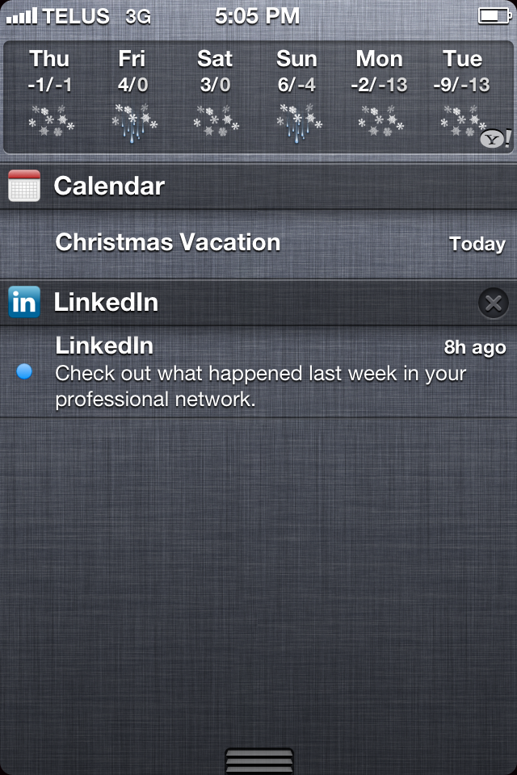
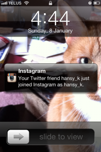

In iOS 4, Apple introduced push notifications and Android fanboys switched from the "iOS sucks because it doesn't have push notifications" gear to "iOS sucks because it copied Android and now has push notifications." While most Apple developers were happy about the new push notification service, a few companies sat at the back of the&nbsp;Presidio trying to contain their excitement about all the ways they could fuck this up.

## Don't Spam Users

This should go without saying, but LinkedIn managed to forget this, so let me be clear: <strong>do not spam your users</strong>. Push notifications are <strong>not</strong> yet another way for you to send a newsletter to your users. If you do this, your app <em>will</em> be uninstalled.

"Check out what happend last week in your professional network." That's not a notification! That's a fucking email! Which I <em>also</em> receive! Fuck!

The justification LinkedIn probably has for this is "people can just disable LinkedIn in the Notification Center if they hate it enough, right?"

Right.

Except for one thing: that's hard and uninstalling your app is easy. And satisfying.

Never underestimate your users' desire for vengeance after you mercilessly stole their attention for a fucking newsletter.

## Use the Notification for More than Just Opening your App

When a user opens a push notification, your app should show the user whatever that notification represents. An email, a tweet, or a friend request, whatever it is you notified the user about should appear on the screen.

When I get a notification from Instagram, I might as well had not got it at all. All it does is open the damn app. When I'm notified about a thing, <em>show me that thing!</em>

If someone commented on my photo, show me that photo. If my twitter friend joined Instagram, take me to their profile page. This shouldn't be that hard, guys!

## Take Advantage of the Notification Payload

When your server sends the notification payload to Apple, it includes information like the text of the alert, what sound to play, and the badge number to display on your homescreen icon. However, you can also specify whatever else you want, as long as you don't exceed Apple's limit on payload byte length. This means that when I open a notification from a <em>good</em> iOS application, like Tweetbot, not only do I see the tweet the notification represented, but it's also loaded <em>instantly</em>. That's because Tweetbot sent the tweet text along with the notification, so I don't have to wait for it to load from the Internet.

Twitter, on the other hand, takes me to a page that will load my tweet. <em>If</em> I'm connected to the Internet at the moment. It's slower and less reliable than Tweetbot.

