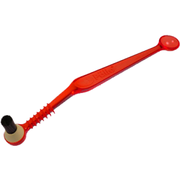

We got one of [these bad boys](http://www.amazon.com/gp/product/B004QDYM9M/ref=as_li_ss_tl?ie=UTF8&tag=ashfur-20&linkCode=as2&camp=1789&creative=390957&creativeASIN=B004QDYM9M) at work a few weeks ago for our Rancilio Silvia. If you have an espresso machine, care at all about your coffee, and don't want to burn your hand every time you wipe off the group, you owe it to yourself to buy one. As the guy who cleans the espresso machine at work, it's a godsend.&nbsp;

The thing is magic. It keeps the hot water from touching you, has [removable bristles](http://www.amazon.com/gp/product/B001D075RC/ref=as_li_ss_tl?ie=UTF8&tag=ashfur-20&linkCode=as2&camp=1789&creative=390957&creativeASIN=B001D075RC) so you don't need to buy a whole new one when they wear out, has a pointy thing for scraping out your steam tip (don't be creepy), and even has a little spoon for picking up machine detergent. I _hate_&nbsp;touching detergent tablets.

This is the only aspect of making coffee I enjoy more at work than I do at home.

  