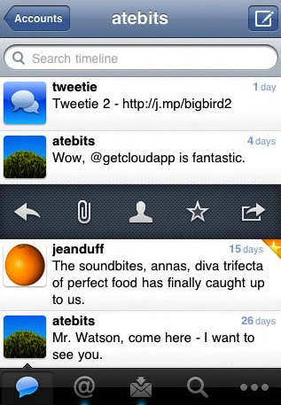
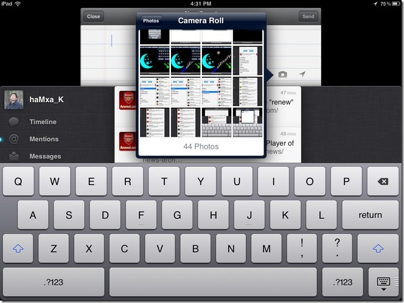

When designing iOS applications, there are two routes you can take: you can either strictly adhere to Apple's look-and-feel, or go out and do your own thing. In this post, I'm going to discuss each option, their pros and cons, and why you should adhere to either one or the other.

App developers, I feel, tend to one of two extremes: a cookie-cutter Apple-y app or a Frankenstein mess of disjoint ideas shoved together (just because you _can_&nbsp;doesn't mean you _should_). Let's look at the first option and see how you can create a great app using all the built-in goodness of UIKit but diverge to make some unique interfaces.

### Adhere to Apple's Look-and-Feel

This option is the best option for most people. Apple provides amazing libraries of user interface elements that can be combined to make great apps. This _doesn't_&nbsp;mean that you can't be innovative and are forced to make cookie-cutter apps; only that you should focus on what the user is familiar with and expects.

This option has many, many advantages. The user will feel &nbsp;at home and know _instantly_&nbsp;how to use your app. If you're a developer, you're probably bad at understanding the user's expectations, so using UIKit for everything means Apple has done _all_&nbsp;the user interface design for you (hooray!). Using UIKit is always _way easier_, so you can spend you're time doing things that make your app functional and unique, like figuring out Facebook's API.

However, developers often feel like using all the pre-made stuff is _boring_. Tough cookies. You know what? Programming isn't always exciting, and if you're interested in making a great iOS app, then you have to be aware of the user's expectations. Otherwise, you're a loose canon and should probably just go write Android apps until you finish puberty.

Let's take a look at one beloved example: Tweetie.

What I admired about Tweetie was the way it combined the existing system interfaces and made a functional app that always behaved as I expected while also not looking like a cookie-cutter apps. They used all your standard view transition conventions - navigation stacks, tab bars, and modal views, and all appropriately.

Yes, they customized the tab bar a bit, but it _behaves_ the exact same. Yes, the tableview cells had custom actions for a swipe gesture, but the underlying controls look suspiciously like a UIToolbar instance. Yes, they were the first to implement pull-to-refresh, but it only takes about a half hour to make pull-to-refresh using nothing but built-in UIKit elements.

Tweetie would make any user familiar with their iPhone feel completely at home and in control of the interface, but they still made some really innovative interface components that makes it a memorable app.

Using the pre-made UIKit elements is faster and easier. It doesn't require up-front graphic design work, so programmers can work solo while they complete their functional app, hiring designers near the end of the project. It lets programmers mess around and try things with limited risk of loosing a lot of time and, most importantly, gets novice iOS developers familiar enough with UIKit and Core Animation to roll their own interfaces (see below).

You can easily add innovative interface elements, as Tweetie did, later in the project. In fact, it's best you do so, so your _working_ app has some neat features &nbsp;instead of a crappy Twitter timeline demo with Stage-4, fully-metastasized&nbsp;feature-creep.

### ... or Roll Your Own

This alternative option is best suited for development teams with graphic designer talent. (No, developers who have a pirated version of photoshop and get confused about how the _Pen_&nbsp;tool works do not count as graphic designers.) This kind of app typically involves making something completely new and innovative or copying existing, but non-standard, interfaces. Examples include Twitter's iPad app, which pioneered the&nbsp;accordion-style "infinite" navigation stack; Facebook's use of an "under the hood" menu, and (not to toot my own horn _too_ much) the 500px iPad app's "floating sidebar" with pinch-to-zoom thumbnails. Even reproducing an existing _system_ style of interface can be challenging if Apple hasn't provided their own public classes to do so.

You have to first&nbsp;understand that rolling your own _anything_&nbsp;in iOS is challenging and probably involves _a lot of work_. Creating a cohesive and consistent interface takes hours upon hours of design work before you even start to code. It should involve designers and developers working together to create an innovative and consistent user experience. Using open-source projects should be a means to an end; if you start with some neat menu demo project from github as the basis for your app, it's probably going to suck. Instead, start with an idea of what you want and leverage existing solutions to achieve this goal.

Creating your own interface requires an in-depth knowledge of both UIKit and Core Animation. You need to know how you can (ab)use existing tools to achieve the interface yo want. Even something as simple as adding a drop shadow to a navigation bar can be challenging. No? Don't think so? Try doing it with a UITableViewController's nav bar. You'll need to add the shadow gradient to to the nav bar to stop it from scrolling with the tableview. Then you'll quickly find a bug in some versions of iOS that makes UIBarButtonItem's in the navigation bar invisible when the bar's `clipsToBounds` is set to `NO`.

Writing your own super-innovative mega-awesome interface is going to require _a lot_&nbsp;of design work. You're going to need icons. Lots and lots of icons. However, use the system standard icons wherever you can. There are some [really neat ways](https://github.com/0xced/UIKit-Artwork-Extractor) to use system UIBarButtonItem's pretty much anywhere, so use them.

With all that said, it can be _really_ fun to do and create a consistent, rewarding user experience. I can't really stress enough, though, the dangers of this route. It can actually be _too fun_. When you get in the mindset of rolling your own things, you tend to forget about the ways that you can use existing things. This happened to me the other day when I found myself entirely reimplementing UIActionSheet. Seriously! I stepped back and ask myself what the hell I was doing! Constantly question yourself and ask if there is a better way to do things using existing tools.

Leveraging existing classes and only deviating from UIKit when necessary will minimize the risk that something will break in future versions of iOS and also save you development time now. Just look at Twitter's iPad app:

Nice iPad App, Twitter! Innovative accordion-style navigation stack! And look! The entire key window appears to slide down to revel the tweet composer! That's awesome! But look at what else there: a popover. A simple instance of UIPopoverController with a content view displaying the user's photo collection. They didn't have to write their own, so they didn't. Perfect. Do you think they implemented their own UITableView for the leftmost navigation view? Or for the tweet list? Of course not. They used what they could and only built from scratch what they had to.

Facebook's new iPhone app is [pretty shitty](/blog/new-facebook-iphone-app/), but they did introduce a really neat top-level navigation system: the key window appears to slide to the right to reveal a navigation menu underneath it. Cool!

Wherever possible, avoid using transparent .png's to achieve some effect. The system can hardware accelerate your app's graphics a lot easier if they're using a CAGradientLayer and not some UIImageView instance.

Most importantly ...

**Under no circumstances should you subclass UINavigationController. Ever.**

I don't often bold entire sentences on my blog, but when I do, I'm really fucking serious. You never - **ever** &nbsp;- need to roll your own navigation controller. The built in one will work absolutely fine. With a little ignorance of MVC, you can achieve all the custom transitions between view controllers you want without ever creating your own navigation stack or abstract base UIViewController class.

### Don't Half-Ass it

Finally, don't half-ass your app's design. Don't just throw a drop shadow under all your navigation bars because you figured out CAGradientLayers. Don't use your app's name as the title text for _all of your views_&nbsp;in the nav stack. Don't throw 7 buttons onto a view and try to fake a UITableView just because you want a logo behind the "cells."

These are all things I've seen developers do in order to make unique apps. Well, they're unique alright, and for good reason.

So that's it. If you're new to iOS development or have no graphic designer available to help, and probably even if you're experienced with designer assistance, go with the first option and use what Apple gave you. If you have a designer holding your hand ever step of the way, you can cross the highway to building your own interface conventions (or re-implementing someone else's). But only when you have a concrete vision of what your app is going to look like when it's finished.
