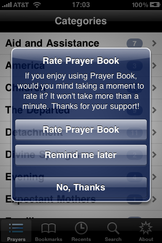

I got an (unsolicited) email from [Chupa](http://www.chupamobile.com/products/details/277/Get+more+AppStore+ratings+with+recurring+UIAlert/) this morning asking to participate in their competition to win ten grand. Doesn't sound like a scam at all does it? Boy was I surprised...

Basically, you write different libraries and sell them on their site. I assume they get a cut somehow. Not a _bad_&nbsp;idea, but kind of a crooked one when you look at what's available. After 30 seconds of browsing the iOS library, I found [this gem](http://www.chupamobile.com/products/details/277/Get+more+AppStore+ratings+with+recurring+UIAlert/):

Basically I could pay $8 to get the code for this "library." I don't think so. I'd rather get the original, open-source [Appirater](https://github.com/arashpayan/appirater):

Chupa calls itself the "Mobile Developer's Resource", which is pretty farcical. The only resources a mobile developer needs are StackOverflow and GitHub. I think Chupa is trying to appeal to people who are new at iOS development (or Ruby or whatever) and want quick-fixes.

Judging from the presentation of their libraries, I have almost no confidence in the quality of the code they sell or the maintenance the code will get. I won't be using Chupa and I suggest if you have a really cool library, you put it up on GitHub where you'll get Internet famous. It'll be worth more.
