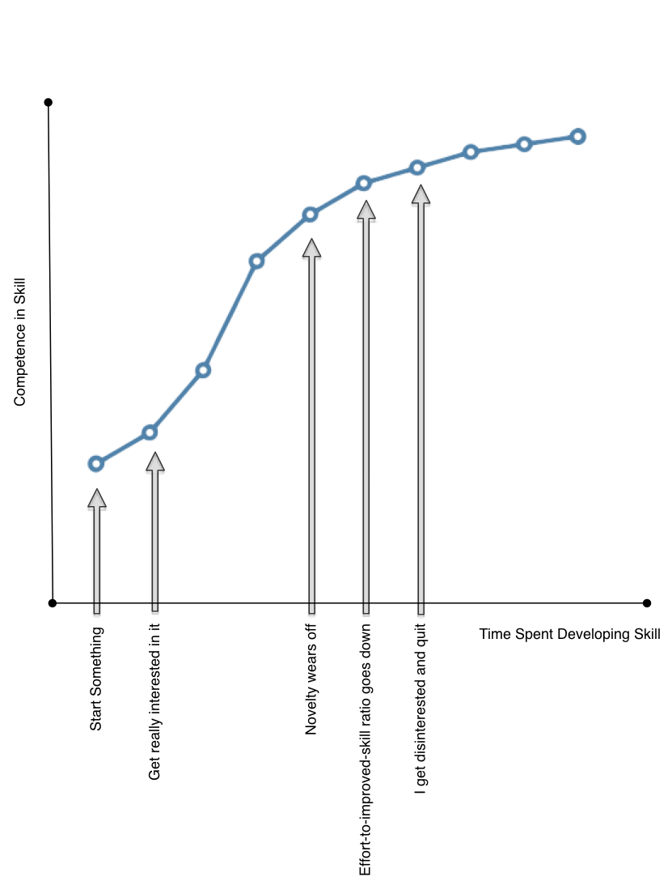

When I expressed an interest in learning more about photography, my coworkers and photographers Tom and Adam were helpful in filling in different areas of the craft I didn't know about. Things like aperture and its relation to shutter speed, different styles of lenses, etc. Tom pointed out that I can get a used DSLR on the Internet for pretty cheap, and indeed I can.&nbsp;I pondered it for a few weeks before deciding not to get into photography; I do&nbsp;_not_&nbsp;need another hobby to spend my valuable time and money on. As I was thinking about getting into photography, and speaking with different photographers on our team, it got me thinking about skills and the time investment we make into developing them.

I've pursued (_really_ pursued) a few skills in my life so far. The first thing that I chose to become good enough at was music. I played piano and saxophone for 7 years. I usually pick up a new skill quickly, but don't often pursue them in the long run. Looking back, I feel this can somewhat be attributed to the lack of marginal skill acquired from extra practice once you reach a certain level of skillfulness.

This graph depicts most things that I get involved with. I start by picking something up naturally and I get _lots_&nbsp;of reward for putting effort into improving my skill. As a teenager, acquiring new skills was considered industrious and laudable, so I started to pursue lots of different ways to spend my time. Usually, however, I'd eventually lose interest; I haven't seriously played any music since graduating from High School.

Attending university for 5 years offered many opportunities to try new pursuits. I'd get involved in student politics, undergraduate student associations, part-time jobs, or undergraduate research, but eventually I would a point where a marginal increase in effort would result in only a very small amount of additional skill in that activity. It's not that I didn't _enjoy_&nbsp;these pursuits, only that I would get a lot less reward for developing skills in the craft itself. It's not that the reward was my only reason for participating in these activities, only that mental reward is a significant reason to do anything and gaining expertise is very rewarding for me.

As an adult, I now have a career. I develop software and refine my craft every day. I am worried that someday I won't enjoy software development enough to continue it as a career, but luckily I'm naive enough to hope that I've actually hit the point of inflection and I'm still pursuing the craft of software development in spite of the decreased marginal benefit practising it has on my expertise. I'd like to think that I'm getting satisfaction out of coding because of what I'm building and not just what I'm gaining as skills.

  