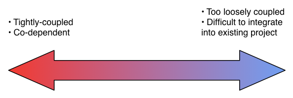
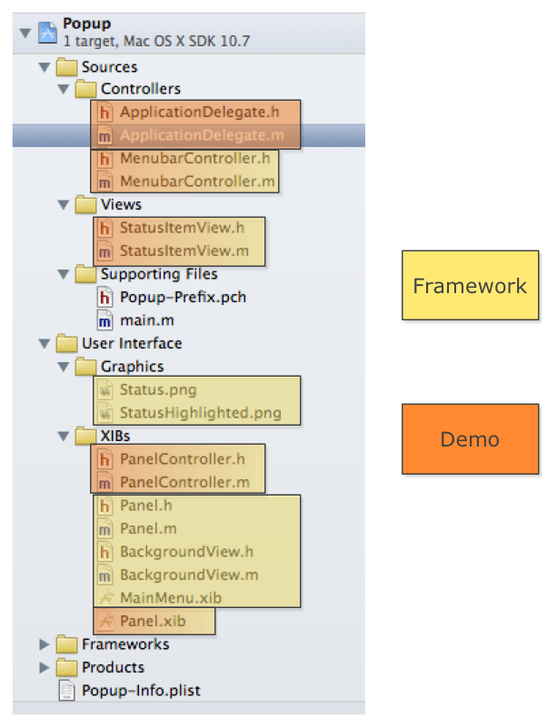
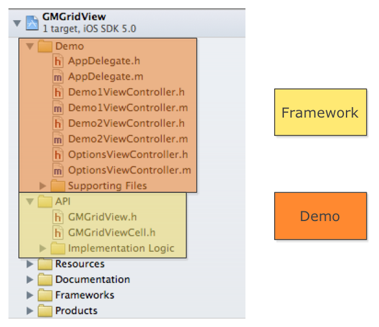

So you're some young hotshot developer who's written _the_ framework&nbsp;that's going to completely change the way everyone makes software. _Of course_&nbsp;you're going to host it on GitHub so everyone can find it, fork it, make pull requests, and you can be famous on the Internet. But it's not enough to just make a framework; you need an demo project showing off your stuff. It needs to use the framework you've written and demonstrate _how easy_ it is to use, how _performant_ it is, and how to _incorporate it into an existing project_. That last point is key and, in my experience, the deciding factor in the decision of developers to use your project.

There is a spectrum of demo projects. On the left is a tightly-coupled project where the framework you've written is often hard to discern from the project that demonstrates it's use; on the right is a project that is _too_&nbsp;loosely coupled and is often difficult to integrate into an existing project; there is a sweet spot in the middle where files are drag-and-droppable (or `git submodule`'able) into an existing project and away you go.

To demonstrate, let's look at three useful projects and how they integrate.

[KKGridView](https://github.com/kolinkrewinkel/KKGridView) is a library for displaying rectangular components in a grid layout on iOS. It's a great library that's actively maintained, but I find it frustrating to use; you typically add the framework as a subproject in your Xcode workspace and then add the product's `.a` file as a link-time dependency in your main project. It's use is so disjoint from your main project that dealing with it's integration into Xcode is often the source of problems for new users. They'll likely get frustrated and look for alternatives.

[Popup](https://github.com/shpakovski/Popup/tree/master/Popup)&nbsp;is a project demonstrating how to display a popover-style modal window anchored on a menubar item. This is surprisingly difficult to accomplish, largely due to a&nbsp; [serious flaw](http://openradar.appspot.com/9722231)&nbsp;in NSPopover and OS X Lion, and I am grateful for the demo project. The problem is that when you open the source project, you see a lot of files and it's not immediately apparent which files you'll need to copy out of the project directory to get this to work. More than that, the project creates an unncessary dependency on _how_&nbsp;you display your NSStatusItem.

It's incredibly difficult to divorce the framework from the demo project and caused me to initially overlook this useful resource.

An example of the perfect balance is [GMGridView](https://github.com/gmoledina/GMGridView), an alternative to KKGridView. Its demo project includes an easily labeled group (called "API") that you can drag into your existing project (or use a git submodule). It demonstrates how to use the framework in the way that most developers will use it: by just compiling the files as part of their main Xcode project.

Hopefully this will help give some direction to framework developers on how to structure their projects. There are many amazing projects out there that offer some serious help to developers and I think it's a shame that many frameworks are likely overlooked by developers because their demo projects need improvement.
