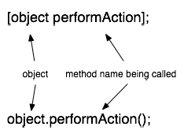
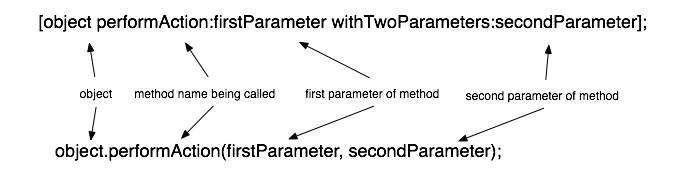
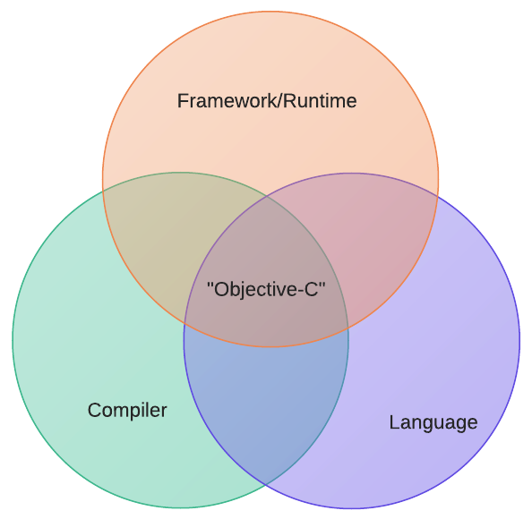

As an active member of "The Internet" and vocal Objective-C coder, I get a lot of questions surrounding the language. They're often framed around thinking about learning the language or trying to write an app, but they also usually involve a phrase like "Objective-C looks really hard" or "what are all those minus signs about?" Both of these are pretty good questions, and I'd like to address why someone might be more hesitant to jump into iOS or OS X development compared to, say, Ruby or Java.

## Syntax

Let's talk about what a programming language is. A programming language is the human-readable code that expresses how a program behaves. A language consists of a syntax (rules for valid expressions and statements) and semantics (rules for how to organize those expressions and statements in meaningful ways to accomplish some task).

Most (common) programming languages out there are based on the C-style syntax of method invocation and the dot-syntax of accessing members of classes (well, structs in C). They'll usually implement their own brand of class definition (Java differs a bit from C# or C++), but the nuts and bolts of the language itself is the same. When approaching a new language, seeing similarities in the syntax makes people feel more comfortable, and most people know the C syntax.

Objective-C is a _very_ different language with regards to its syntax. It's so different, even, that most people don't look at it long enough to realize that the semantics of the language are almost identical to C++, Java, or others.

Even other "weird" languages like Python or Ruby are accessible because they at least use the dot-syntax for method invocation and member access in classes. Lack of curly braces doesn't bother people for long because they were probably indenting their code anyway.

This is usually how introducing someone to Objective-C goes: I compare it with another OOP language.



No problem so far. Maybe they've seen lisp at some point, but they're usually OK with this.


OK they're freaking out a little and asking a lot of questions. But then things take a turn for the worse.



At this point, people usually start breathing into a paper bag and trying not to pass out.

What is all that typing? Those colons! The horror! Questions start poring in: What is that method called, anyway? performAction? Or something else? How does overloading work, then? Argh!

Forget the fact that we're not even talking about methods, really, we're talking about _messages_ (a distinction I'm not going to make) and you refer to _selectors_ like the one above as `performAction:withTwoParameters:`. Most people don't care anymore.

The language is a strict superset of C, which is kind of cool, except in some ways it's holding the language back when compared to other modern languages. Being a superset of C adds a lot of cruft which, we'll see shortly, compounds a problem with complexity of Objective-C.

Objective-C is a large language. I mean that in a very special way: its syntax is complex and extensive. Apple has been making strides in reducing the size of the Objective-C language, like their slow-but-steady transition away from classical C-style header files. However, they're also adding to the language in ways that makes the code expressed in Objective-C simpler:

- Synthesizing properties
- Dot-syntax for accessing getters/setters
- Garbage Collection
- Blocks (closures)
- Automatic Reference Counting
- Weak references

So while the language is getting larger, the code used to express ideas in the language is getting less complex.

## Runtime

The Objective-C runtime is dynamic, which seems counter-intuitive when you think about Objective-C's relation to C. C is about as close to the metal as you can get without writing assembly code, so you'd expect Objective-C to be very rigid, but in fact it's a very fluid, dynamic runtime. Among other things, Objective-C lets you do function currying, adding and removing methods from classes at runtime, and reflection.

Unless you've played with other languages that support these features, like Ruby or Lisp, then this feels really weird. Don't worry! Lots of great things feel really weird the first time you try them, like broccoli or sexual intercourse.

## Frameworks

Objective-C is almost useless without the Cocoa/Cocoa Touch frameworks used by developers to build apps. It would be like trying to write a web app in Ruby from scratch without Rails.

Cocoa is very old and very large. Again, Apple is making progress in reducing its complexity year after year and it's iOS-based cousin Cocoa Touch is very lean. However, there is still a lot to learn when making even the most simplest of apps. While the header files and developer documentation provided by Apple are wonderful resources, there is still a lot of assumed knowledge. Take the `contentStretch` property on UIView, for instance. This is all the header file has to say:

```objc
@property(nonatomic) CGRect contentStretch __OSX_AVAILABLE_STARTING(__MAC_NA,__IPHONE_3_0); // animatable. default is unit rectangle {{0,0} {1,1}}
```

That's it? What does it _do_? Well, it defines the stretchable content area, I suppose. But how? And what is this unit rectangle? It's a property you could probably live without ever knowing about, but when you need to use it, how would you know?

Cocoa/Cocoa-Touch is _large_ and the only way to get better at it is experimentation, which is daunting to a newcomer.

## History

Historically, Apple has driven forward development on the Objective-C language, the Objective-C runtime, the Cocoa/Cocoa Touch frameworks, and the Compiler to build Objective-C programs. There is a high level of co-design in these different areas, which makes "Objective-C' such a nebulous term.



When learning Objective-C, it's not just a language or a framework or a runtime or a compiler, it's all of these things. Something as integral to the language like Automatic Reference Counting involves the language semantics (no calling `dealloc` directly anymore), the compiler (obviously), and strongly enforced naming conventions in the Cocoa/Cocoa Touch frameworks.

This tightly-coupled co-design is unique to Objective-C. There are other languages that run on .Net, such as Iron Python. Lots of language use the JVM besides Java, like Clojure. Even Ruby and Rails are two distinct entities and projects. The only significant effort to use a different language with Cocoa/Cocoa Touch and the Objective-C runtime, [Mac Ruby](http://www.macruby.org/), was a project largely backed by Apple before they abandoned it.

Objective-C, and the corresponding frameworks, runtime, and compiler, exist in a silo from the rest of the software development community.

## Future

The evidence we've seen over the past 4 years or so indicates that Apple is attempting to reduce the size and complexity of the Objective-C language. They're attempting to make it easier to approach by doing away with manual memory management and classical C header files; they're also introducing modern programming language concepts like Automatic Reference Counting and dot-syntax for getter/setter access. But for now, Objective-C remains difficult to approach; only the appeal of writing hit iOS apps seems to be driving its popularity.
