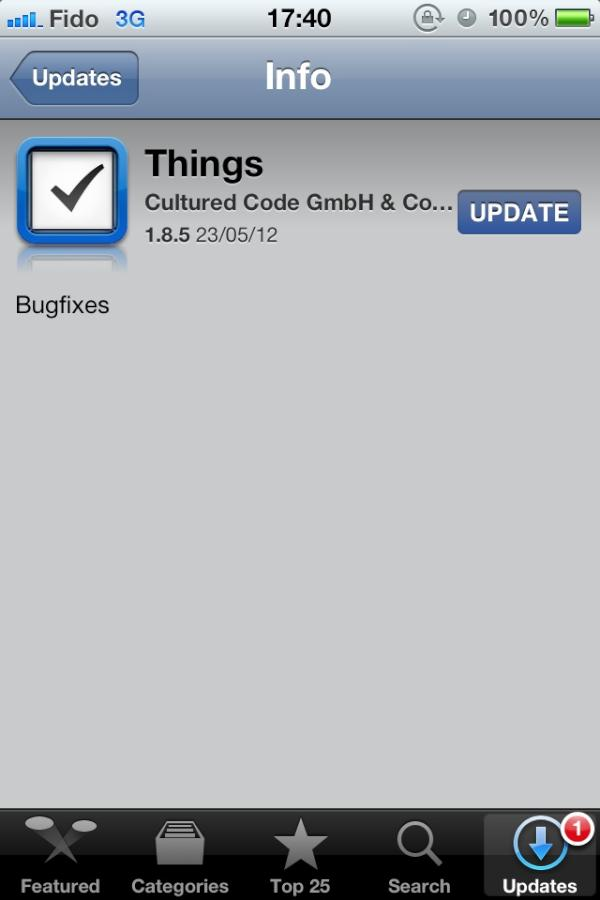

My boss [tweeted](https://twitter.com/oleggutsol/status/205413845114691584) a screenshot of the [Things](http://culturedcode.com/things/) 1.8.5 iOS update, which I have included below. I remarked on twitter to them that this is an example of why developers should not be the ones to write the "what's new in this version" copy for iOS app updates. They replied that the developers didn't write the release notes, but instead it was the testers that did.

Let's talk about how we can improve the release notes for iOS apps.

_Most_ users will never look at this screen; they'll just hit "Update All", which is great. But when you're making apps on the scale of Things, you have lots of users, so some users inevitably will take a look at what's in the update. And when you think about it, the users who _do_ happen to look at that page are probably very interested in what you write there. So you should make it count.

This is the **only** part of the app store where Apple provides completely dedicated space for whatever unabridged copy you want the user to read. Additionally, you _know_ that the users reading this care about whatever it is that you put there. From a marketing perspective, this is incredibly valuable real-estate.

Whatever you put there is sending a message to your audience. What does the message "Bugfixes", without even punctuation, send to your users? It sends the message that you don't care enough to write something meaningful.

As a (perhaps self-serving) counter-example, let's look at the "What's new in this version" page for the latest 500px iOS app update:

> Thanks for all the feedback! We fixed the problems with loading thumbnails and also fixed the occasional crashes. If you have any other suggestions, please let us know!

What does this message say to the user? That we care about their time. That we want their feedback. That we appreciate that they are using our product.

The latest Cineplex update had some mediocre release notes:

> What's New in Version 2.6
>
> -
>
> iOS 5 Optimization
>
> -
>
> UI Refinements
>
> -
>
> Bug Fixes

Users don't know what iOS 5 optimizations are, unless you tell them (like "runs faster"). They also don't know or care about UI refinements or bug fixes. Why are you even using the abbreviation "UI" in release notes that typical, non-developer users might see?

Another good example is the latest Instapaper update:

> (a bunch of specific bullet points)
>
> On a personal note, my wife and I just had a baby. Your support lets me work at home and spend as much time with my family as possible during this great time. Thank you so much.
>
> —Marco

I think that the release notes of iOS app updates are one of the most underused method of communicating with your users. Next time you submit an update, put yourself in the user's shoes and ask yourself how they're going to perceive your message.
