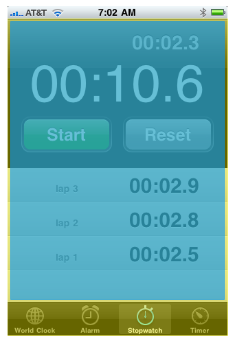
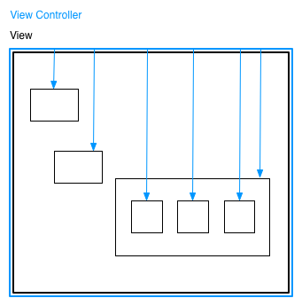
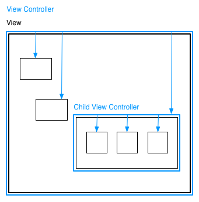
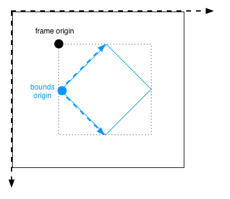

I was thinking about the overall architecture of iOS apps the other day, and it struck me just how much Cocoa Touch enforces use of the Model-View-Controller paradigm. Not just _encourages_, but actively enforces. A good example is your application delegate; by the time your app finishes launching, it's your app delegate's responsibility to make sure that the window your app is in has a root view controller.

Not a view.

A view _controller_.

In iOS, a view controller is an object that controls a view hierarchy. Views are nested within one another to be rendered to the user, who can then interact with them. Those interactions represent changes the user wants to make to the data, stored in model objects. The view controller's responsibility is to mediate the interaction between the models and the views (it does so via different mechanisms, of which Cocoa and Cocoa Touch provide a healthy variety of). In essence, that's the MVC framework.

A view controller has a `view` property, which is the root of its view hierarchy. That view has subviews, which the controller can also reference directly. As a concrete example, let's take a look at the built-in system stopwatch example:


The controller's view is everything on the screen, below the status bar at the top and above the tab bar at the bottom. However, the view controller also has references to the Start and Reset buttons, the labels indicating the lapsed time to the user, and the table view of the laps.

I was careful to specify where on the screen that controller's view was present; specifically, the view is _above_ the tab bar. That's because the tab bar is a view that belongs to another, special kind of view controller that belongs to the system: a tab bar controller. The view controller representing the stopwatch is one of the tab bar controller's child view controllers.



The blue stopwatch controller is a child of the yellow tab bar controller.

In this way, there's sort of a doubled hierarchy: views are nested within views, and view controllers are nested within other controllers.

It used to be that the system's built-in "containment" view controllers, like this tab bar controller, a navigation controller which slides view controllers left and right, or a split view controller on the iPad, were the only ways to nest these controllers reliably. Since the system enforces the use of view controllers, writing your own and trying to fake the interactions and system callbacks was messy and ill-advised. Until iOS 5.

In iOS 5, Apple provided new containment view controller APIs that made writing apps with sub-view controllers trivially easy. Let's take a look at how.

In iOS 4 and earlier, a view hierarchy might look like the following.



This is a pedagogical example, certainly, but the 500px app has some view controllers with references to dozens and dozens of subviews. It makes writing code with a clear separation of concern impossible and debugging that code stressfully difficult.

In iOS 5, we can delineate exactly which view controller is responsible for which views. Excellent!



Nice! Notice that the parent view controller doesn't even need a reference to the child view controller's view; it can access it indirectly via `self.subviewcontroller.view`.

Now, there are some guidelines developers should abide by. These aren't enforced, necessarily, but following some established standards will make your life easier.

First, a parent view controller should never reach into another view controller's hierarchy. It'd be a faux pas to assume that you know more about a view controller's view hierarchy, the thing which is its paramount responsibility, than it does. Let's not micromanage, here.

Conversely, a child view controller shouldn't reach out to its parent's view hierarchy. The parent situates the _position_ and _size_ of its child controller's view, and the child manages its own hierarchy from there.

Here's the tricky part: the child view controller's view is in the parent controller's view hierarchy. That means, following our rules, that the child view controller _should not_ modify its own view's position and size.

Bam.

(But that's not the end of the story. When I write a self-righteous essay, I don't stop short of a thousand words.)

A view's position and size are determined by a C struct named `CGRect`, which contains two structs itself; a point representing the origin (top-left corner) of a view, and a size representing the width and height.

If you access `self.view.frame` in a view controller, you're accessing the view's position _with respect to its parent's coordinate system_. That means that the values you retrieve (or, more dangerously, assign) will be subject to transformations applied by the _parent_ view controller. This could include rotations and scaling, in which case, you're fucked!

How so?

Well, the `frame` of a view is defined as the smallest bounding box of that view with respect to its parents coordinate system, including any transformations applied to that view. Let's look at an example:



Here you can see that the bounds size and the frame size are completely different.

This is very important: a view's frame is the position and size with respect to _its parent's coordinate system_. A view's bounds is the position and size with respect to _its own_ coordinate system.

This means that relying on `self.view.bounds.size` will reliably get you the size of a view controller's view. We'll discuss origin in a moment.

If you were in the blue view controller above and tried to add a subview to your view hierarchy, and you used frame to have the view take up the entire screen, you'd end up with weird results.



```
hotNewSubview.frame = self.view.frame; //HORRIBLY, HORRIBLY WRONG
hotNewSubview.frame = self.view.bounds; //Better, but still not good
```



Why is setting the subview's `frame` to the `bounds` rect still not a good idea?

The origins of a bounds is not always zero. Remember I said that the bounds origin is the origin of the view with respect to its own coordinate system, so in the majority of cases, the bounds origin is `(0, 0)`. But not always.

A transform on the view's coordinate system will affect its origin. You'll see this mostly with scroll views; scroll up by 10 points, and your bounds origin is now `(0, -10)`. This not only affects scroll views, but also scroll view subclasses, the most famous of which is `UITableView`.

What's that? iOS has a built-in view controller for table views? And you say if I rely on `self.view.bounds` as a rect that covers my entire visible view, that I'm doing it completely wrong?

Yes I am.

So what's the answer? How do you avoid this?

Don't be lazy.

Objective-C developers often use `self.view.frame` or `self.view.bounds` to create a new subview that takes up the entire visible space. Instead of just copying these `CGRect` values over wholesale, create your own `CGRect`s.

Let's review:



```
hotNewSubview.frame = self.view.frame; //HORRIBLY, HORRIBLY WRONG
hotNewSubview.frame = self.view.bounds; //Better, but still not perfect
hotNewSubview.frame = CGRectMake(0, 0,
    CGRectGetWidth(self.view.bounds),
    CGRectGetHeight(self.view.bounds)); //Best
```



A little more typing, sure, but this is Objective-C. We don't eschew verbosity. And it could literally save your life someday. (Editor's note: implausible, but not impossible.)

This problem is not really all that bad, since you'll mostly be OK. Mostly. And hey, we've all written code that's not great. I just looked through the 500px codebase and I've found several occurrences of this, mostly to get my view's size.

So the takeaway is, know what you're doing. If you don't know, learn. View hierarchies are a _huge_ part of making amazing apps. Make sure that you completely understand [views](http://developer.apple.com/library/iOS/#documentation/WindowsViews/Conceptual/ViewPG_iPhoneOS/WindowsandViews/WindowsandViews.html) and their [coordinate systems](http://developer.apple.com/library/ios/#documentation/general/conceptual/Devpedia-CocoaApp/CoordinateSystem.html).
