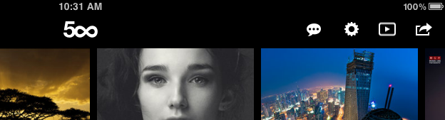
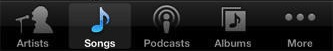
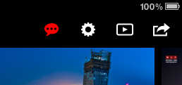

Yesterday, I was going through the 500px iPad app looking to update some graphics used in our navigation bars. I think that the existing navigation bar is too boring.



I've decided that the push notifications button should be red so more users tap on it. I think this design decision's a winner, so I'm not even going to run it by the designer first.

However, after some light digging around in the code, I spent a lot of time learning more and more about `UIBarButtonItem` and I'm not really impressed.

## Contraints on UIBarButtonItem

`UIBarButtonItem` and `UITabBarItem` are the two common subclasses of `UIBarItem`. The former is for use in `UINavigationBar`s and the latter is used in `UITabBar`s. I'm going to be speaking mostly about `UIBarButtonItem`, but my complaints mostly transfer to `UITabBarItem`.

The first thing you'll notice about `UIBarItem` is that it extends `NSObject`, not `UIView`. That means that you can't manipulate its frame, you can't access its background colour and other appearence properties, you can't attach a gesture recognizer to it, and when you use the target/action of the `UIBarButtonItem`, the sender is not in a view hierarchy.

That last point is kind of important. If I create a `UIBarButtonItem` and point it to a selector on `self` called `userDidPressBarButtonItem:`, the parameter is the bar button item that was pressed. Pretty easy so far. But since it's not actually a view, I can't get its frame or bounds to present a popover from it.

Not so bad, you counter, since `UIPopover` can be presented from a `UIBarButtonItem` directly instead of an arbitrary view. OK, fine, but if I have a custom popover implementation or other UI that I want to present from the pressed button, I'm fucked.

## Historical Reasons

So, `UIBarButtonItem` has some serious and fucked up limitions, but you need to use it. Why are these limits imposed by Apple's framework? Because the class has been around since forever. If you're familiar with OS X development, the idea of a kind of proxy class to set up custom containers would seem familiar.

However, that techique is _not common_ in iOS. Additionally, its popularity in App Kit on OS X is fading as Apple moves to a more modern library.

`UIBarButtonItem` is as messed up as it is because some engineer at Apple wrote it when that was the accepted way to write it. The world has moved on while `UIBarButtonItem` has stayed where it is.

## Convenience

I can see the rationale behind this class; you supply a black and white image and the bar item renders it appropriately. As a developer, it seems really easy to use. Provide a simple image and your app looks like it belongs in the rest of UIKit. However, if you want to customize the appearance at all, welcome to a world of pain, as we'll see shortly.

In the above screenshot, the image used to create the notifications `UIBarButtonItem` looks something like the following:


`UIBarButtonItem` would take this image and figure out what it was _supposed_ to look like, given the properties of the bar it was contained in.

As another example, `UITabBar` renders images with a blue gradient and nice overlay depending on if its tab was selected:



Those tab bar buttons are all drawn using a single, black and white `png` and are re-rendered if they become selected, as "Songs" currently is.

If you want to circumvent the default appearence of the bar button item, then you can provide a custom view to be placed within the `UIBarButtonItem` without any custom drawing performed on it. The easiest way to do this is provide a `UIImageView` with your new custom image in it. For example, if I took the notification icon used above and replaced it with a red icon, I could achieve this effect in the 500px iPad app:


Using this new icon as a `UIImageView` custom view with `UIBarButtonItem`'s `initWithCustomView:` initializer, I'll get the following effect:



Awesome! I think this is a huge improvement. I can't wait to show it to Adam to see what he thinks.

Not so fast, however. I noticed that the notification popover no longer appears when I tap the button. What gives?!

_Turns out_, `UIBarButtonItem` doesn't invoke it's target/action when tapped if you use a custom view.

Huh.

The solution is to replace the `UIImageView` as the custom view for the bar button item with a `UIButton` which _contains_ the image. All I need to do is add the target/action previously assigned to the bar button item to the `UIButton` and set the `UIButton`'s `showsTouchWhenHighlighted` property to `YES` to get the standard glow applied when the user touches it. This isn't a hard change, and I even wrote a convenient category method on `UIBarButtonItem`:

```
+ (id)barButtonWithImage:(UIImage *)image style:(UIBarButtonItemStyle)style target:(id)target action:(SEL)action
{
    UIButton *button = [UIButton buttonWithType:UIButtonTypeCustom];
    [button addTarget:target action:action forControlEvents:UIControlEventTouchUpInside];
    button.frame = CGRectMake(0, 0, MAX(44, image.size.width), 44);
    button.contentMode = UIViewContentModeCenter;
    [button setShowsTouchWhenHighlighted:YES];

    [button setImage:image forState:UIControlStateNormal];

    UIBarButtonItem *barButtonItem = [[UIBarButtonItem alloc] initWithCustomView:button];

    return barButtonItem;
}
```

Sure, I take some liberties with the size of the button (I wouldn't publish this to GitHub), but I know that it'll suit our needs perfectly. I drop it into my Xcode project and hit the play button and try out my app.

Crash.

Well well well. Whenever I tap the notifications button, my app crashes!

```
2012-08-24 11:42:02.688 500px[72157:c07] *** Terminating app due to uncaught exception 'NSInvalidArgumentException', reason: '-[UIAccessibilityBundle view]: unrecognized selector sent to instance 0x92438c0'
*** First throw call stack:
(0x2b13022 0x22becd6 0x2b14cbd 0x2a79ed0 0x2a79cb2 0x18c21fe 0xa44a4 0x2b14e99 0x142414e 0x14240e6 0x14caade 0x14cafa7 0x14ca266 0x14493c0 0x14495e6 0x142fdc4 0x1423634 0x3c2fef5 0x2ae7195 0x2a4bff2 0x2a4a8da 0x2a49d84 0x2a49c9b 0x3c2e7d8 0x3c2e88a 0x1421626 0x683dc 0x2f15)
terminate called throwing an exception(lldb)
```

Wow, thanks Xcode. As usual, super helpful stack trace. But no worries; since I follow [Michael Fey's blog](http://www.fruitstandsoftware.com), I know about a useful tip for [debugging these types of errors](http://www.fruitstandsoftware.com/blog/2012/08/quick-and-easy-debugging-of-unrecognized-selector-sent-to-instance/) and I find the line that's crashing my app:

```
[self.pushNotificationsPopoverController presentPopoverFromBarButtonItem:sender permittedArrowDirections:UIPopoverArrowDirectionAny animated:YES];
```

Everything appears to be fine... wait! There it is! I was using `sender` to present the popover, but now the sender isn't a `UIBarButtonItem` anymore, it's my custom `UIButton`! Fuck! Well, not a hard change; I'll just create a new instance variable in my view controller and use it to present my popover:

```
[self.pushNotificationsPopoverController presentPopoverFromBarButtonItem:notificationBarButtonItem permittedArrowDirections:UIPopoverArrowDirectionAny animated:YES];
```

Finally, everything works. I've got my slick new red notification button, which responds to touches, and it doesn't even crash my app. Not bad.

It would have been a lot easier if, say, `UIBarButtonItem` wasn't such a fucking enigma of pain and sublcassed `UIView` like any other self-respecting member of UIKit, but I digress.

## Conclusion

There are historical reasons for using this pattern to create standard icons, and it makes the job of developers easy if the look they're going for fits within the existing interface paradigm (ie: their app looks like it shipped with the user's device). However, for advanced customization, you'll have to break out some advanced techniques to convince `UIBarButtonItem` to behave.


  