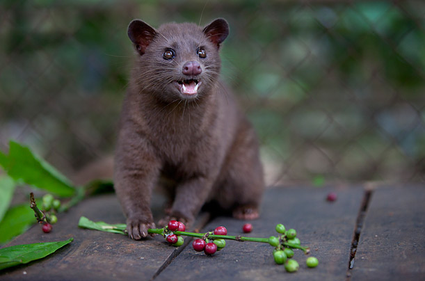

Recently, a coworker sent out an email to the office asking if anyone else was interested in buying some Kopi Luwak (aka "civet") coffee. It is the world's most expensive coffee, since it has been through the digestive tract of a type of Indonesian cat called a luwak, or civet.

Of course I was already interested. When our boss saw the email, he actually bought a pound of the coffee for the 500px office, which I had the honour of roasting at home and bringing in to serve to my coworkers.

Roasting the coffee was very interesting: it didn't have the usual repugnant smell of unroasted coffee, but wasn't as aromatic in the days that followed.

The coffee is pretty fantastic - very smooth. It has a buttery mouth feel and I'm really happy to have had tried it, though it's far too expensive to consume on a regular basis!

If you're a coffee nerd, I would highly recommend giving it a shot at some point. It's completely safe - the beans are thoroughly cleaned and dried before being roasted at over 400 degrees.

(Photo credit to this [Times Photo Essay](http://www.time.com/time/photogallery/0,29307,2048674,00.html)
