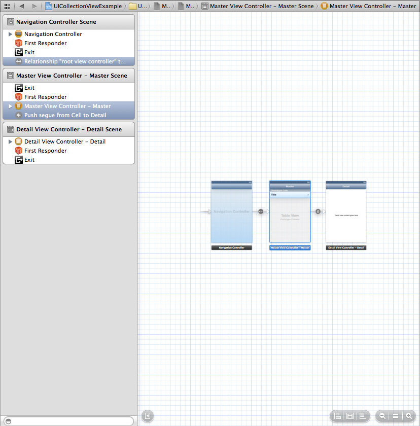
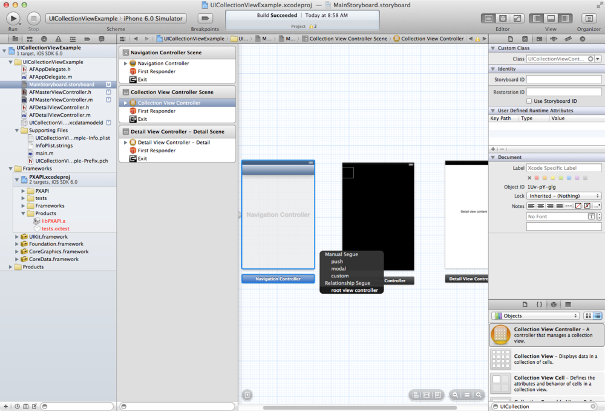
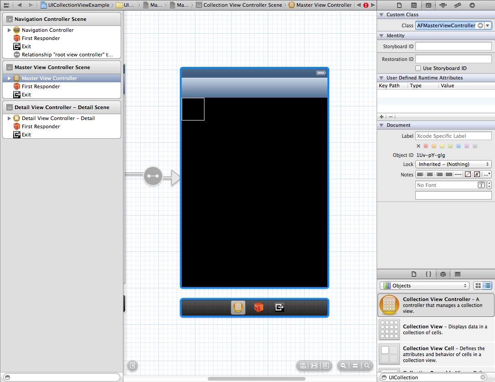
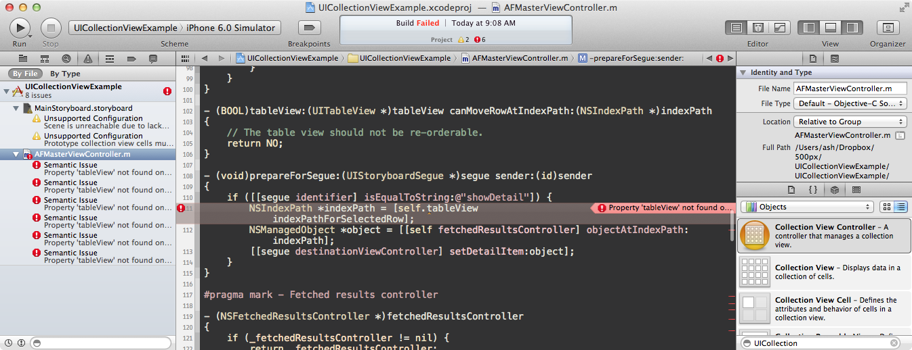
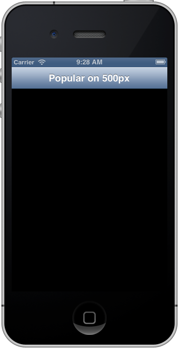
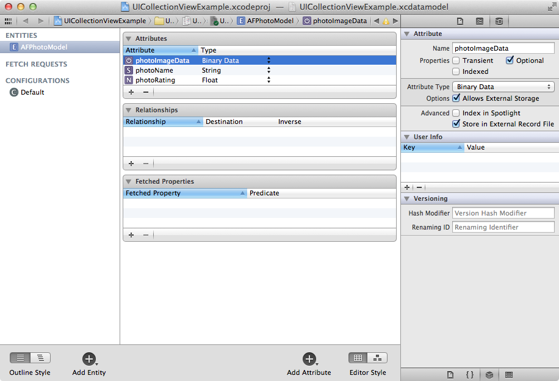
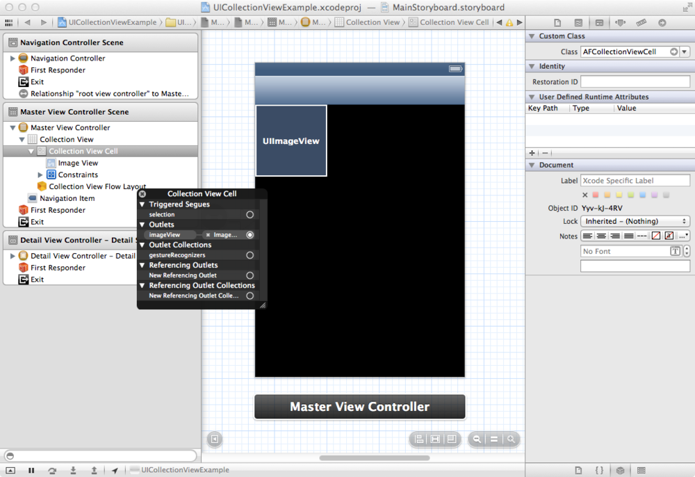
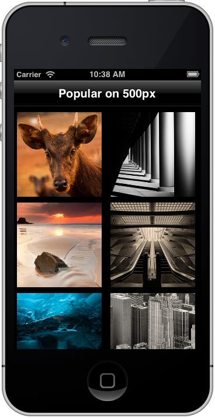
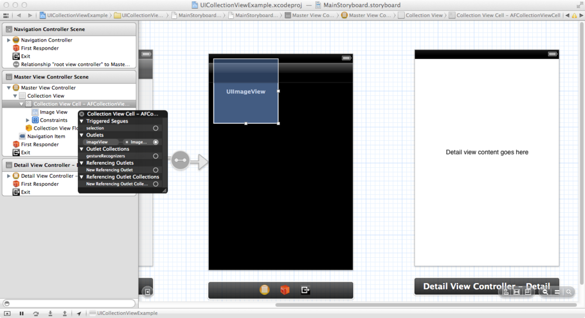
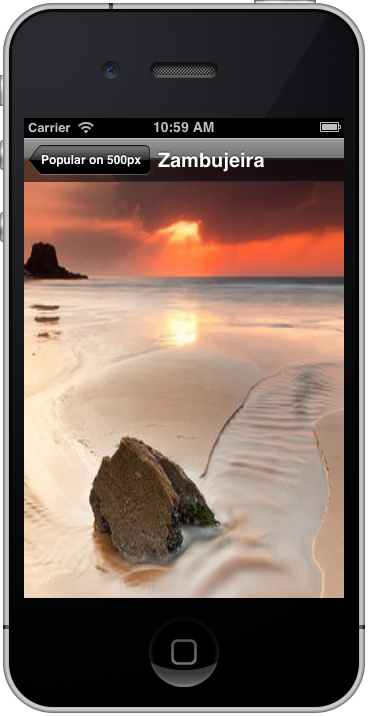

We're going to take a look at the new `UICollectionView` class Apple introduced in iOS 6. It's used to display a grid of cells, and what better to display in those cells than some beautiful photos from 500px?

I've got an example project completed and hosted [on github](https://github.com/AshFurrow/UICollectionViewExample) that you can check out and play with. Don't forget to [register yourself with 500px](http://developers.500px.com/settings/applications?from=developers) first to get a consumer key and consumer secret, or else the API won't work for you. Copy these into a text file because you'll need them later.

Xcode might introduce a new template for collection view apps, but in the mean time, we'll have to modify an existing project that uses `UITableView`.

Create a new Xcode project using the "Master-Detail Application" template.

Open the main Storyboard file. We're going to throw away the existing table view and replace it with a great new collection view. The easiest way to do that is to select the existing Master View Controller, shown below, and hit the delete key.



Now that the Master View Controller is missing, we need to re-add it. Go to your Master View Controller's `.h` file and change it from inheriting from `UITableViewController` to `UICollectionViewController`. You'll get some compiler errors; ignore them for now.

Drag a new `UICollectionViewController` form the library. Right click and drag from the Navigation Controller onto the collection view controller and select the "root view controller" outlet.



Right. Almost there. Open the identity inspector (⌘⎇3) and give the new UICollectionViewController the class name of your Master View Controller.



We'll worry about the segues later. For now, go to the `UICollectionViewController` subclass' `.m` file. We'll fix those compiler errors now.



It's always something with you, isn't it, Xcode?

We're going to gut the contents of the master view controller that deal with the `tableView` property (which we replaced). For this example, I'm deleting the following method:

```objc
- (void)tableView:(UITableView *)tableView commitEditingStyle:(UITableViewCellEditingStyle)editingStyle forRowAtIndexPath:(NSIndexPath *)indexPath
```

Everywhere else you see `tableView` cuasing a problem, replace it with `collectionView`. The two classes behave almost identically, so it'll be an easy conversion.

The only problem I had was

```objc
[self.collectionView indexPathForSelectedRow];
```

`UICollectionView` doesn't have the method `indexPathForSelectedRow`, so replace that line with the following:

```objc
[[self.collectionView indexPathsForSelectedItems] lastObject];
```

You'll also need to modify the `insertSections:withRowAnimation:` method calls, since `UICollectionView` doesn't have row animations; just remove the second part of the selector name.

Once you deal with all of the transition, you have a an app that runs, but is empty. Let's fill it with beautiful photos.



We need a data model. Since we're smart, accomplished, and handsome developers, let's use Core Data. Create the following Core Data model.



All we need is a `photoRating` to sort by and `photoImageData` to display actual images, but let's add a `photoName` for the detail view.

We need to configure the prototype cell used by the collection view. Create a new class, subclassing `UICollectionViewCell`, create a `UIImageView` outlet and appropriate instance methods to set the image.

Go to the Storyboard and select the protoype cell in the collection view. In the identity inspector, set it's class to the `UICollectionView` subclass you just created. Add a `UIImageView` to the prototype cell and connect the outlet.



Make sure to set the `Identifier` in the Storyboard or the collection view won't dequeue the proper class.

We need to queue up the updates from our `NSFetchedResultsController`, since `UICollectionView` can _only_ perform batch updates (with animation). Serious oversight on Apple's here, in my opinion, since it makes using `NSFetchedRsultsController` with `UICollectionView` very sticky.

You basically need to cache the updates to the sections and objects individually until the fetched results controller is finished with the updates. This is because of the [limitations imposed on `UICollectionView`](https://ash-furrow.squarespace.com/blog/how-to-use-nsfetchedresultscontroller-with-uicollectionview).

_Note_: We're using batch updates because we are inserting more than one cell at a time, and we want that nice animation when adding each individual cell. You could call `reloadData` once all the results are loaded, but you wouldn't have any animations, which are part of the delight of `NSCollectionVIew`.

Creating the `NSFetchedResultsController` is almost the exact same as the project template:

```objc
- (NSFetchedResultsController *)fetchedResultsController
{
    if (_fetchedResultsController != nil) {
        return _fetchedResultsController;
    }

    NSFetchRequest *fetchRequest = [[NSFetchRequest alloc] init];
    // Edit the entity name as appropriate.
    NSEntityDescription *entity = [NSEntityDescription entityForName:@"AFPhotoModel" inManagedObjectContext:self.managedObjectContext];
    [fetchRequest setEntity:entity];

    // Set the batch size to a suitable number.
    [fetchRequest setFetchBatchSize:20];

    // Edit the sort key as appropriate.
    NSSortDescriptor *sortDescriptor = [[NSSortDescriptor alloc] initWithKey:@"photoName" ascending:NO];
    NSArray *sortDescriptors = @[sortDescriptor];

    [fetchRequest setSortDescriptors:sortDescriptors];

    // Edit the section name key path and cache name if appropriate.
    // nil for section name key path means "no sections".
    NSFetchedResultsController *aFetchedResultsController = [[NSFetchedResultsController alloc] initWithFetchRequest:fetchRequest managedObjectContext:self.managedObjectContext sectionNameKeyPath:nil cacheName:@"Master"];
    aFetchedResultsController.delegate = self;
    self.fetchedResultsController = aFetchedResultsController;

    NSError *error = nil;
    if (![self.fetchedResultsController performFetch:&error]) {
         // Replace this implementation with code to handle the error appropriately.
         // abort() causes the application to generate a crash log and terminate. You should not use this function in a shipping application, although it may be useful during development.
        NSLog(@"Unresolved error %@, %@", error, [error userInfo]);
        abort();
    }

    return _fetchedResultsController;
}
```

Create two `NSMutableArray` instance variables and instantiate them in `viewDidLoad`. Implement the following `NSFetchedResultsControllerDelegate` methods.

```objc
- (void)controller:(NSFetchedResultsController *)controller
    didChangeSection:(id <NSFetchedResultsSectionInfo>)sectionInfo
    atIndex:(NSUInteger)sectionIndex
    forChangeType:(NSFetchedResultsChangeType)type
{

    NSMutableDictionary *change = [NSMutableDictionary new];

    switch(type) {
        case NSFetchedResultsChangeInsert:
            change[@(type)] = @[@(sectionIndex)];
            break;
        case NSFetchedResultsChangeDelete:
            change[@(type)] = @[@(sectionIndex)];
            break;
    }

    [_sectionChanges addObject:change];
}

- (void)controller:(NSFetchedResultsController *)controller
    didChangeObject:(id)anObject
    atIndexPath:(NSIndexPath *)indexPath
    forChangeType:(NSFetchedResultsChangeType)type
    newIndexPath:(NSIndexPath *)newIndexPath
{

    NSMutableDictionary *change = [NSMutableDictionary new];
    switch(type)
    {
        case NSFetchedResultsChangeInsert:
            change[@(type)] = newIndexPath;
            break;
        case NSFetchedResultsChangeDelete:
            change[@(type)] = indexPath;
            break;
        case NSFetchedResultsChangeUpdate:
            change[@(type)] = indexPath;
            break;
        case NSFetchedResultsChangeMove:
            change[@(type)] = @[indexPath, newIndexPath];
            break;
    }
    [_objectChanges addObject:change];
}
```

These two methods queue the updates to the collection view. The following method waits for the fetched results controller to be finished before dequeuing those updates and applying them to our collection view.

```objc
- (void)controllerDidChangeContent:(NSFetchedResultsController *)controller
{
    if ([_sectionChanges count] > 0)
    {
        [self.collectionView performBatchUpdates:^{

            for (NSDictionary *change in _sectionChanges)
            {
                [change enumerateKeysAndObjectsUsingBlock:^(NSNumber *key, id obj, BOOL *stop) {

                    NSFetchedResultsChangeType type = [key unsignedIntegerValue];
                    switch (type)
                    {
                        case NSFetchedResultsChangeInsert:
                            [self.collectionView insertSections:[NSIndexSet indexSetWithIndex:[obj unsignedIntegerValue]]];
                            break;
                        case NSFetchedResultsChangeDelete:
                            [self.collectionView deleteSections:[NSIndexSet indexSetWithIndex:[obj unsignedIntegerValue]]];
                            break;
                        case NSFetchedResultsChangeUpdate:
                            [self.collectionView reloadSections:[NSIndexSet indexSetWithIndex:[obj unsignedIntegerValue]]];
                            break;
                    }
                }];
            }
        } completion:nil];
    }

    if ([_objectChanges count] > 0 && [_sectionChanges count] == 0)
    {
        [self.collectionView performBatchUpdates:^{

            for (NSDictionary *change in _objectChanges)
            {
                [change enumerateKeysAndObjectsUsingBlock:^(NSNumber *key, id obj, BOOL *stop) {

                    NSFetchedResultsChangeType type = [key unsignedIntegerValue];
                    switch (type)
                    {
                        case NSFetchedResultsChangeInsert:
                            [self.collectionView insertItemsAtIndexPaths:@[obj]];
                            break;
                        case NSFetchedResultsChangeDelete:
                            [self.collectionView deleteItemsAtIndexPaths:@[obj]];
                            break;
                        case NSFetchedResultsChangeUpdate:
                            [self.collectionView reloadItemsAtIndexPaths:@[obj]];
                            break;
                        case NSFetchedResultsChangeMove:
                            [self.collectionView moveItemAtIndexPath:obj[0] toIndexPath:obj[1]];
                            break;
                    }
                }];
            }
        } completion:nil];
    }

    [_sectionChanges removeAllObjects];
    [_objectChanges removeAllObjects];
}
```

These methods should work for any `UICollectionView` and `NSFetchedResultsController` data.

Now that the `NSFetchedResultsController` is hooked up the the `UICollectionView`, let's load some photos from 500px!

Use the consumer key and consumer secret from when you [registered your application](http://developers.500px.com/settings/applications?from=developers) earlier. Follow the directions in the [iOS 500px SDK](https://github.com/500px/500px-iOS-api) to add the 500px SDK to your Xcode project. Make sure to follow the instructions in the SDKs `README` to set up your project to use the SDK.

```objc
[PXRequest setConsumerKey:@"your consumer key" consumerSecret:@"your consumer secret"];

[PXRequest requestForPhotoFeature:PXAPIHelperPhotoFeaturePopular completion:^(NSDictionary *results, NSError *error) {
    if (error)
    {
        [[[UIAlertView alloc] initWithTitle:@"Couldn't fetch from 500px." message:error.localizedDescription delegate:nil cancelButtonTitle:nil otherButtonTitles:@"OK", nil] show];
        return;
    }

    NSArray *photoArray = [results valueForKey:@"photos"];

    for (NSDictionary *photoDictionary in photoArray)
    {
        NSManagedObject *photoModel = [NSEntityDescription insertNewObjectForEntityForName:@"AFPhotoModel" inManagedObjectContext:AppDelegate.managedObjectContext];
        [photoModel setValue:[photoDictionary valueForKey:@"rating"] forKey:@"photoRating"];
        [photoModel setValue:[photoDictionary valueForKey:@"name"] forKey:@"photoName"];

        dispatch_async(dispatch_get_global_queue(DISPATCH_QUEUE_PRIORITY_HIGH, 0), ^{
            NSString *urlString = [[[photoDictionary valueForKey:@"images"] objectAtIndex:0] valueForKey:@"url"];
            NSData *imageData = [NSData dataWithContentsOfURL:[NSURL URLWithString:urlString]];
            dispatch_async(dispatch_get_main_queue(), ^{
                [photoModel setValue:imageData forKey:@"photoImageData"];
            });
        });
    }
}];
```

The fetched results controller will take care of that magic for us. We just need to configure our cells.

```objc
- (UICollectionViewCell *)collectionView:(UICollectionView *)collectionView cellForItemAtIndexPath:(NSIndexPath *)indexPath
{
    AFCollectionViewCell *cell = (AFCollectionViewCell *)[collectionView dequeueReusableCellWithReuseIdentifier:CellIdentifier forIndexPath:indexPath];

    NSManagedObject *object = [self.fetchedResultsController objectAtIndexPath:indexPath];
    [cell setImage:[UIImage imageWithData:[object valueForKey:@"photoImageData"]]];

    return cell;
}
```



I went to the liberty of adjusting the sizes to make things pretty - nice app! Let's connect the detail view controller now.

Open the Storyboard and right-click on the prototype cell. We'll be connecting the `selection` triggered segue to the detail view controller. Drag the circle beside `selection` to the detail view controller and choose "push" from the menu that appears.



Select the segue and make sure its identifier is set to "showDetail".

Replace the `UILabel` with a `UIImageView`, change the `IBOutlet` in the header file, reconnect the outlet, and modify `configureView` to look like the following:

```objc
- (void)configureView
{
    // Update the user interface for the detail item.

    if (self.detailItem)
    {
        self.detailImageView.image = [UIImage imageWithData:[self.detailItem valueForKey:@"photoImageData"]];
        self.title = [self.detailItem valueForKey:@"photoName"];
    }
}
```

In the master view controller, `prepareForSegue:sender:` should look like the following:

```objc
- (void)prepareForSegue:(UIStoryboardSegue *)segue sender:(id)sender
{
    if ([[segue identifier] isEqualToString:@"showDetail"]) {
        NSIndexPath *indexPath = [[self.collectionView indexPathsForSelectedItems] lastObject];
        NSManagedObject *object = [[self fetchedResultsController] objectAtIndexPath:indexPath];
        [[segue destinationViewController] setDetailItem:object];
    }
}
```

Run the app, tap on a photo, and you'll see the following:



Looks great!

If you have any questions, please let me know. Check out [the code](https://github.com/AshFurrow/UICollectionViewExample) from GitHub and have fun!
