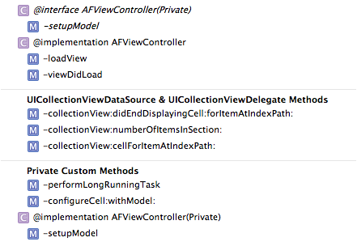

I've gotten a lot of feedback from my [Seven Deadly Sins of Modern Objective-C](/blog/seven-deadly-sins-of-modern-objective-c) article. Thank you so much for getting in touch! I'm going to be addressing the main feedback in a series of follow-up articles.

In this article, we're going to take a look at some virtuous habits that can make you a more productive developer. These are tips that I've compiled from my experience, and there are many, many more out there (as I'll talk about in number seven). So let's get started.

## 1. Use `#pragma`

The `#pragma` preprocessor directive is a useful tool for organizing code and [other interesting things](http://nshipster.com/pragma/). I use `#pragma` primarily to divide groups of methods within a class. For example:

```
#pragma mark - UICollectionViewDataSource & UICollectionViewDelegate Methods

//All those methods

#pragma mark - Private Custom Methods

//And so on
```

When I open my jump bar's drop down for the file, It'll divide my methods with headers. Beginning the mark with a hyphen will also add a horizontal line to the drop down.



This method works in headers and implementation files. It's a great way to keep your code organized into logical chunks and find things easier later on.

## 2. Use Core Data

I debated on including this one, and it comes with a caveat: use Core Data _when appropriate_. For example, if you don't have to persist any data between launches of your applications or if you want to have complete control over the query structure of the generated SQL, then Core Data might not be for you.

Core Data isn't an Object-Relational Model. It's actually just an object graph manager that happens to have a SQLite backend.

The distinction is subtle, but important. Core Data is useful if you have too many objects to fit in RAM at once — an easy thing to do on an iPhone. Core Data can persist those objects down to a SQLite database, a plist, or a binary file. It also provides a high-level query interface to retrieve objects from the object graph.

It's a very useful tool that can save you from writing a lot of code to do things like manage memory, caches, and disk access. If you find yourself using `NSKeyedArchiver` on `NSUserDefaults`, or storing everything in a plist, you should consider using Core Data instead.

Core Data has a steep learning curve, but once you have the basics mastered, it can help you concentrate on the parts of your code that make your app unique.

## 3. Write Self-Documenting Code

This may sound like obvious common sense, but there is some subtlety to it. Variable names should be descriptive, obviously. Another self-documenting code practice is to take advantage of Objective-C's message-passing syntax. For example, the following method declaration is perfectly valid Objective-C:

```
-(void)doSomethingWithInt:(int)anInt :(float)aFloat;
```

You'd call this method like this:

```
[obj doSomethingWithInt:13 :0.5f];
```

This is a pedagogical example, but wouldn't this make more sense like this?

```
[obj doSomethingWithInt:13 float:0.5f];
```

Now you know more about the method because it's been named properly. I never thought this was a problem until I started diving into some open source projects that I'm not going to name here. It's an easy way to make your code more expressive, and others will thank you for it.

Of course, this isn't to say that comments aren't important. I've found that code comments are useful for explaining _why_ some piece of code does something instead of _what_ it's doing. In any case, both are good practice.

## 4. Use View Controller Hierarchies

View Controller hierarchies were first introduced in iOS 5. They allow developers to divide view hierarchies into logical units controlled by proper view controllers.

When you separate out logic managing a sub view hierarchy into a separate view controller, you instantly make that code reusable. It also keeps your files small (the next point).

View controller hierarchies are super useful and make a lot of sense. I'd highly recommend the [2011 WWDC](https://developer.apple.com/videos/wwdc/2011/) video discussing their use.

## 5. Keep Files Small

I've found that the classes I enjoy maintaining the least are also those that are the largest. I think there are two types of large classes: either you copy and paste most of another class's implementation and the new class bloats immediately, or it accumulates more and more logic over time.

Refactoring common logic to categories or class extensions is a great way to keep repeated code to a minimum. Separating chunks of logic into categories or class extensions can help force you to keep code decoupled, testable, and easily refactored.

By keeping files small, you inherently limit the amount of logic contained in each one. This makes sure each class only does what it's supposed to, which is great for maintaining. It does introduce some overhead in terms of number of classes and message forwarding, but there is a balance to be struck.

## 6. Learn Xcode Keyboard Shortcuts

This is a general rule of computer use: if you find yourself doing the same tasks often with the mouse, try learning the keyboard shortcuts, instead.

Xcode is certainly rife with them. Anything on the left hand pane (file list, search, etc) can be shown with ⌘-X, where X is the index of that thing. For example, the file list is the first pane, so ⌘-1 will open the file list. ⌘-0 will hide the left pane altogether.

The utilities pane on the right side can be opened and closed with the same shortcut with the addition of ⎇. So to open the file inspector, press ⌘⎇-1.

These two sets of shortcuts have let me get a really productive workflow without relying on [Behaviours](http://www.jaythrash.com/blog/2012/06/04/xcode-behaviors-presentation/), another great productivity tip if they work for you.

There are many, many more, but I think the best way to learn a shortcut is to recognize you're performing some action and then investigate how to speed it up.

(One more favourite is "Open Quickly" with ⌘⇧-O. It will open a prompt where you can type in a search-as-you-type list of every file in your project and the libraries. It even uses fuzzy-matching, so you can skip letters in the file name. It's fantastic for opening header files!)

## 7. Practice Purposefully

Practice alone isn't enough: you have to be purposeful in your effort to improve.

That sounds silly, I know. What I mean is that if you want to become really, really good, then you have to imbue every moment of your practice with that same attitude.

If you enjoy Objective-C, then you should be following other developers on twitter and reading [Objective-C blogs](/blog/list-of-cocoa-programming-blogs). Surround yourself with opportunities to learn and you'll become a better developer. I know I have.
