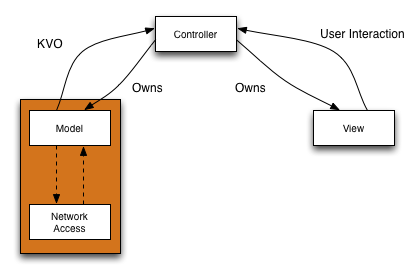

So the big question is, "what is worth Unit Testing in Objective-C?"

Server guys will mock out entire databases just to test the "Hello, World" equivalent of a SQL statement. Do you need to be this meticulous? Probably not. Do you need to Unit Test every line of code in your iOS app? Definitely not. Let's take a look at how you can decide on your testing strategy.

Unit Testing serves two purposes. First, and most importantly (in my opinion), it helps you keep your classes small and cohesive. Second, it provides you with automated tests (duh). These can be super useful. Let's see what I mean.

If you code up a class to fetch some data from an API, you're developing it with some assumptions about its behaviour. The code using that class it relies on those assumptions. Now, come back a few months later and you've forgotten what those assumptions are. If you change the network code, you break the code around it. However, you might not know it until after you ship!

What Unit Tests do is automate the manual testing you should be doing for your app anyway. That doesn't mean you need to Unit Test the whole app, but you should test it in some way, every time you ship. Why do all that work manually?

[Matt Gemmell](http://mattgemmell.com/2012/05/24/api-design/) once wrote "thou shalt suffer no bugs to ship", and I take that seriously. He went on to clarify that it doesn't matter what kind of mechanism you use to ensure you don't ship bugs, only that you have one. Unit Tests, UI Acceptance Tests, or manual testing are all appropriate. Manual testing, however, takes a long time. Unit tests and UAT are fast.

All that is preamble for the main topic: what is worth Unit Testing in Objective-C? Let's consider a well-architected iOS app. It's divided into three parts: the model, the view, and the controller.

Did I say three parts? I meant three-ish. On apps requiring usage of an API, you have network access code, too. Sometimes that code is separate from the model and sometimes it's included within the model. It's never included in the view and should not be included in the controller if avoidable (it's always avoidable).

The interactions between the view and the controller aren't really testable using Unit Tests — that's where UAT can step in to save you some time. But this article is about Unit Tests, dammit! Where do those fit in?

The highlighted orange box above shows where Unit Tests will be the most effective: models and networking code.

You can easily [test networking code](/blog/your-first-objective-c-unit-test-with-ocmock/) to verify and codify your assumptions about it when you first write it. If your models are thin, then you might get away without testing them at all. However, those models are created and modified somewhere, so make sure to test that code (which again, shouldn't really be in the view or controller).

So that's it: Unit Test models and networking code. Use UAT to test the rest, if it's worth your time. Maybe manual testing the views and controllers would fit better into your work flow, especially for smaller apps. Finally, document whatever Unit Testing and UAT does _not_ test, so you can be sure to manually test it before you ship.
