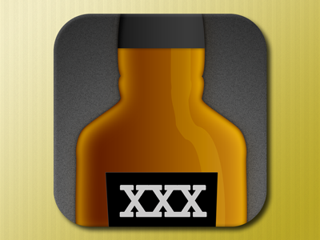
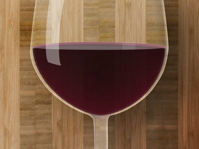

When I wrote the [whisky app](/blog/whiskey-list) I wrote about last week, I mentioned that [the icon](http://dribbble.com/shots/922178-Whiskey-List) was took the longest time. In reality, it was the hardest thing for me to do. However, it's a lot better than any of my previous attempts at icon design (or even design in general).

I've been using Photoshop for editing photos, and I'm a lot more comfortable with it than I was a year ago when I set out to improve my design abilities. I think I've come a long way. I've been exercising my skills by trying to reproduce real-world objects, like [this one](http://dribbble.com/shots/926143-Wine-List-II).

Any feedback on any of my work, design or otherwise, is always welcome. Don't feel the need to hold back — the only way I'll get better is through objective feedback and practice.
