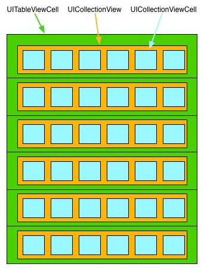
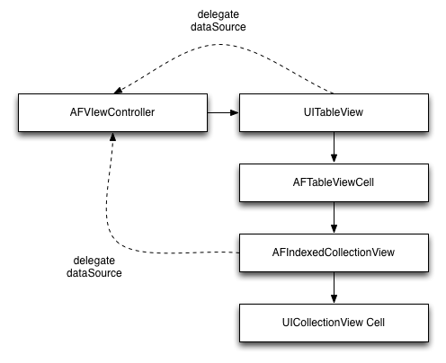
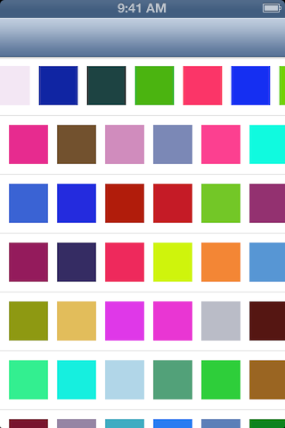

**Update**: I've re-written this tutorial using storyboards and Swift – [check it out](/blog/putting-a-uicollectionview-in-a-uitableviewcell-in-swift/)!

---

So you want to put a collection view inside of a table view cell, eh? Sounds easy, right? Well, to do it right requires a little bit of work. We want a clear separation of concerns so that the `UITableViewCell` isn't acting as the data source or delegate for the `UICollectionView` (because that would be very, very bad). You can follow along by downloading the [sample code](https://github.com/AshFurrow/AFTabledCollectionView).

We're going to build a view hierarchy like the one below. Each `UITableViewCell` will contain a `UICollectionView` instead in its `contentView`. (For reasons we'll get into momentarily, this collection view needs to be a custom subclass.) Each collection view contains a certain number of cells, defined by its datasource.



Each collection view will have the same data source and delegate as the table view, necessitating the requirement to use a custom `UICollectionView` subclass.



The diagram should show you that the tricky part here is going to be getting the `UICollectionView` to see the view controller as the delegate. That's fine, we'll just subclass `UICollectionView` to get it to have an `index` property. Subclassing `UICollectionView` isn't common, but it's perfectly acceptable here.

Adding the collection view to the cell is very strait forward. We'll create an instance of `AFCollectionView` using a standard `UICollectionViewFlowLayout` in our cell's designated initializer.



```objc
- (id)initWithStyle:(UITableViewCellStyle)style
    reuseIdentifier:(NSString *)reuseIdentifier
{
    if (!(self = [super initWithStyle:style reuseIdentifier:reuseIdentifier])) return nil;

    UICollectionViewFlowLayout *layout = [[UICollectionViewFlowLayout alloc] init];
    layout.sectionInset = UIEdgeInsetsMake(10, 10, 10, 10);
    layout.itemSize = CGSizeMake(44, 44);
    layout.scrollDirection = UICollectionViewScrollDirectionHorizontal;
    self.collectionView = [[AFIndexedCollectionView alloc] initWithFrame:CGRectZero collectionViewLayout:layout];
    [self.collectionView registerClass:[UICollectionViewCell class] forCellWithReuseIdentifier:CollectionViewCellIdentifier];
    self.collectionView.backgroundColor = [UIColor whiteColor];
    self.collectionView.showsHorizontalScrollIndicator = NO;
    [self.contentView addSubview:self.collectionView];

    return self;
}
```



We'll adjust the side of the collection view to fill the cell in `layoutSubviews`.



```objc
-(void)layoutSubviews
{
    [super layoutSubviews];

    self.collectionView.frame = self.contentView.bounds;
}
```



Next, we'll set up our model in the view controller. We'll use `UIColor`s because they're easy. Each cell will display a different, random colour.

This model is going to represent the table view _and_ each collection view. We'll use an array; each object represents a table cell. These objects are themselves arrays, with each of their objects representing a collection view cell.



```objc
-(NSInteger)tableView:(UITableView *)tableView
    numberOfRowsInSection:(NSInteger)section
{
    return self.colorArray.count;
}
```



Next we'll implement our `UICollectionViewDataSource` methods.



```objc
-(NSInteger)collectionView:(AFIndexedCollectionView *)collectionView
    numberOfItemsInSection:(NSInteger)section
{
    NSArray *collectionViewArray = self.colorArray[collectionView.index];
    return collectionViewArray.count;
}

-(UICollectionViewCell *)collectionView:(AFIndexedCollectionView *)collectionView
    cellForItemAtIndexPath:(NSIndexPath *)indexPath
{
    UICollectionViewCell *cell = [collectionView dequeueReusableCellWithReuseIdentifier:CollectionViewCellIdentifier forIndexPath:indexPath];

    NSArray *collectionViewArray = self.colorArray[collectionView.index];
    cell.backgroundColor = collectionViewArray[indexPath.item];

    return cell;
}
```



You'll see we're using the `index` property of the collection view to determine the appropriate model to use. Notice that the view controller doesn't retain references to any of the collection views – they belong to the `UITableViewCell`s only. This is great, since they'll be re-used and save memory.

But where is the `index` getting set? We'll need to do that, too.



```objc
-(void)tableView:(UITableView *)tableView willDisplayCell:(AFTableViewCell *)cell forRowAtIndexPath:(NSIndexPath *)indexPath
{
    [cell setCollectionViewDataSourceDelegate:self index:indexPath.row];
}
```



The only thing left to do is "remember" the content offset of each cell as we end displaying it to reset it when we begin displaying it again. I we don't do this, newly displayed collection views will have non-zero content offsets and returning collection views will be in different positions. We'll use an `NSMutableDictionary` to remember the content offsets.



```objc
-(void)tableView:(UITableView *)tableView
    willDisplayCell:(AFTableViewCell *)cell
    forRowAtIndexPath:(NSIndexPath *)indexPath
{
    [cell setCollectionViewDataSourceDelegate:self index:indexPath.row];
    NSInteger index = cell.collectionView.index;

    CGFloat horizontalOffset = [self.contentOffsetDictionary[[@(index) stringValue]] floatValue];
    [cell.collectionView setContentOffset:CGPointMake(horizontalOffset, 0)];
}

-(void)tableView:(UITableView *)tableView
    didEndDisplayingCell:(AFTableViewCell *)cell
    forRowAtIndexPath:(NSIndexPath *)indexPath
{
    CGFloat horizontalOffset = cell.collectionView.contentOffset.x;
    NSInteger index = cell.collectionView.index;
    self.contentOffsetDictionary[[@(index) stringValue]] = @(horizontalOffset);
}
```





That's it. Not a lot of code, but to do it right, it requires a little bit of planning ahead. You can [download the entire sample code on GitHub](https://github.com/AshFurrow/AFTabledCollectionView).

If you've enjoyed this tutorial, and I sincerely hope you have, then I'd recommend my ebook, [`UICollectionView`: The Complete Guide](http://click.linksynergy.com/fs-bin/click?id=3JVIZPzOhac&subid=&offerid=145238.1&type=10&tmpid=3559&RD_PARM1=http%253A%252F%252Fwww.informit.com%252Fstore%252Fios-uicollectionview-the-complete-guide-9780133410945). In the book, I go into far more detail on every aspect of using `UICollectionView`. You can pre-order it now and get access to all the draft chapters immediately.
