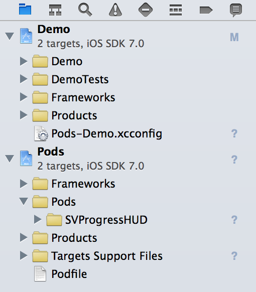

CocoaPods is an open source library management tool for Objective-C (both iOS and OS X). This article is going to briefly take you through how to get started. This is meant t0 be a quick-fire demo – check out the [Getting Started](http://docs.cocoapods.org/guides/getting_started.html) guide for more details.

A CocoaPod (singular) is a specification for a library, usually open source. CocoaPods (plural) is the tool for managing these specs.

First, you'll need to install CocoaPods. That's pretty easy since CocoaPods is a Ruby Gem, and all Macs ship with Ruby. Open a terminal and type the following (it'll ask you for your password):

```
sudo gem install cocoapods
```

That'll install CocoaPods on your machine.

Next, you'll need an Xcode project that you want to integrate. Use `cd` to navigate to the working directory of your app.

```
cd ~/Desktop/Demo
```

Next, type the following command:

```
pod init
```

This command creates an empty Podfile for you. Open it in a text editor. It'll look like the following.

```
# Uncomment this line to define a global platform for your project
# platform :ios, "6.0"

target "Demo" do

end

target "DemoTests" do

end
```

Uncomment the second line to specify the platform (iOS) and the version (6). For your target (the first target), enter `pod "SVProgressHUD", "0.9"`.

```
platform :ios, "6.0"

target "Demo" do

pod "SVProgressHUD", "0.9"

end

target "DemoTests" do

end
```

Save the file and return to the text editor. Enter the following command.

```
pod install
```

This will produce the following output.

```
> pod install
Analyzing dependencies
Downloading dependencies
Installing SVProgressHUD (0.9)
Generating Pods project
Integrating client project

[!] From now on use `Demo.xcworkspace`.
```

Follow the last line's instruction and close your Xcode project and open the Xcode Workspace file that's been created for you. An Xcode workspace is like a folder for Xcode projects. Your Pods project contains all of the libraries (pods).



Cool.

Now we need to import the `SVProgressHUD.h` header. Since it's in another Xcode project, make sure to use angle brackets.

```
#import <SVProgressHUD.h>
```

That's it! We can now use our library. We've successfully integrated CocoaPods into our project. For each library you want to use, write `pod "POD_NAME", "POD_VERSION"` in your Podfile and re-run `pod install`.

There's an [Xcode plugin](https://github.com/kattrali/cocoapods-xcode-plugin) for CocoaPods if you're not into the command line.

I gave a talk this morning on effectively using open source software. The slides are below.


