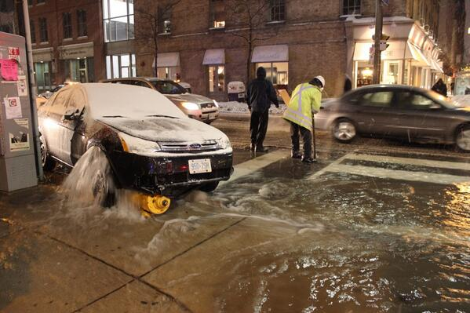

There was an accident today at a fairly major intersection in Toronto. A car hit a fire hydrany in sub-zero temperatures.

[This vine](https://vine.co/v/h0hPem6eVrd) should show you everything you need to know about what this is a horrible situation.

I use multiple modes of transportation. I walk, cycle, transit, and drive all over this city. In the age of multi-modal transportation being readily available and, I predict, soon the norm, it's getting harder and harder for me to justify the effort our society puts into owning cars.

  