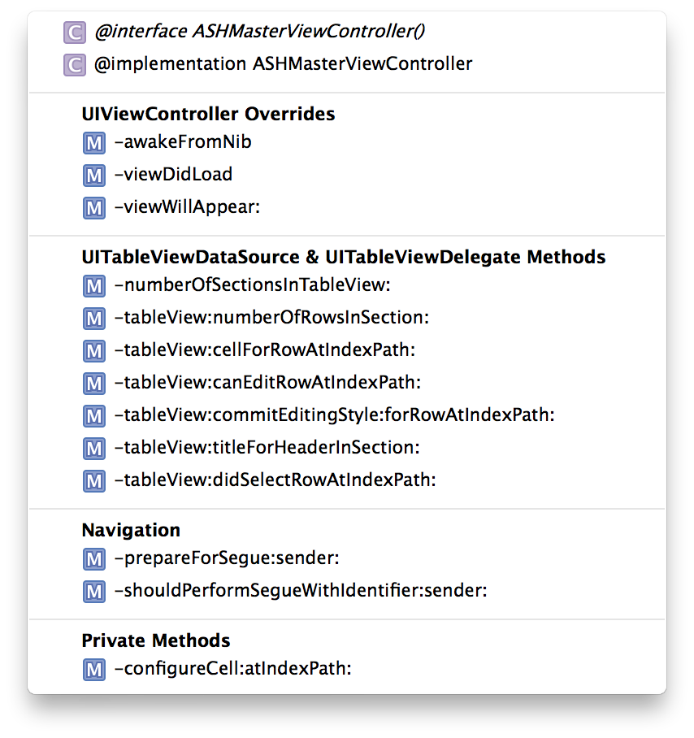

Well, here we are again. Another New Year's Eve, another blog post list of changes to make in the new year. I thought I'd follow up [last year's post](/blog/seven-deadly-sins-of-modern-objective-c) with a little more positive one about virtuous habits that we should all endeavour to integrate into our routines.

These are habits that anyone, whether you're a beginner or an expert, or a old-world C developer or a [third-wave Objective-C'ist](https://speakerdeck.com/mattt/third-wave-objective-c), can use to help themselves become a more proficient coder.

## Xcode Behaviours

Xcode behaviours are like putting your IDE on autopilot so that you can focus on writing code instead of changing the layout of your editor. Behaviours let Xcode automatically switch to a view ideal for debugging when the debugger hits a breakpoint. Or go to a view ideal for editing when a compiler error occurs.

It's a little overwhelming at first, since we're used to doing everything ourselves and letting go of that control is difficult.

Admittedly, I haven't put in the time to master this habit yet; I've continued to use keyboard shortcuts to manually change Xcode's layout depending on the context within which I'm using it. Here's an example of me not following my own advice. That said, I'm going to make it a priority in the new year to master Xcode Behaviours.

You can check out [Jay Thrash's presentation](http://cocoaheads.tv/taming-xcode-by-jay-thrash/) on Xcode Workflows for more details. I highly recommend giving it a watch.

## Effective use of #Pragma mark -

`#pragma` is a C preprocessor command that can be used to [alter the behaviour of the compiler](http://nshipster.com/pragma/). While it's very powerful, one of the simplest uses of it is just to separate different parts of your code.

When used in conjunction with the quick-jump bar – ^6 for quick access – your code becomes easily navigable.

I use `#pragma mark -`, followed by protocol names in order to divide my code. Because I have the actual name of the protocol, I can ⌘-click on that name to immediately jump to the protocol definition. I also use it to separate out my private and public methods, which helps my sanity.

Using `#pragma mark -` takes nearly no effort and helps you keep your code straight. It'll also help other developers learn their way around your codebase. There's really no down side to this one.

## Exploration
> The only constant in the world is change.
> 
> — [Jeff Atwood](http://www.codinghorror.com/blog/2006/05/the-ten-commandments-of-egoless-programming.html)

It's tempting to get comfortable as a developer –&nbsp;to rest on our laurels and stop learning. However, the world will move on, especially Objective-C. Code from even a few years ago already looks stale compared to the latest and greatest in Objective-C land. I'm not saying that you need to embrace all these improvements, but you owe it to yourself to explore and determine for yourself if these are worthwhile enhancements.

Are unit tests the future? ReactiveCocoa? CocoaPods? Maybe. How will you know if you haven't tried them out?

Always keep learning and you'll always be employable.

For resources on exploration, I'd recommend [GitHub's digest emails](https://github.com/explore/subscribe) and [iOS Dev Weekly](http://iosdevweekly.com). They're great ways to keep your finger on the pulse of the developer community.

## Open Source Contributions

I know first hand that getting started contributing to an open source project can be difficult, and opening a project of your own is intimidating. However, it's well worth the effort.

There's also something really satisfying about helping others. None of us, I believe, could have gotten here by ourselves. We've all had help from mentors, stack overflow answers, and the open source community. Contributing is a great way to pay back the help that we've received so that others can benefit from what we've learnt.

How to get started? The easiest way is to simply start _using_ open source software. Instead of writing things yourself from scratch every time, look for an existing solution. It probably won't fit your needs perfectly, so fork it and improve it. Someone else will probably find your improvements a great addition to the project.

You should take a look at [Sam Vermette's presentation](http://cocoaheadsmtl.s3.amazonaws.com/Open-Source.pdf) on how and why to open source your own code.

## Accessibility Testing

iOS and OS X applications actually ship with two interfaces. The first is the interface you see and interact with in the usual way. The second is an aural interface you interact with through a series of gestures. Many applications focus solely on the first type of interface, leaving users of the secondary interface using a (potentially) broken app.

The crux of the argument for accessibility on iOS and OS X is simply that it takes nearly no time to do. Knowing, they say, is half the battle, but with accessibility, it's more like 90% of the battle. You just need to know what to use, and when to use it. For example, a button using an image and no text will need an accessibility label.

Check out [Matt Gemmell's excellent post](http://mattgemmell.com/accessibility-for-iphone-and-ipad-apps/) on iOS accessibility for an in-depth perspective on the topic. A lengthy read, it's well worth your time.

  