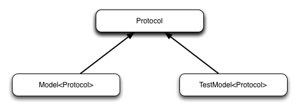

I've been experimenting with [Model-View-ViewModel](https://github.com/ReactiveCocoa/ReactiveViewModel#model-view-viewmodel) lately; one of the benefits of using MVVM is that your code becomes more testable. In a nutshell, you take all of the presentation logic in view controllers, which are infamously hard to unit test, and put them in a _view model_ that is easy to unit test. Then you can test that logic.

Great.

But the thing is that the view model also has a reference to your model object, which contains all your data. Because I'm something of a wimp, I like to use Core Data for my persistence layer. Core Data is, famously, unit tested by Apple (See: [Why should you use Core data](https://developer.apple.com/library/mac/documentation/cocoa/conceptual/coredata/articles/cdTechnologyOverview.html)). So as long as you don't put business logic in your model objects, you don't have to test them because, ostensibly, Apple already has.

Here's the thing. Ever looked in a `.m` file of a managed object and see all those `@dynamic` directives? They're there because Core Data actually adds getters and setters for your properties at runtime, not at compile time. This matters because you [can't mock Core Data models](http://stackoverflow.com/questions/1876568/ocmock-with-core-data-dynamic-properties-problem). I was raised in .Net land where mocking is the _de facto_ unit testing approach, so I looked for alternatives.

There are two options. First, you can create a protocol that has all of your model's properties defined. Then, make your `NSManagedObject` subclass conform to that protocol. Core Data will still add those properties at runtime because of the `@dynamic` directives. Next, create a new model object – just for testing&nbsp;– that conforms to that same protocol and `@synthesize`s all of the protocols properties.



Not _terrible_, but it's messy just for the sake of getting managed object mocks to work. I don't like having two code paths for testing and the actual runtime – it defeats the purpose of unit testing in the first place.

The other option is to create an entire Core Data stack just for testing, and reset it frequently. This is the approach I took on a [recent project](/blog/c-41) and I quite like the results.

```
static ASHRecipe *recipe;

beforeEach(^{
    NSManagedObjectContext *context = [[ASHCoreDataStack defaultStack] managedObjectContext];
    [context reset];

    recipe = setupRecipe(context);
});
```

`ASHCoreDataStack` is a singleton where all the Core Data logic goes, so it can be used by the test suite and the app. The `reset` ensures that each test has a fresh context, and `setupRecipe` creates a new instance of `ASHRecipe` that can be used by the tests.

Now, instead of mocking `NSManagedObject`s, I can use them themselves and rely on the data they contain. A weakness of this approach is that relies on the data in the model instead of mocks, so if your tests just happen to pass because of that data, you might be getting false positives.

I'm still completing the tests for this project, so I'm open to suggestions on how to improve the tests. Feel free to open an issue or pull request on the [GitHub project page](https://github.com/AshFurrow/C-41).


  