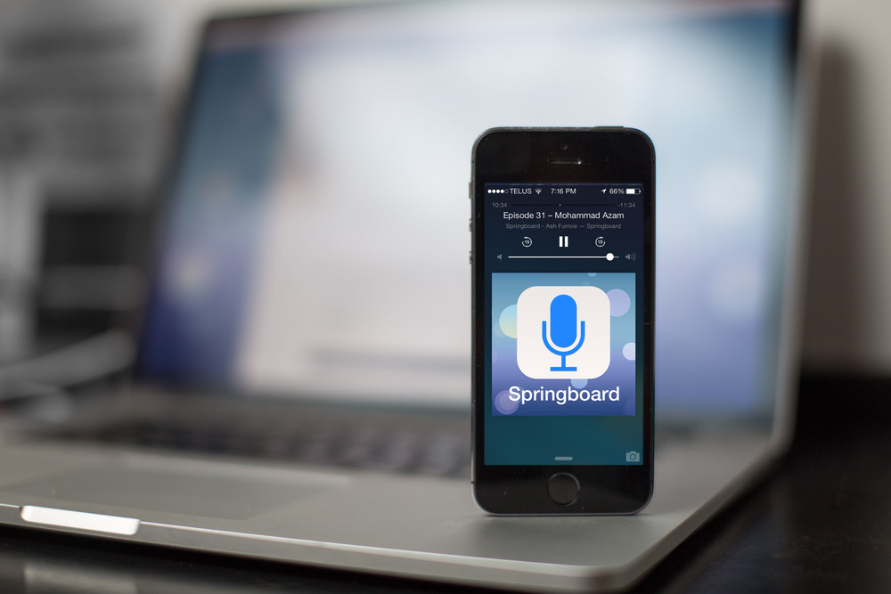

I host an interview podcast called [Springboard](http://springboardshow.com) for beginning and aspiring iOS developers. I love doing it, but lately I had been feeling a little bit like I'm phoning it in. I didn't look forward to recording as much as I used to.

That's always been, for me, a sign that things need to change. I looked at what I was making, or rather, I listened to it, and I realized that I wasn't putting the same effort into my show anymore because I wasn't pleased with the quality of my product. The content and guests were great, but I was sounding a bit... rough.

So, based on Dan Benjamin's [Podcasting Handbook](http://www.podcastinghandbook.co/podcasting-equipment-guide), I purchased a [new microphone](http://www.amazon.com/gp/product/B000JM46FY/ref=as_li_ss_tl?ie=UTF8&camp=1789&creative=390957&creativeASIN=B000JM46FY&linkCode=as2&tag=ashfur-20). Now I know that equipiment isn't everything and it isn't going to help anything but the _sound_ quality of Springboard, but I'm loving the way I sound when I record with it. It's motivating to know that my prowress as an audio engineer is now the limiting factor in the quality of my podcast.

I'm switching from GarageBand to Logic Pro X for my recording software. I'll probably be ditching Piezo in favour of Audio Hijack Pro for recording, since I don't want my files double-compressed.

(By the way, next week will be the last episode recorded with my old [compressor mic](http://www.amazon.com/gp/product/B004MF39YS/ref=as_li_ss_tl?ie=UTF8&camp=1789&creative=390957&creativeASIN=B004MF39YS&linkCode=as2&tag=ashfur-20), so give it another episode for the difference in sound quality.)
