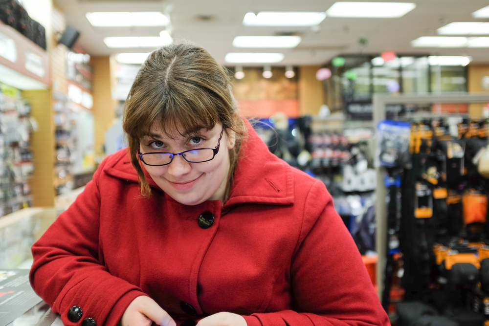
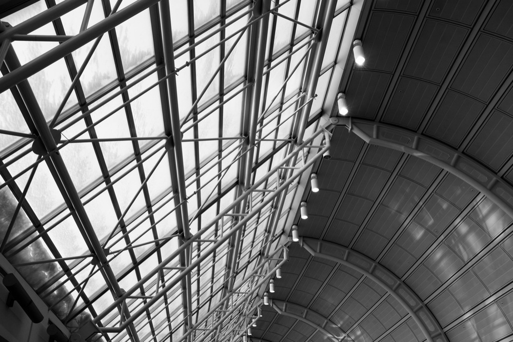
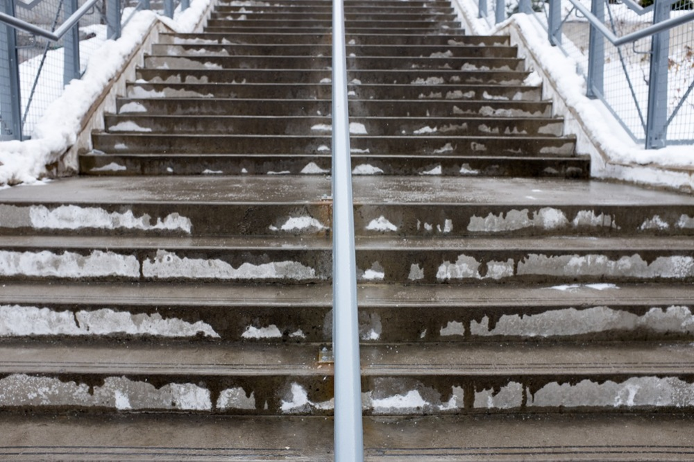
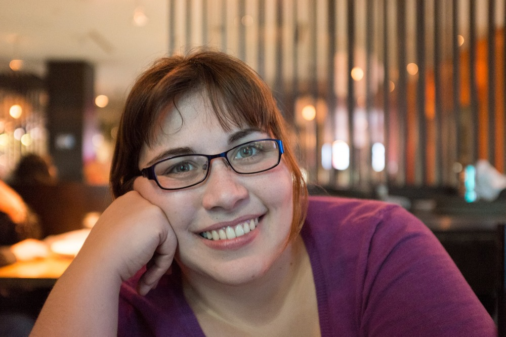
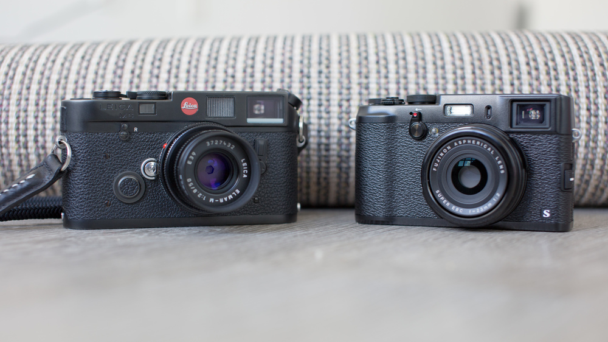
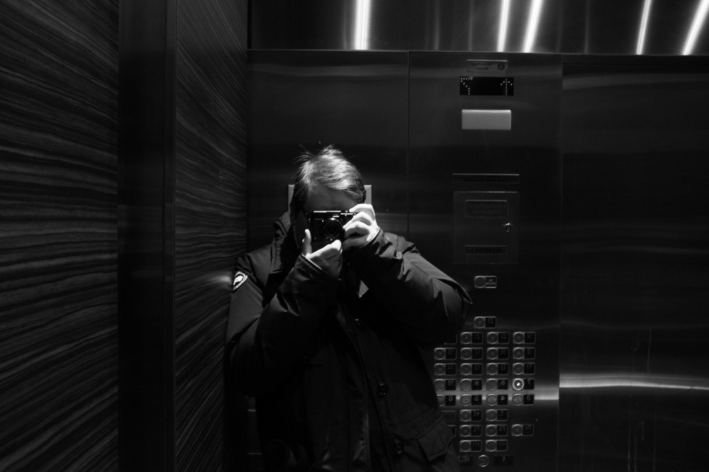

So I bought a new camera the other day.

Oops.

I've read a lot about the [Fujifilm X100S](http://www.amazon.com/gp/product/B00ATM1MVA/ref=as_li_ss_tl?ie=UTF8&camp=1789&creative=390957&creativeASIN=B00ATM1MVA&linkCode=as2&tag=ashfur-20), including Ken Rockwell's review of the [X100](http://www.kenrockwell.com/fuji/x100.htm) precursor. My friend Eric also swears by it. I'm planning on doing quite a bit of travelling in the future, and my 5D is quite bulky. Here's my miniature review of the camera.

## First Impressions

Let's start from the top. I'm at the camera store and I pick up the camera. At this point, the only thing I have to shoot is my incredulous-but-beautiful wife.

The first thing I'm struck by is how easy it is to operate the camera. I've read some things about the menu system being hard to navigate, and having used the camera for a week now, I find that it's not the most intuitive. However, at first glance, a lot of what I need to use is available through knobs or buttons.

I get the focusing system immediately. I'm used to the focus-center and recompose method of shooting, which is good since the X100S' parallax compensation only kicks in once focus is locked. That's OK.

I'm a little annoyed by one thing, which is that every time I take a photo, the hybrid viewfinder pops into EVF mode to show me the photo I just took. As someone familiar with film rangefinders, this is a break in my existing workflow. I'd rather review the image on the back of the camera, but I can't disable auto-review in the viewfinder without also disabling it on the main screen. Oh well.

## Build Quality

I'm not going to insert the obligatory "nothing holds a candle to my Leica" schtick here. I'm paying a moderate price for a camera and I expect good build quality. The X100S doesn't disappoint. It feels sturdy, like it could handle an accidental tumble. Good knob-feel. Buttons feel good to press. I like it.

## Image Quality

I'm really impressed with the image quality so far.

Distortion from the lens is low-to-nonexistent. I'm really happy with that, since I'm used to wide-angle lenses I use either being zooms or ultra-wides, so distortion has historically been a thorn in my side.

## Performance

Performance is good, really good. Good dynamic range, average high-ISO noise. Not nearly as good as my 5D, but it's also a lot less expensive.

Autofocus is a bit finicky. I've lost a couple of shots to it. Oh, well. It seems to do a lot better in daylight than at nighttime, as you'd expect.

At f/2, bokeh is nice. Not as creamy as my [Sigma 50mm f/1.4](http://500px.com/photo/49617434), but good for f/2 on a crop sensor.

## Conclusion

Overall I'm really happy with the camera. A few quirks but otherwise a real performer. I bought this partially so I could stick it in my coat pocket while going about Amsterdam, and I'm really satisfied with it so far.

I'm still going to shoot on my M6 – I love that camera. However, the future of my 5D is in question. It's always been more camera than I strictly need, but I love to shoot with it. It's just so damn big. At this point, I'm going to see how my habits develop. If I'm not using my 5D at all, then I'll likely sell it. It would be a compromise on flexibility of a zoom lens and quality of bokey I can get from shots, but life is about compromises I suppose.

