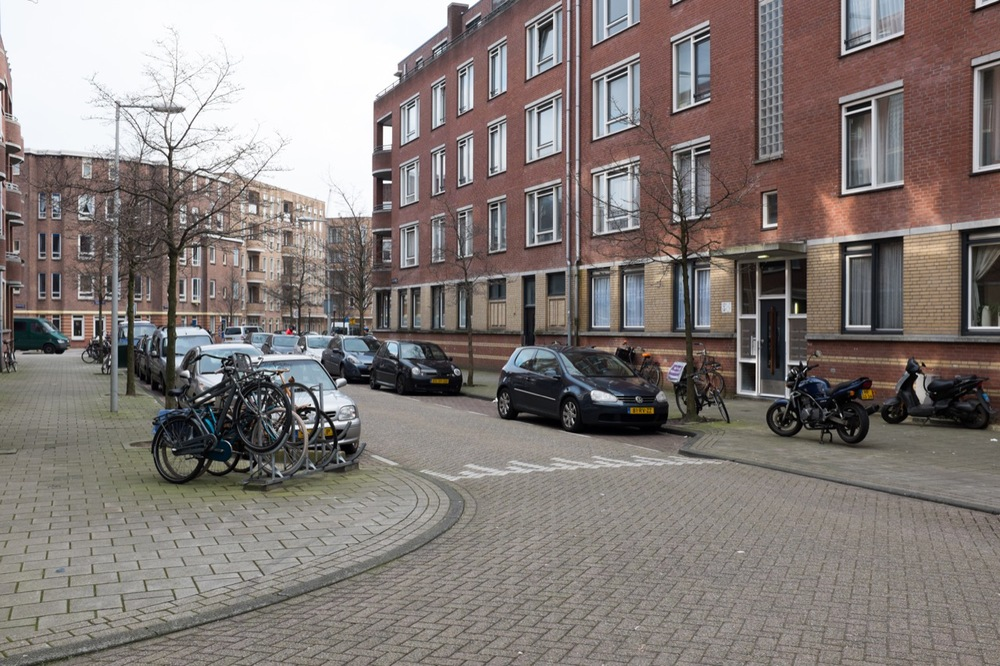
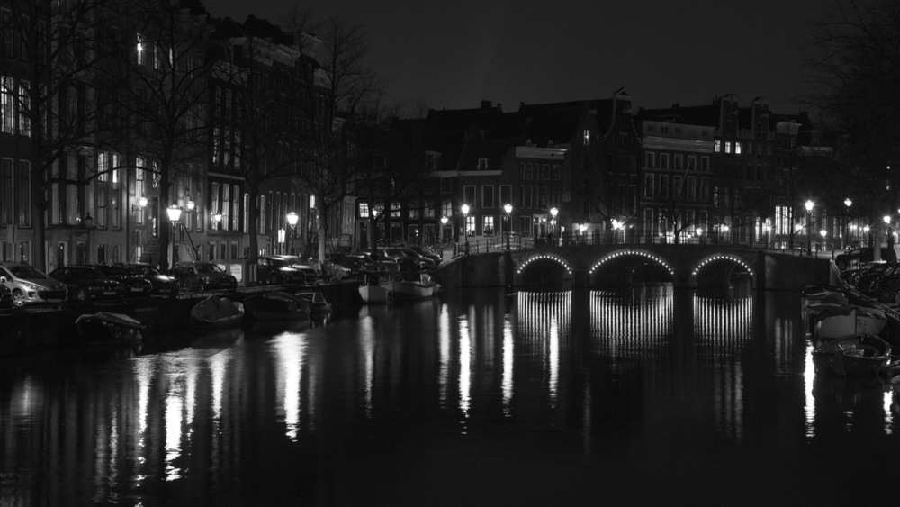
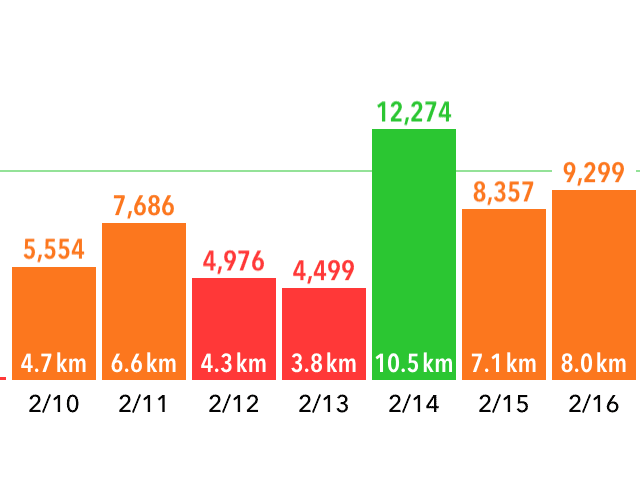
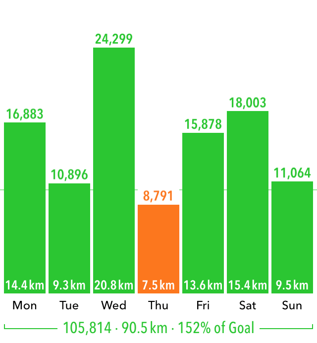

My wife and I landed in Amsterdam last Monday, so we've been here about a week. I thought it would be nice to do a "first impressions" of the city, the atmosphere, and the work environment.

## City

The city is gorgeous, even the shitty parts. We live outside the core of Amsterdam in a quiet neighbourhood called Transvaalbuurt. Buildings here are old, but not _that_ old, and there are lots of shops and cafes and restaurants.

Closer to the center of the city, we've explored neighbourhoods where the tall residential buildings lean toward the street, tourist areas where everyone was speaking English, Dam Square where the palace was located, and of course walked along some canals at night. Such a beautiful city.

## Language

One of my primary concerns about moving to Europe was language. We've always wanted to try living in Europe but our options are limited because we only speak English. OK, I can get by in French, but that's it. Amsterdam is great because everyone here speaks English which spoken in English to, and there is a large expat community. All software development here is done in English, so I didn't have a hard time finding a job. Ashley's still looking, but we're hopeful it won't be a problem.

## Transportation

The first thing I have to say is that, especially for its size, Amsterdam has the transit thing figured out. Trams run reguarly on a schedule and I haven't seen one be late yet. The subway also runs very regularly and is easy to figure out. My only complaint has been the _nachtbus_, or night bus, which I had to take home after a night of drinking. It was expensive and difficult to figure out (and the bus driver was very rude). That's been, however, my only negative experience at all so far, so I'll count myself lucky.

Amsterdam is a small city, so it's easy and fast to get around. I've been doing a lot of walking, and I mean a lot. Let's compare and constrast. Here's my pedometer readings from the last week I was in Toronto.

And here's my first week in Amsterdam.

I've taken the intercity train a few times now, once to Sloterdijk and once to Utrecht, and it was really easy and cheap. Additionally, my new employer is going to be reimbursing me for transit costs, which is super-cool.

Bikes are everywhere. I'm planning on buying one next month. The only real downside to biking is that it may be difficult to find a place to park.

## Food

Ashley and I haven't been eating out a whole lot, but what we have eaten at restaurants has been fantastic. Food in restaurants seems to be a bit more pricey than in Toronto, probably because they pay their workers a decent wage. You also don't tip here, which is taking some getting used to.

We've got a large (for Amsterdam) grocery store a five minute walk away, and a smaller one five minutes in the other direction. We've been eating great, going to the grocery store about once a day to get just what we need for that day. Between the healthy eating and the walking, I'm looking forward to becoming healthier than we were in our last year in Toronto.

Food at the grocery store is cheap. Like, really cheap. Not the pre-packaged stuff, but real food. Cheese is cheap, too, and plentiful. Oh, and I found one of my favourite beers for about a Euro per bottle. Amazing.

## People

I've heard that the Dutch people are direct, which is true. What I hadn't heard, but I've certainly observed, is that they're polite when spoken to politely. Besides my bus driver incident, everyone has been curteous, though sometimes curt. Even the meany at the immigration office was polite.

## iOS Community

Part of the reason I moved here was for the iOS community. Mike Lee, over the Summer, convinced me that there was no other place like Amsterdam to develop software. He was correct.

On my second day here, I attended the largest CocoaHeads meeting I've ever attended in a nearby city. It was amazing. People are interested in learning and attending community events. Companies seem to be on the constant lookout for developers. It's a great combination.

  