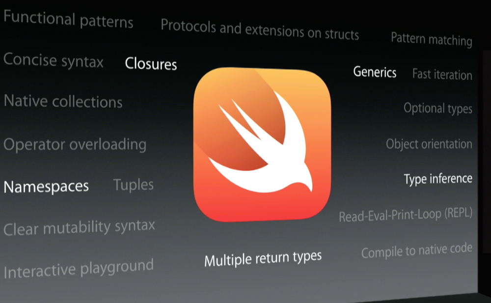

Yesterday, Apple announced a brand new programming language as a replacement for Objective-C called Swift.

Super cool. I [wrote](/blog/we-need-to-replace-objective-c) about replacing Objective-C a few months ago, and I'm glad to see this update from Apple. Here was my list of criteria for a "good" replacement:

1. It shouldn't use pointers, structs, header files, anything C-based
2. It should be a memory-managed language (No ARC, not retain/release, no Core Foundation)
3. It should have native, unicode strings and native collections
4. It should be concise
5. It should have named parameters

It looks like everything except memory-management has been checked off, and I haven't played around with it enough to determine if it's new memory management system is up to snuff, but from what I've seen so far, I am very impressed with Swift.

I'm very impressed with Apple's [book](https://itunes.apple.com/us/book/swift-programming-language/id881256329?mt=11) on Swift. It's great that this stuff isn't sealed under NDA.

I'm planning on writing at least one book on Swift, which will be out in the coming months. While I'm impressed with the resources Apple has released, I think that there is room for some third-party resources, too.
