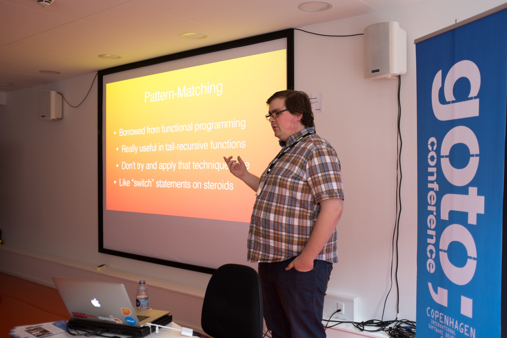
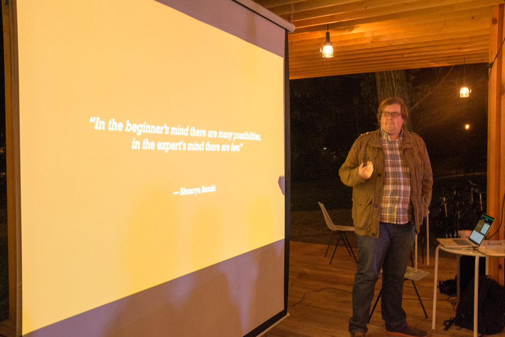

Last week, my wife and I returned from a trip to Copenhagen, then Warsaw. I spoke at two meetups in the cities, got to visit some new places, and take some photos. It was a really great trip.

In Copenhagen, I gave a rendition of my [Solving Problems the Swift Way](/blog/solving-problems-the-swift-way) presentation at a [GotoNight](https://secure.trifork.com/cph-2014/freeevent/index.jsp?eventOID=6461). Great attendance with some excellent questions. Really nice city – we stayed at an Airbnb very close to the city centre.

The following week, we went to Warsaw and I gave a talk on [ReactiveCocoa](https://www.youtube.com/watch?v=TlgUWYrQ0sc) at [Mobile Warsaw](http://mobile-warsaw.pl/). Really cool venue – sort of an outdoor cafe that got pretty chilly later in the evening. [Robb Böhnke](https://twitter.com/ceterum_censeo) was also presenting and gave an inspiring talk about iOS accessiblilty.

Returning home after a week-long, pretty exhausting trip, I fell asleep on the plane. When we moved to Amsterdam, I looked forward to getting to know the local Appsterdam folk. I didn't anticipate having the opportunity to travel about Europe and give presentations to different local groups. It has been one of the most gratifying aspects of my time here so far.
